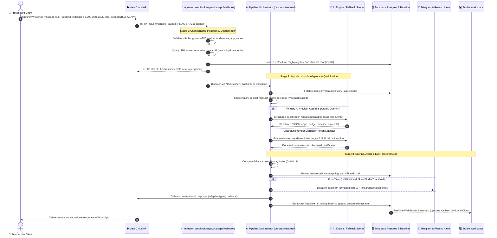
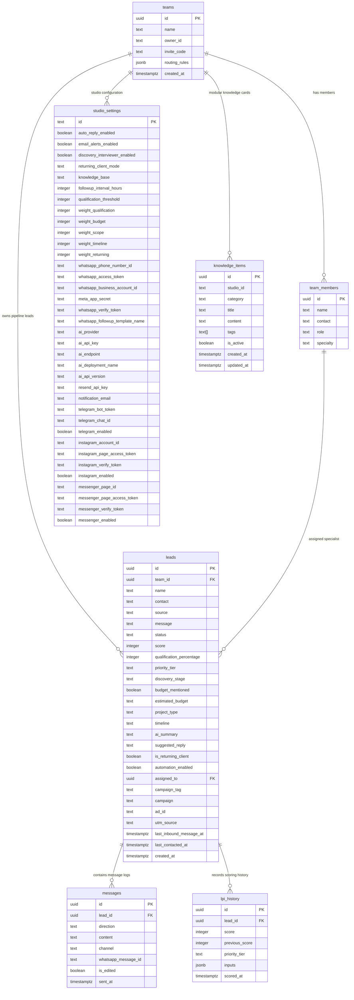

# 🏛️ Marketing Machine: Technical Architecture & System Design Whitepaper
> **Autonomous Inbound AI Marketing, Lead Qualification & Real-Time CRM for High-Ticket Architecture & Design Practices**

---

## 📌 Executive & Commercial Context

High-ticket architectural and design practices operate in a specialized commercial environment where individual commissions routinely range from **$50,000 to $500,000+**. In this market, prospective clients—commercial property developers, luxury homeowners, and corporate buyers—predominantly initiate contact via conversational messaging channels: **WhatsApp, Instagram Direct, and Facebook Messenger**. Inquiries frequently arrive outside standard studio operating hours or while senior partners are conducting site inspections or client presentations.

Conventional CRM systems (e.g., Salesforce, HubSpot) rely on static web forms, manual data entry, and delayed email sequences. They lack the conversational capabilities required to conduct multi-turn omnichannel discovery, extract nuanced architectural briefs, or evaluate client buying power in real time.

**Marketing Machine** delivers an autonomous, real-time inbound intelligence infrastructure:
- **Omnichannel Conversational Ingestion**: Engages prospects immediately across WhatsApp, Instagram Direct DMs, Facebook Messenger, and website landing briefs with an authentic studio persona, capturing project scope, budget depth, and timeline constraints without robotic friction.
- **Dual-Metric Evaluation**: Computes both semantic service alignment (AI Match: 0–100%) and a commercial **Lead Priority Index (LPI: 0–100)** to distinguish high-value commissions from low-intent inquiries.
- **Sub-Second Multi-Channel Dispatch**: Notifies studio principals via Telegram broadcast cards and branded Resend transactional emails the instant an inquiry meets qualification thresholds.
- **Live Collaborative Control Center**: Synchronizes conversations and pipeline states across drag-and-drop Kanban, high-density spreadsheets, live unified chat inboxes, and modular knowledge bases via Supabase Realtime WebSockets.
- **Native Outbound Messaging Engine**: Dispatches direct replies via Meta Graph API v25.0 and WhatsApp Cloud API, supporting operator takeovers and 24-hour customer care window compliance.

---

## 📁 Repository Structure & File System Architecture

The codebase follows the Next.js App Router architecture, cleanly decoupling presentation components, serverless route handlers, domain logic, and data access layers:

```
Marketing Machine/
├── src/
│   ├── app/
│   │   ├── api/
│   │   │   ├── auth/demo/route.ts       # 1-Click judge & evaluator authentication
│   │   │   ├── cron/followup/route.ts   # 24-hr follow-up sweep & Meta window check
│   │   │   ├── health/route.ts          # Granular 7-way health diagnostic matrix (DB, AI, Meta, IG, Msg, TG, Resend)
│   │   │   ├── instagram/webhook/       # Dedicated Instagram Direct inbound webhook intake
│   │   │   │   └── route.ts             # Direct re-export & challenge handler
│   │   │   ├── integrations/test/       # Live connectivity test endpoints (AI, Meta, IG, Msg, TG, Resend)
│   │   │   ├── knowledge/route.ts       # Modular knowledge item CRUD & sync API
│   │   │   ├── leads/route.ts           # REST API for lead management & stage progression
│   │   │   ├── messages/                # Message history, sending & deletion API
│   │   │   │   ├── route.ts             # Inbound/outbound message persistence & multi-channel dispatch
│   │   │   │   └── typing/route.ts      # Realtime typing presence broadcast endpoint
│   │   │   ├── messenger/webhook/       # Dedicated Facebook Messenger inbound webhook intake
│   │   │   │   └── route.ts             # Direct re-export & challenge handler
│   │   │   ├── settings/route.ts        # Studio settings persistence API with masked secrets
│   │   │   ├── teams/                   # Team roster, invitations & join endpoints
│   │   │   │   ├── invite/route.ts      # Cryptographic 8-char invite link generator
│   │   │   │   ├── join/route.ts        # Workspace join validation endpoint
│   │   │   │   └── route.ts             # Team members & routing rules query endpoint
│   │   │   ├── webhook/whatsapp/        # Legacy webhook routing alias
│   │   │   └── whatsapp/webhook/        # Multi-product HMAC-verified Meta webhook endpoint
│   │   ├── dashboard/
│   │   │   ├── page.tsx                 # Master Dashboard orchestrator (state & view routing)
│   │   │   └── platform/page.tsx        # Multi-tenant admin & health monitoring view
│   │   ├── join/[code]/page.tsx         # Public team invitation landing page
│   │   ├── layout.tsx                   # Root HTML layout, font loaders & metadata
│   │   └── page.tsx                     # Landing page & interactive product demo
│   ├── components/
│   │   ├── dashboard/                   # Modular dashboard view subsystem
│   │   │   ├── AnalyticsView.tsx        # Conversion funnels, LPI distribution & link generator
│   │   │   ├── KanbanView.tsx           # Interactive 6-stage drag-and-drop pipeline
│   │   │   ├── KnowledgeView.tsx        # Raw markdown & modular cards editor with token counter
│   │   │   ├── MetricsStrip.tsx         # High-level KPI metric cards strip
│   │   │   ├── PipelineView.tsx         # Unified lead table, channel badges & LPI audit modal
│   │   │   ├── PlatformView.tsx         # Embedded multi-tenant platform health matrix
│   │   │   ├── SettingsView.tsx         # BYOK credentials & integration management center
│   │   │   ├── SheetView.tsx            # High-density spreadsheet data grid with inline stage pills
│   │   │   ├── Sidebar.tsx              # View navigation, studio switcher & status indicators
│   │   │   ├── TeamView.tsx             # Team members & scope-to-specialist routing matrix
│   │   │   ├── index.ts                 # Component exports barrel
│   │   │   ├── modals/
│   │   │   │   ├── KnowledgeItemModal.tsx # Dialog for creating & editing modular knowledge cards
│   │   │   │   └── LeadCaptureModal.tsx   # Dialog for manual lead entry with live AI qualification
│   │   │   └── types.ts                 # Shared TypeScript data models & interface definitions
│   │   ├── AuthModal.tsx                # Email/password authentication dialog
│   │   ├── ChatInbox.tsx                # Omnichannel chat stream (WhatsApp, IG, Messenger) with live typing
│   │   ├── DemoModal.tsx                # Staging demo credentials guide dialog
│   │   ├── FAQ.tsx                      # Landing page FAQ accordion
│   │   ├── Features.tsx                 # Landing page feature showcase
│   │   ├── FinalCTA.tsx                 # Landing page conversion call-to-action
│   │   ├── Footer.tsx                   # Landing page footer
│   │   ├── Hero.tsx                     # Landing page hero with animated visual badge
│   │   ├── HowItWorks.tsx               # Landing page visual workflow section
│   │   ├── Navbar.tsx                   # Top navigation bar with responsive mobile menu
│   │   ├── Pricing.tsx                  # Commercial licensing tiers
│   │   ├── Product.tsx                  # Product interface showcase
│   │   ├── Solutions.tsx                # Architectural practice use cases
│   │   ├── Stats.tsx                    # Commercial performance statistics
│   │   ├── Testimonials.tsx             # Studio director testimonials
│   │   ├── ThemeProvider.tsx            # Dark/light theme context provider
│   │   ├── TrustedBy.tsx                # Client architectural practice logos
│   │   └── WaitlistForm.tsx             # Early access lead capture form
│   ├── hooks/
│   │   └── useInView.ts                 # Intersection observer animation hook
│   └── lib/
│       ├── ai/
│       │   ├── fallbackScorer.ts        # Zero-failure regex & NLP heuristic fallback engine
│       │   ├── knowledgeRetriever.ts    # Keyword extractor, typo normalizer & ranker
│       │   └── qualifyLead.ts           # Uncapped OpenAI/Azure qualification engine
│       ├── email/
│       │   ├── resend.ts                # Resend client wrapper
│       │   └── sendLeadAlert.ts         # Branded studio alert & welcome email templates
│       ├── messages/
│       │   └── messageActions.ts        # Message mutation & deletion logic
│       ├── meta/
│       │   └── messaging.ts             # Meta Graph API v25.0 direct messaging & typing engine
│       ├── telegram/
│       │   └── bot.ts                   # Telegram alert broadcaster & follow-up digests
│       ├── whatsapp/
│       │   ├── api.ts                   # Meta WhatsApp Cloud API client (dispatch & templates)
│       │   └── webhook.ts               # HMAC-SHA256 signature verification & deduplication
│       ├── formatTime.ts                # Date/time formatting helpers
│       ├── settings.ts                  # Settings cache service & multi-tenant accessor
│       ├── settingsResolver.ts          # Tiered credential resolver (DB priority over env)
│       ├── supabase.ts                  # Supabase Admin & client instances
│       └── workflows/
│           ├── messageDebouncer.ts      # Inbound message debounce, coalescing & in-flight preemption
│           └── processNewLead.ts        # Core pipeline orchestration workflow
├── supabase/
│   └── migrations/                      # PostgreSQL relational schema migrations (00001 - 00013)
├── tests/
│   └── v2-pipeline-system.test.mjs      # 50 automated integration test suites
├── public/                              # Static visual assets & diagrams
├── .env.example                         # Environment configuration template
├── package.json                         # Dependencies & project scripts
├── tsconfig.json                        # TypeScript strict compiler configuration
└── README.md                            # Executive overview & developer launchpad
```

---

## 🏗️ End-to-End Execution Sequence Diagram



---

## 🔍 Step-by-Step Technical Lifecycle

### Step 1: Webhook Ingestion, Cryptographic Verification & Deduplication
1. **Signature Validation**: Inbound webhooks from Meta WhatsApp, Instagram, or Messenger contain an `x-hub-signature-256` header. The route recalculates the HMAC-SHA256 digest of the raw payload using the studio's configured `meta_app_secret` and verifies it using `crypto.timingSafeEqual()`.
2. **Deduplication**: Meta frequently retries delivery if an endpoint takes longer than 3 seconds. The webhook engine uses an in-memory LRU cache combined with a unique database index on `messages.whatsapp_message_id` to discard duplicate transmissions.
3. **Immediate Acknowledgement**: The handler sends an HTTP 200 OK response within **<50ms**, satisfying Meta's SLA, and offloads heavy processing to background execution using Next.js `after()`.

---

### Step 2: Inbound Message Debounce, Multi-Message Coalescing & In-Flight Preemption Engine (`messageDebouncer.ts`)
Clients frequently send messages in rapid succession across several separate bursts (e.g. *"do you have clothes?"*, *"mens?"*, *"and size L in black?"*), or send a follow-up inquiry while the AI is actively generating:
1. **Immediate DB Ingestion**: Every raw message is written to `public.messages` immediately upon arrival so operators and real-time dashboard sessions have 0-delay visibility.
2. **2.5-Second Conversational Sliding Window**: When a message arrives, a 2.5-second debounce timer arms. If subsequent messages arrive before the timer fires, the timer automatically resets.
3. **In-Flight Preemption via AbortController**: If a 3rd or 4th message arrives *while* the AI is actively generating or during the natural conversational typing cadence, the debouncer immediately triggers `abortController.abort()`. The running OpenAI HTTP connection is terminated, saving tokens and execution time, and any partial or stale outbound dispatch is strictly suppressed.
4. **Multi-Message Coalescing**: When the debounce window elapses, the engine queries all un-replied inbound messages since the last assistant reply, coalesces them in chronological order (`"do you have clothes\nmens?\nand size L in black?"`), and triggers a single LLM qualification run.
5. **Single Unified Reply**: Exactly **one comprehensive, human-like reply** addressing all client inquiries is dispatched to WhatsApp, Instagram, or Messenger.

---

### Step 3: Uncapped AI Intelligence, Selective Knowledge RAG & Lean Token Injection
1. **Dynamic Prompt Assembly**: Assembles the prompt using the studio's identity, active conversation turns, and relevant knowledge cards.
2. **Knowledge Retrieval**: Analyzes customer queries using typo-tolerant token extraction (`knowledgeRetriever.ts`), matching against modular knowledge cards. Irrelevant cards are excluded to prevent context dilution.
3. **Uncapped Reasoning & Model Independence**:
   - Works natively with Azure OpenAI (`gpt-5-nano`, `gpt-4o-mini`) or OpenAI Direct.
   - Operates with uncapped reasoning time and zero artificial completion token limits.

---

### Step 4: Dynamic 5-Factor Lead Prioritization Index (LPI: 0–100)
Rather than relying on vague sentiment analysis, Marketing Machine calculates a mathematical **Lead Priority Index (0–100)**:

$$\text{LPI} = S_{\text{qual}} + S_{\text{budget}} + S_{\text{scope}} + S_{\text{timeline}} + S_{\text{returning}}$$

| Factor | Weight | Evaluation Logic |
| :--- | :---: | :--- |
| **1. AI Semantic Alignment** | `40%` | Extracted from structured model response ($0 - 100\% \times 0.40$). |
| **2. Budget Depth** | `25%` | Tiered evaluation: $\ge \$100\text{k} \rightarrow 25\text{ pts}$, $\ge \$20\text{k} \rightarrow 20\text{ pts}$, $\ge \$5\text{k} \rightarrow 15\text{ pts}$, Mentioned $\rightarrow 8\text{ pts}$. |
| **3. Scope & Typology** | `15%` | $15\text{ pts}$ if specific typology identified (Commercial, Residential, Master Planning, etc.). |
| **4. Timeline Urgency** | `10%` | $10\text{ pts}$ if urgent/immediate (< 3 months); $5\text{ pts}$ if standard schedule. |
| **5. Returning VIP Bonus** | `10%` | $10\text{ pts}$ bonus if contact exists in historical database. |

*Every LPI calculation writes an immutable audit record to `public.lpi_history` with full parameter snapshots.*

---

### Step 5: Zero-Failure Heuristic Fallback Engine
If Azure OpenAI or OpenAI experiences an outage, high latency, or rate limits:
1. `fallbackScorer.ts` executes automatically with zero system downtime.
2. Regex and NLP pattern matchers parse numeric budgets (e.g. `"$150k"`, `"250,000"`), architectural typologies, and timeline urgency indicators.
3. Contextual conversational replies are selected from the verified studio knowledge base.

---

### Step 6: Multi-Turn Contextual Follow-Up Engine
A scheduled cron runner (`/api/cron/followup`) scans active leads:
- Evaluates elapsed hours against `studio_settings.followup_interval_hours` (default: 24h).
- Selects leads in `contacted` or `needs_scope` stages without client reply.
- Uses multi-turn conversation memory to draft personalized re-engagement messages.

---

### Step 7: Scope-to-Specialist Routing Matrix
When an inquiry qualifies:
- The system checks `teams.routing_rules` for keyword and scope mappings.
- Automatically assigns the lead to the designated partner (e.g. Commercial briefs to Commercial Lead, Residential to Residential Partner).
- If no direct rule matches, assigns to studio default or primary specialist.

---

### Step 8: Multi-Channel Alerts (Telegram & Resend)
When an inquiry qualifies:
- **Telegram Broadcast Card**: Dispatches an instant Markdown card to the partners' Telegram group with lead name, contact, LPI score, budget, and project typology.
- **Branded Resend HTML Email**: Delivers an executive briefing email with priority chips, discovery parameters, and direct dashboard deep-links.

---

### Step 9: Dynamic Lead Revival State Machine
- If a client states they are not interested, the system flags their record as `lost` and deactivates automated replies.
- If that same contact subsequently messages with a new inquiry, the state machine automatically revives the lead: transitions status back to active (`contacted` or `qualified`), re-enables automation, and replies in real time.

---

### Step 10: Meta 24-Hour Messaging Policy Compliance
- **Customer Care Window**: Evaluates the time delta between the current timestamp and the client's last inbound message (`leads.last_inbound_message_at`).
- **Enforcement**:
  - **$\le$ 24 Hours**: Transmits dynamic conversational messages.
  - **$>$ 24 Hours**: Automatically restricts transmissions to pre-approved Meta HSM templates (`lead_reengagement`), safeguarding the studio's WhatsApp Business Account from policy sanctions.

---

### Step 11: Real-Time Event Bus & Bi-directional State Synchronization
The application maintains continuous synchronization across browser tabs and backend workers using **Supabase Realtime WebSockets**:
- **Scoped Channel Architecture**:
  - `chat:${leadId}`: Dedicated communication topic per active lead thread.
  - `public:leads`: Studio-wide channel tracking global pipeline mutations.
  - `public:studio_settings`: Studio-wide channel tracking dynamic configuration updates.
- **Real-Time Broadcast Protocol**:
  - `ai_typing` (`{ leadId, isTyping: boolean, timestamp }`): Dispatched during uncapped AI inference to render an authentic typing indicator to operators before dispatch.
  - `customer_typing` (`{ leadId, isTyping: boolean, timestamp }`): Dispatched by the typing API (`/api/messages/typing`) or inbound webhooks when clients are composing messages.
- **Postgres Change Data Capture (CDC)**:
  - `public.leads` (`INSERT`, `UPDATE`): Dynamically updates Kanban cards, High-Density Sheet rows, and Metrics Strip totals across all active sessions.
  - `public.messages` (`INSERT`, `UPDATE`, `DELETE`): Streams incoming and outgoing messages, reflects 15-minute inline message edits in place, and updates preview snippets upon deletion.
  - `public.studio_settings` (`UPDATE`): Synchronizes qualification thresholds, time zones, and automation toggles across staff instantly.

---

## 🗄️ Complete Database Schema & Entity-Relationship Architecture



---

## 🔌 API Route Specifications (All 19 Endpoints)

| HTTP Method | Route Path | Subsystem | Description & Security Protocol |
| :--- | :--- | :--- | :--- |
| **POST** | `/api/whatsapp/webhook` | Ingestion | Ingests Meta WhatsApp webhooks. Validates `x-hub-signature-256` HMAC-SHA256 digest & deduplicates on `mid`. |
| **GET** | `/api/whatsapp/webhook` | Ingestion | Responds to Meta WhatsApp verification challenge (`hub.mode`, `hub.verify_token`, `hub.challenge`). |
| **POST** | `/api/instagram/webhook` | Ingestion | Dedicated Instagram Direct DM webhook intake with HMAC-SHA256 verification and `mid` deduplication. |
| **GET** | `/api/instagram/webhook` | Ingestion | Responds to Instagram webhook challenge using `instagram_verify_token`. |
| **POST** | `/api/messenger/webhook` | Ingestion | Dedicated Facebook Messenger webhook intake with HMAC-SHA256 verification and `mid` deduplication. |
| **GET** | `/api/messenger/webhook` | Ingestion | Responds to Facebook Messenger webhook challenge using `messenger_verify_token`. |
| **GET** | `/api/cron/followup` | Cron Automation | Automated 24-hr follow-up sweep. Requires `Authorization: Bearer <CRON_SECRET>`. |
| **POST** | `/api/cron/followup` | Pipeline Action | Manual 1-click re-engagement sweep or targeted single-lead follow-up. |
| **GET** | `/api/health` | Diagnostics | Granular 7-way latency probe across Database, AI, Meta WhatsApp, Instagram Direct, Facebook Messenger, Telegram, and Resend. |
| **POST** | `/api/integrations/test` | Diagnostics | Real-time diagnostic verification of credentials (AI, WhatsApp, Instagram, Messenger, Telegram, Resend). |
| **GET** | `/api/knowledge` | Knowledge Base | Query modular knowledge cards by studio identifier, category, or search query. |
| **POST** | `/api/knowledge` | Knowledge Base | Create a new categorized modular knowledge card. |
| **PUT** | `/api/knowledge` | Knowledge Base | Update existing card or save canonical raw Markdown with bidirectional sync. |
| **DELETE**| `/api/knowledge` | Knowledge Base | Remove a specific modular knowledge card. |
| **GET** | `/api/leads` | Lead Management | Paginated query for leads with multi-parameter filtering (status, tier, query). |
| **PATCH** | `/api/leads` | Lead Management | Mutate lead properties (status transition, specialist assignment, notes). |
| **DELETE**| `/api/leads` | Lead Management | Cascade delete a lead record and associated conversation logs. |
| **GET** | `/api/messages` | Chat | Retrieve chronological conversation logs for a given lead. |
| **POST** | `/api/messages` | Chat | Transmit outbound message via Meta Graph API v25.0 (WhatsApp, Instagram Direct, or Messenger). |
| **PATCH** | `/api/messages` | Chat | Correct outbound message content within the 15-minute operational edit window. |
| **DELETE**| `/api/messages` | Chat | Delete message record and dynamically recompute lead conversation preview snippet. |
| **POST** | `/api/messages/typing` | Presence | Broadcast real-time operator or AI typing presence across Supabase channels. |
| **GET** | `/api/settings` | Administration | Retrieve studio configuration parameters with masked authentication tokens. |
| **PUT** | `/api/settings` | Administration | Persist studio settings, BYOK credentials, and scoring weights. |
| **GET** | `/api/teams` | Team Roster | Retrieve team directory, member roles, and typology routing rules. |
| **PATCH** | `/api/teams` | Team Roster | Update member roles or persist scope-to-specialist routing matrix with auto-resolving fallback. |
| **POST** | `/api/teams/invite` | Team Roster | Generate an 8-character invitation token and shareable onboarding link. |
| **POST** | `/api/teams/join` | Team Roster | Validate invitation token and associate user account with workspace team. |
| **POST** | `/api/telegram/test` | Diagnostics | Transmit an immediate test notification card to verify Telegram Bot configuration. |
| **POST** | `/api/auth/demo` | Authentication | Authenticates evaluator accounts with 1-click access to staging environment. |

---

## 📱 Meta Omnichannel Messaging Setup & Webhook Runbook

### 1. Meta WhatsApp Cloud API Setup
1. **Developer Portal Configuration**:
   - Create a **Business App** on [developers.facebook.com](https://developers.facebook.com/) and add the **WhatsApp** product.
   - In **WhatsApp &rarr; Configuration**, set your **Callback URL**:
     ```
     https://<your-domain>/api/whatsapp/webhook
     ```
   - Provide a secure **Verify Token** (e.g. `archscale_meta_verify_2026`) and subscribe to the `messages` field.
2. **Configure Studio Settings**:
   - In the Dashboard, navigate to **Settings &rarr; WhatsApp Business API**.
   - Input your Phone Number ID, WABA Account ID, System User Access Token, and Verify Token.
   - Click **Test Connection** for instant verification.

### 2. Instagram Direct Messaging Setup
1. **Link Professional Account**:
   - In **Meta Business Suite**, connect your Instagram Professional / Creator account to your Facebook Page.
2. **Add Instagram Product to Meta App**:
   - In your Meta Developer App, add the **Instagram** product.
   - Under **Webhooks**, set the Callback URL:
     ```
     https://<your-domain>/api/instagram/webhook
     ```
   - Enter your configured **Verify Token** and subscribe to `messages`.
3. **Save Credentials in Studio Settings**:
   - In the Dashboard, open **Settings &rarr; Instagram Direct Messaging**.
   - Paste your **Instagram Professional Account ID** and **Page Access Token** (or reuse your shared System User token).
   - Click **Test Connection** to confirm live API handshake.

### 3. Facebook Messenger Setup
1. **Add Messenger Product**:
   - In your Meta Developer App, add **Messenger**.
   - Under **Messenger API Settings**, link your Facebook Page and generate a **Page Access Token**.
2. **Subscribe Webhooks**:
   - Set Callback URL to:
     ```
     https://<your-domain>/api/messenger/webhook
     ```
   - Subscribe your Page to `messages` and `messaging_postbacks`.
3. **Configure Studio Settings**:
   - In the Dashboard, open **Settings &rarr; Facebook Messenger**.
   - Input your **Facebook Page ID** and **Page Access Token**, then click **Test Connection**.

### 4. Telegram Broadcast Bot Setup
1. Message **@BotFather** on Telegram with `/newbot` to generate a **Bot Token**.
2. **Critical Step**: Search for your bot username and press **Start** (Telegram requires the recipient to start the conversation before bots can dispatch messages).
3. Message **@userinfobot** to obtain your personal or group numeric **Chat ID**.
4. In **Settings &rarr; Telegram Alerts**, enter your Bot Token and Chat ID, toggle **Enable Telegram Alerts**, and click **Test Connection**.

---

## 🛡️ Enterprise Security, Fault Tolerance & Troubleshooting

### Security Safeguards
- **HMAC-SHA256 Signature Verification**: Every inbound byte from Meta is validated against the studio's stored `meta_app_secret`. Payloads missing signatures or containing mismatched digests are rejected with HTTP 401 Unauthorized before execution.
- **Dual-Layer Deduplication**: An in-memory cache and Postgres unique constraints track `mid` / `wamid` headers, ensuring network retries from Meta never trigger duplicate AI processing or multiple client replies.
- **Dynamic Credential Hierarchy**: Credentials configured in `studio_settings` in Supabase take precedence over environment variables, allowing multi-tenant updates without redeployment.
- **Client Secret Masking**: Sensitive keys (`whatsapp_access_token`, `instagram_page_access_token`, `messenger_page_access_token`, `meta_app_secret`, `ai_api_key`, `telegram_bot_token`) are masked as `••••••••••••••••••••••••` in client-facing APIs, preventing accidental exposure.

### Troubleshooting Matrix

| Operational Symptom | Root Cause Analysis | Remediation Protocol |
| :--- | :--- | :--- |
| **Webhook HTTP 401 Unauthorized** | `x-hub-signature-256` mismatch; `meta_app_secret` in settings differs from Meta portal. | Re-copy App Secret from Meta Developer Dashboard &rarr; Basic Settings and update in Studio Settings. |
| **Webhook HTTP 403 Forbidden** | Verification token mismatch during challenge negotiation. | Ensure exact case-sensitive string match between Meta portal and verify tokens in Settings. |
| **Dispatch HTTP 422 Window Error** | Outbound transmission attempted outside Meta 24-hour window using free-form text. | Register and approve template `lead_reengagement` in WhatsApp Business Manager, or wait for client reply. |
| **AI Provider Outage / Latency** | Upstream OpenAI or Azure OpenAI service disruption. | Zero-failure heuristic fallback engine automatically activates, scoring the lead with 0 downtime. |

---

## ⚙️ Complete Environment Variable Reference Matrix (All 22 Variables)

| Variable Name | Status | Subsystem | Default / Example Value | Dynamic DB Override | Description & Operational Purpose |
| :--- | :--- | :--- | :--- | :--- | :--- |
| `NEXT_PUBLIC_SUPABASE_URL` | **Required** | Supabase | `https://xyz.supabase.co` | No | Base URL for Supabase REST API, Auth, and Realtime WebSocket engine. |
| `NEXT_PUBLIC_SUPABASE_ANON_KEY` | **Required** | Supabase | `eyJhbGciOiJIUzI1...` | No | Public anonymous JWT for browser Realtime channel subscriptions and client queries. |
| `SUPABASE_SERVICE_ROLE_KEY` | **Required** | Supabase | `eyJhbGciOiJIUzI1...` | No | Privileged backend admin JWT to bypass RLS for webhook ingestion and cron dispatches. |
| `WHATSAPP_ACCESS_TOKEN` | Optional | Meta WhatsApp | `EAAG...` | `whatsapp_access_token` | Permanent Meta System User Bearer Token for Graph API v25.0 dispatches. |
| `WHATSAPP_PHONE_NUMBER_ID` | Optional | Meta WhatsApp | `100512345678901` | `whatsapp_phone_number_id` | Meta Phone Number ID representing the studio's verified WhatsApp sender. |
| `WHATSAPP_BUSINESS_ACCOUNT_ID`| Optional | Meta WhatsApp | `100812345678902` | `whatsapp_business_account_id` | Meta WABA ID for managing business profile assets and approved templates. |
| `META_APP_SECRET` | Optional | Meta Security | `a1b2c3d4e5f6...` | `meta_app_secret` | Secret key used to compute and verify `x-hub-signature-256` HMAC digests. |
| `WHATSAPP_WEBHOOK_VERIFY_TOKEN`| Optional | Meta Ingestion | `custom_verify_token` | `whatsapp_verify_token` | Shared token negotiated during GET webhook challenge handshake. |
| `WHATSAPP_FOLLOWUP_TEMPLATE_NAME`| Optional | Meta Compliance | `lead_reengagement` | `whatsapp_followup_template_name` | Name of pre-approved Meta HSM template used outside the 24-hr care window. |
| `AZURE_OPENAI_ENDPOINT` | Optional | AI Intelligence | `https://studio.openai.azure.com/` | `ai_endpoint` | HTTPS resource endpoint when `ai_provider` is set to Azure OpenAI. |
| `AZURE_OPENAI_API_KEY` | Optional | AI Intelligence | `your-azure-api-key` | `ai_api_key` | Primary authentication key for Azure OpenAI service. |
| `AZURE_OPENAI_DEPLOYMENT_NAME`| Optional | AI Intelligence | `gpt-5-nano` | `ai_deployment_name` | Azure deployment model name for structured qualification inference. |
| `AZURE_OPENAI_API_VERSION` | Optional | AI Intelligence | `2024-12-01-preview` | `ai_api_version` | Target API version string for Azure OpenAI model endpoints. |
| `OPENAI_API_KEY` | Optional | AI Intelligence | `sk-proj-...` | `ai_api_key` | Direct OpenAI API key used when running in standalone OpenAI mode. |
| `OPENAI_MODEL_NAME` | Optional | AI Intelligence | `gpt-4o-mini` | `ai_deployment_name` | Model name identifier when using direct OpenAI provider. |
| `TELEGRAM_BOT_TOKEN` | Optional | Telegram Alerts | `123456:ABCdef...` | `telegram_bot_token` | Bot authentication token generated via @BotFather. |
| `TELEGRAM_CHAT_ID` | Optional | Telegram Alerts | `-1001234567890` | `telegram_chat_id` | Target chat or group identifier for qualified lead push alert broadcasts. |
| `RESEND_API_KEY` | Optional | Email Alerts | `re_123456789...` | `resend_api_key` | API key for dispatching transactional partner briefing emails. |
| `NOTIFICATION_EMAIL` | Optional | Email Alerts | `owner@studio.com` | `notification_email` | Studio partner email recipient for qualified lead briefs and alerts. |
| `INSTAGRAM_ACCOUNT_ID` | Optional | Meta Instagram | `178414000000000` | `instagram_account_id` | Instagram Professional Account ID for direct messaging. |
| `INSTAGRAM_PAGE_ACCESS_TOKEN` | Optional | Meta Instagram | `EAAG...` | `instagram_page_access_token` | Dedicated Page Access Token (falls back to WhatsApp token if blank). |
| `INSTAGRAM_VERIFY_TOKEN` | Optional | Meta Instagram | `ig_verify_token` | `instagram_verify_token` | Dedicated verify token for Instagram webhook subscription verification. |
| `MESSENGER_PAGE_ID` | Optional | Meta Messenger | `102345678901234` | `messenger_page_id` | Facebook Page ID representing the studio's Messenger presence. |
| `MESSENGER_PAGE_ACCESS_TOKEN` | Optional | Meta Messenger | `EAAG...` | `messenger_page_access_token` | Dedicated Page Access Token (falls back to WhatsApp token if blank). |
| `MESSENGER_VERIFY_TOKEN` | Optional | Meta Messenger | `msg_verify_token` | `messenger_verify_token` | Dedicated verify token for Messenger webhook subscription verification. |
| `AI_QUALIFIED_THRESHOLD` | Optional | Pipeline Scoring | `70` | `qualification_threshold` | Default LPI score (0–100) required to promote lead to `qualified` status. |
| `CRON_SECRET` | **Required in Prod** | Automation Security | `your-cron-secret` | No | Secret bearer token required to authorize `/api/cron/followup` executions. |
