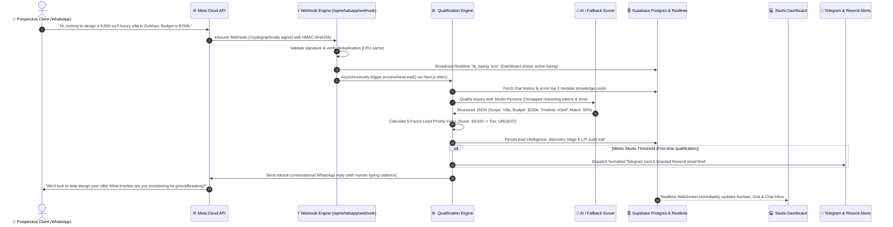
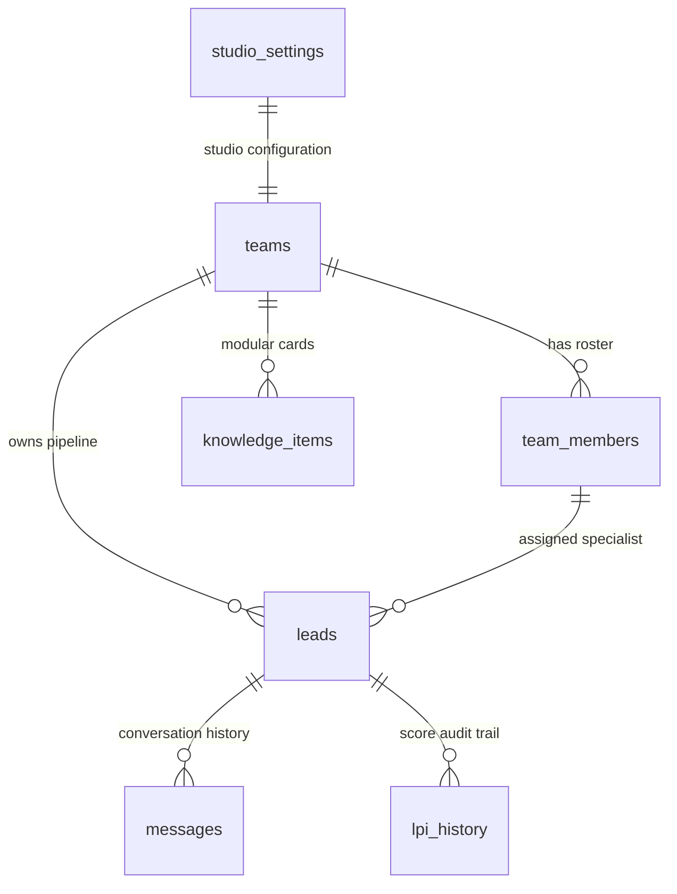

# 🏛️ Marketing Machine
> **Autonomous Inbound AI Marketing, Lead Qualification & Real-Time CRM for High-Ticket Architecture & Design Practices**

[](https://nextjs.org/)
[](https://www.typescriptlang.org/)
[](https://supabase.com/)
[](https://developers.facebook.com/)
[](https://azure.microsoft.com/)
[](tests/v2-pipeline-system.test.mjs)

---

## ⚡ The 30-Second Elevator Pitch

High-ticket architectural and design practices routinely lose **$50,000+ commissions** because senior partners are on job sites or in client presentations when prospective developers and property owners message on WhatsApp. Standard CRMs (HubSpot, Salesforce) are designed for cold email blasts and web forms—they cannot hold a natural conversation on WhatsApp, extract nuanced architectural briefs, or evaluate realistic budgets.

**Marketing Machine acts as an autonomous 24/7 AI Studio Director.**
- 💬 **Greets prospective clients instantly** on WhatsApp with a warm, authentic studio voice (never sounds like an automated bot).
- 🔍 **Discovers project scope, budget, and timeline** naturally across multi-turn dialogue.
- 🎯 **Calculates a 5-factor Lead Priority Index (0–100 LPI)**, separating multi-million-dollar commissions from casual tire-kickers.
- 🚨 **Instantly alerts senior partners** via Telegram and branded Resend transactional emails the exact moment a lead qualifies.
- 💻 **Syncs live with an interactive dashboard** (Kanban, spreadsheet, real-time chat, and knowledge manager).

---

## 🚀 Experience It Live (1-Click Judge Access)

Judges, evaluators, and studio owners can explore the entire platform live with active leads, transparent scoring breakdowns, and operational studio tools:

- 🌐 **Live URL**: [https://marketing-machine.vercel.app](https://marketing-machine.vercel.app)
- ⚡ **1-Click Judge Access**: Click **"Sign In"** on the top navigation bar &rarr; select **"⚡ 1-Click Hackathon Judge Login"**.
- 🔑 **Direct Demo Credentials**:
  - **Email**: `demo@archscale.com`
  - **Password**: `Hackathon2026!`

---

## 🎬 A Day in the Life: How an Inbound Lead Flows Through the System

Here is what happens under the hood from the millisecond a high-net-worth client texts at 11:00 PM to the moment an architect takes over:



---

## 🌟 Core Superpowers (Explained for Humans)

### 1. 🧠 Autonomous WhatsApp Discovery Director
- **Speaks as a Human Studio Teammate**: Communicates warmly as a senior consultant representing the practice ("we", "our team"). It never claims to be an AI, bot, or robotic auto-responder.
- **Multi-Turn Contextual Memory**: Retains project scope, budget figures, and timeline preferences across multiple turns without asking the client to repeat themselves.
- **Smart Commercial Steer**: Politely steers prospects away from off-topic trivia or jokes back to their architectural project.
- **Strict Knowledge Anchoring**: Grounded exclusively in your verified studio portfolio. If past chats mentioned old services or unrelated industries, the AI completely ignores them and anchors strictly to the verified catalog.

---

### 2. 🎯 Dual-Metric Scoring: Why Two Scores Are Better Than One
Most CRMs make the mistake of assigning a single arbitrary score. Marketing Machine separates **Service Alignment** from **Commercial Buying Power**:

| Metric | What It Measures | Range | Question It Answers |
| :--- | :--- | :---: | :--- |
| **AI Qualification Match** | **Semantic Service Fit** | `0 – 100%` | *"Is what this client asking for something our studio actually designs?"* |
| **Lead Priority Index (LPI)** | **Total Commercial Value** | `0 – 100 pts` | *"How urgent and valuable is this deal to our partners right now?"* |

#### Why This Separation Protects Your Pipeline:
> [!TIP]
> **Real-World Example**: A high-net-worth developer asks to design a luxury commercial pavilion. They haven't stated their budget yet.
> - **In a dumb CRM**: They receive a low score and get ignored as a tire-kicker.
> - **In Marketing Machine**: Their **AI Match is 95%** (perfect fit) and their **LPI is 64 [HIGH]**. The AI continues warm discovery to naturally extract their budget depth without alienating the client!

---

### 3. 🛡️ Zero-Failure Heuristic Fallback Engine
If Azure OpenAI or OpenAI experiences an outage, high queue latency, or rate limits, **your business never drops a lead**.
- An in-memory sub-millisecond regex & NLP engine takes over instantly.
- It parses budgets (`$150k`, `100,000`, `$2.5M`, `50k usd`, `210`), detects timeline urgency, and scores the lead with 0 external API dependencies.
- **Context-Aware Active Chat Replies**: Never repeats generic greetings in the middle of a live conversation. If a client replies with just a number (`"210"`) or an affirmation (`"Yes"`), the fallback acknowledges it contextually.

---

### 4. 📚 Bidirectional Modular Knowledge Base
Knowledge in Marketing Machine isn't a buried PDF. Studio owners can manage their knowledge in two seamless ways:
- **Raw Markdown Mode**: Paste or edit your entire company overview, catalog, fee tiers, and FAQs in standard Markdown.
- **Modular Cards Mode**: View, filter, add, edit, or delete individual cards partitioned into 5 clean categories:
  - 🏢 **`overview`**: Studio history, principal bios, office locations, hours.
  - 📐 **`catalog`**: Architectural typologies, packages, itemized offerings.
  - 💳 **`pricing_delivery`**: Retainers, milestone fee structures, project timelines.
  - 📋 **`policies`**: Revisions, site consultation policies, cancellation terms.
  - ❓ **`faq`**: Common client questions & support details.
- **Automatic Bidirectional Sync**:
  - Editing Raw Markdown automatically parses and updates modular cards.
  - Editing Modular Cards reassembles the canonical Markdown document.
  - **The Empty Raw Text Rule**: Clearing raw text completely flushes all modular cards to guarantee zero phantom data or hallucinated cards.
- **Intelligent RAG-Lite Retrieval**: Tokenizes client inquiries, filters stop words, normalizes common typos (`sampoo` ➔ `shampoo`, `lipstic` ➔ `lipstick`, `fon` ➔ `phone`), and retrieves only the top 2 relevant cards (~450 tokens), saving **75–85% on prompt tokens**.

---

### 5. ⚡ Uncapped AI Generation & Unlimited Reasoning Time
- **Zero Completion Token Caps**: Advanced reasoning models (Azure `gpt-5-nano`, `o1`, `o3`) need thinking room. Artificial limits (`max_completion_tokens: 300`) cut responses off mid-sentence. Marketing Machine uncaps completion tokens so the model can reason thoroughly and output complete structured JSON.
- **Zero Client-Side Timeouts**: Removed artificial `AbortController` timers so latency spikes on AI providers never cause false cancellations.
- **Lean Input Tokens**: Keeps prompt overhead minimal (~350–550 tokens) through smart history pruning (last 4 turns) and targeted knowledge cards.

---

### 6. 🔄 Automatic Lead Revival & Continuity
- If a client previously opted out (`"Not interested right now"`), the system respectfully sets their status to `lost` and disables auto-replies.
- **The Magic**: If that same client texts back weeks later with a new project inquiry (`"Hi, we are ready to build now"`), the pipeline **automatically revives them**, restores active status (`contacted` or `qualified`), re-enables automation, and replies instantly.

---

### 7. 💬 Real-Time Typing Indicators & Human Cadence
- **Continuous AI Typing in Dashboard**: When an inquiry arrives, the background worker broadcasts an `ai_typing` event over Supabase Realtime. Dashboard operators see a persistent, live typing bubble for the exact duration the AI is reasoning.
- **Natural WhatsApp Cadence**: Outbound WhatsApp replies include a simulated human typing delay (`Math.min(4000, Math.max(2500, replyText.length * 20))`), so the client sees *"typing..."* on their phone rather than an unnerving 0.1s robotic blast.

---

### 8. ⚙️ Zero-Code BYOK (Bring Your Own Keys) Settings Center
Studio directors can manage their entire tech stack from a clean UI without touching code or `.env` files:
- **Meta WhatsApp**: Phone Number ID, Access Token, WABA ID, Webhook Verify Token, App Secret.
- **AI Provider**: 1-Click toggle between **Azure OpenAI** and **OpenAI Direct**, with endpoint, deployment, and API version inputs.
- **Live Connection Diagnostics**: 1-Click **"Test Connection"** buttons for AI, WhatsApp, Telegram, and Resend with instant ping feedback.
- **Granular 4-Way Health Matrix**: Independent real-time latency probes for Postgres DB, AI Provider, Meta Graph API, and Telegram Bot.

---

### 9. 🤝 Scope-to-Specialist Routing & Team Workspaces
- **Role-Based Collaboration**: Invite team members as `Owner`, `Partner`, or `Specialist` with custom 8-character invite links (`/join/[code]`).
- **Automated Specialist Assignment**: When an inquiry is qualified, the system matches the extracted project typology (e.g., *High-End Residential*, *Commercial*, *Interior FF&E*) against partners' registered specialties and auto-assigns the lead.

---

### 10. ⏱️ Meta 24-Hour Policy Compliance & 1-Click Follow-Up Sweeps
- **Meta Policy Protection**: Meta forbids free-form messages to WhatsApp users outside a 24-hour window from their last message. Marketing Machine checks the elapsed hours:
  - **Inside 24 Hours**: Sends personalized AI follow-ups.
  - **Outside 24 Hours**: Automatically switches to pre-approved Meta HSM templates (`lead_reengagement`) to protect your WhatsApp Business Account from suspensions.
- **1-Click Follow-Up Sweep**: Trigger a studio-wide re-engagement sweep on demand from the dashboard header.

---

## 💻 The 9 Dashboard Views (Studio Control Center)

```
Studio Control Center
├── 1. Kanban Pipeline     ── Visual drag-and-drop lead progression (6 stages)
├── 2. High-Density Sheet ── Excel-like keyboard grid with inline stage pills
├── 3. Pipeline Triage     ── Lead list with transparent 5-bar LPI score breakdown
├── 4. Real-Time Chat      ── WhatsApp messenger with live typing & 15-min message edit
├── 5. Knowledge Studio    ── Split Markdown editor & modular cards manager
├── 6. Team & Routing      ── Specialist roster, invite links & auto-assignment rules
├── 7. Analytics Hub       ── Conversion funnels, LPI distribution & revenue forecast
├── 8. Settings Center     ── BYOK integrations, API credentials & scoring sliders
└── 9. Platform Health     ── 4-way diagnostic matrix & multi-tenant monitor
```

<details>
<summary><b>🔍 Click to expand detailed descriptions of all 9 dashboard views</b></summary>

1. **Kanban View (`KanbanView.tsx`)**:
   - 6 Drag-and-Drop Columns: `New` &rarr; `Contacted` &rarr; `Qualified` &rarr; `Consultation Booked` &rarr; `Won` &rarr; `Archived`.
   - Priority badges (`🚨 Urgent`, `🔥 High`, `⚡ Medium`, `Low`) and 1-click status advance buttons.
2. **Sheet View (`SheetView.tsx`)**:
   - Dense spreadsheet grid for executives. Inline status dropdowns, search, column sorting, and always-visible horizontal scrollbars.
3. **Pipeline View (`PipelineView.tsx`)**:
   - Table view with relative timestamps. Clicking any lead opens the **Lead Priority Index Modal** with a transparent 5-bar scoring breakdown.
4. **Chat Inbox (`ChatInbox.tsx`)**:
   - WhatsApp-style chat viewer with inbound/outbound styling, persistent AI typing animation, 15-minute outbound message editing, message deletion, and lead dossier sidebar.
5. **Knowledge View (`KnowledgeView.tsx`)**:
   - Dual-pane Markdown editor and modular cards manager with category filters and live prompt token estimation.
6. **Team View (`TeamView.tsx`)**:
   - Roster of partners and specialists with active statuses, 8-character invite code generator, and typology routing matrix.
7. **Analytics View (`AnalyticsView.tsx`)**:
   - Commercial conversion funnel metrics, LPI score distribution bar charts, and lead acquisition velocity.
8. **Settings View (`SettingsView.tsx`)**:
   - Integration tabs for Meta WhatsApp, AI Provider, Resend Email, and Telegram Bot, with 1-click connection testers, threshold slider, and masked token protection.
9. **Platform View (`PlatformView.tsx`)**:
   - Multi-tenant management console with granular 4-way health latency matrix.
</details>

---

## 🧠 Under the Hood: How the Math & AI Work

### 1. The 5-Factor Lead Priority Index (0–100 LPI)

$$\text{LPI} = \text{QualFit} (40\%) + \text{BudgetDepth} (25\%) + \text{ScopeClarity} (15\%) + \text{TimelineUrgency} (10\%) + \text{LoyaltyBonus} (10\%)$$

| Scoring Factor | Default Weight | How Points Are Earned | Maximum Points |
| :--- | :---: | :--- | :---: |
| **1. Semantic Match** | **40%** | `(AI Match% / 100) * 40` (evaluates service & typology fit) | **40 pts** |
| **2. Budget Depth** | **25%** | $\ge \$100\text{k}$ (25 pts), $\ge \$20\text{k}$ (20 pts), $\ge \$5\text{k}$ (15 pts), under \$5k (10 pts), mentioned (7.5 pts) | **25 pts** |
| **3. Scope Clarity** | **15%** | Stated architectural typology (e.g. *Residential Villa*, *Commercial Pavilion*) | **15 pts** |
| **4. Timeline Urgency**| **10%** | Immediate / ASAP / weeks (10 pts), months / soon (6 pts), unspecified (3 pts) | **10 pts** |
| **5. VIP Client Loyalty**| **10%**| Returning client relationship bonus | **10 pts** |
| **Total Possible LPI**| **100%**| **Combined Multi-Factor Commercial Priority Score** | **0 – 100 pts** |

- **Threshold Auto-Promotion**: When $\text{LPI} \ge \text{studio threshold}$ (default: `70`), the lead is automatically upgraded from `Contacted` to **`Qualified`**.
- **Alert Deduplication**: Alerts fire **only on the initial transition** to `Qualified` (`justQualified`), preventing alert spam during active conversations.

---

### 2. Regular Expression Budget Parsing Specs

The in-memory regex engine in `fallbackScorer.ts` normalizes diverse budget expressions into clean currency numbers:

| Client Input Sample | Parsing Mechanism | Normalized Budget | Raw Integer |
| :--- | :--- | :---: | :---: |
| **"$150k" / "$150,000"** | Explicit currency symbol + amount | `"$150K"` | `150,000` |
| **"budget is 2.5m"** | Keyword "budget" + million abbreviation | `"$2.5M"` | `2,500,000` |
| **"1.5 billion"** | Magnitude word parsing | `"$1.5B"` | `1,500,000,000` |
| **"100,000 usd"** | Comma-formatted numbers with currency suffix | `"$100,000"` | `100,000` |
| **"210" (standalone)** | Conversational short number pattern | `"210"` | `210` |

---

## 🛠️ Technology Stack

| Component | Technology | Role in Marketing Machine |
| :--- | :--- | :--- |
| **Frontend** | **Next.js 16.3.4 (App Router)** | React 19 Server & Client Components, Webpack optimization |
| **Styling & UI** | **Tailwind CSS v4, Lucide Icons** | High-end studio aesthetic with responsive dark mode |
| **Database & Realtime** | **Supabase (PostgreSQL 15)** | Relational persistence, Row-Level Security, Realtime WebSockets |
| **Primary AI Inference**| **Azure OpenAI / OpenAI Direct** | GPT-5-nano / GPT-4o-mini structured qualification & persona |
| **Fallback AI Engine** | **In-Memory Heuristic NLP Engine** | Sub-millisecond offline regex & keyword scoring |
| **Knowledge Engine** | **Modular Categorical RAG-Lite** | Typo normalization, stopword filter & dynamic top-2 ranking |
| **Messaging Channel** | **Meta WhatsApp Cloud API v21.0** | Inbound webhooks, outbound dispatch & typing presence |
| **Team Notifications** | **Telegram Bot API & Resend** | Real-time group alert cards and HTML transactional emails |
| **Test Suite** | **Node.js Native Test Runner** | 45 comprehensive automated unit and integration tests |

---

## ⚡ Quick Start: Run Locally in 3 Steps

### Prerequisites
- **Node.js**: v18.17.0+ or v20.0.0+
- **Supabase**: Free or paid Supabase project

### 1. Clone & Install
```bash
git clone https://github.com/your-username/marketing-machine.git
cd "Marketing Machine"
npm install
```

### 2. Configure Environment
```bash
cp .env.example .env.local
```
Fill in your Supabase credentials in `.env.local`:
```env
NEXT_PUBLIC_SUPABASE_URL=https://your-project.supabase.co
NEXT_PUBLIC_SUPABASE_ANON_KEY=your-anon-key
SUPABASE_SERVICE_ROLE_KEY=your-service-role-key
```
*(Optional: You can configure AI, Meta, Resend, and Telegram keys here or directly in the Dashboard Settings UI)*.

### 3. Run Automated Tests & Start Server
```bash
npm test        # Runs all 45 automated integration test suites
npm run dev     # Starts Next.js development server at http://localhost:3000
```

---

## 🗄️ Database Architecture & Entity Relationships

Marketing Machine uses 7 dedicated PostgreSQL tables in Supabase with full Row-Level Security:



<details>
<summary><b>📋 Click to expand full Database Schema & Data Dictionary (7 Tables)</b></summary>

#### 1. `leads`
- `id` (UUID PK, default gen_random_uuid())
- `team_id` (UUID FK teams)
- `name` (TEXT NOT NULL) — Client display name
- `contact` (TEXT NOT NULL) — E.164 phone or email
- `source` (TEXT NOT NULL) — `whatsapp`, `web`, `messenger`, `referral`, `manual`
- `status` (TEXT DEFAULT 'new') — `new`, `contacted`, `qualified`, `consultation_booked`, `converted`, `lost`, `dead`
- `score` (INTEGER DEFAULT 0) — Lead Priority Index (0–100)
- `qualification_percentage` (INTEGER DEFAULT 0) — AI semantic match (0–100%)
- `priority_tier` (TEXT DEFAULT 'medium') — `urgent`, `high`, `medium`, `low`
- `discovery_stage` (TEXT DEFAULT 'discovery') — `discovery`, `needs_scope`, `needs_budget`, `needs_timeline`, `confirmed`, `escorted`, `lost`
- `budget_mentioned` (BOOLEAN DEFAULT false)
- `estimated_budget` (TEXT) — Normalized budget
- `project_type` (TEXT) — Extracted typology
- `timeline` (TEXT) — Extracted schedule
- `ai_summary` (TEXT) — Executive dashboard brief
- `suggested_reply` (TEXT) — AI suggested reply
- `is_returning_client` (BOOLEAN DEFAULT false)
- `automation_enabled` (BOOLEAN DEFAULT true)
- `assigned_to` (UUID FK team_members)
- `last_contacted_at` (TIMESTAMPTZ DEFAULT now())
- `created_at` (TIMESTAMPTZ DEFAULT now())

#### 2. `messages`
- `id` (UUID PK)
- `lead_id` (UUID FK leads, ON DELETE CASCADE)
- `direction` (TEXT NOT NULL) — `inbound` | `outbound`
- `content` (TEXT NOT NULL)
- `channel` (TEXT DEFAULT 'whatsapp') — `whatsapp`, `web`, `email`, `sms`
- `whatsapp_message_id` (TEXT, indexed) — Used for deduplication
- `is_edited` (BOOLEAN DEFAULT false)
- `sent_at` (TIMESTAMPTZ DEFAULT now())

#### 3. `studio_settings`
- `id` (TEXT PK DEFAULT 'default')
- `auto_reply_enabled` (BOOLEAN DEFAULT true)
- `email_alerts_enabled` (BOOLEAN DEFAULT true)
- `discovery_interviewer_enabled` (BOOLEAN DEFAULT true)
- `returning_client_mode` (TEXT DEFAULT 'draft_only')
- `time_format` (TEXT DEFAULT '12h') — `12h` | `24h`
- `timezone` (TEXT DEFAULT 'auto')
- `knowledge_base` (TEXT) — Raw Markdown
- `followup_interval_hours` (INTEGER DEFAULT 24)
- `qualification_threshold` (INTEGER DEFAULT 70)
- `weight_qualification` (INTEGER DEFAULT 40)
- `weight_budget` (INTEGER DEFAULT 25)
- `weight_scope` (INTEGER DEFAULT 15)
- `weight_timeline` (INTEGER DEFAULT 10)
- `weight_returning` (INTEGER DEFAULT 10)
- `whatsapp_phone_number_id` (TEXT)
- `whatsapp_access_token` (TEXT)
- `whatsapp_business_account_id` (TEXT)
- `meta_app_secret` (TEXT) — HMAC validation key
- `whatsapp_verify_token` (TEXT)
- `whatsapp_followup_template_name` (TEXT DEFAULT 'lead_reengagement')
- `ai_provider` (TEXT DEFAULT 'azure') — `azure` | `openai`
- `ai_api_key` (TEXT)
- `ai_endpoint` (TEXT)
- `ai_deployment_name` (TEXT DEFAULT 'gpt-5-nano')
- `ai_api_version` (TEXT DEFAULT '2024-12-01-preview')
- `resend_api_key` (TEXT)
- `notification_email` (TEXT)
- `telegram_bot_token` (TEXT)
- `telegram_chat_id` (TEXT)
- `telegram_enabled` (BOOLEAN DEFAULT false)

#### 4. `knowledge_items`
- `id` (UUID PK)
- `studio_id` (TEXT DEFAULT 'default')
- `category` (TEXT) — `overview`, `catalog`, `pricing_delivery`, `policies`, `faq`
- `title` (TEXT NOT NULL)
- `content` (TEXT NOT NULL)
- `tags` (TEXT[] GIN indexed)
- `is_active` (BOOLEAN DEFAULT true)
- `created_at`, `updated_at` (TIMESTAMPTZ)

#### 5. `lpi_history`
- `id` (UUID PK)
- `lead_id` (UUID FK leads)
- `score` (INTEGER NOT NULL)
- `previous_score` (INTEGER)
- `priority_tier` (TEXT)
- `inputs` (JSONB)
- `scored_at` (TIMESTAMPTZ DEFAULT now())

#### 6. `teams` & 7. `team_members`
- `teams`: `id`, `name`, `owner_id`, `invite_code` (UNIQUE 8-char), `routing_rules` (JSONB).
- `team_members`: `id`, `team_id`, `user_id`, `name`, `email`, `contact`, `role`, `specialty`, `status`.
</details>

---

## 🔌 Complete REST API Reference (All 15 Endpoints)

<details>
<summary><b>🌐 Click to expand complete REST API Endpoints Specification</b></summary>

| Method | Endpoint | Description | Key Headers / Params |
| :--- | :--- | :--- | :--- |
| **POST** | `/api/whatsapp/webhook` | Ingests Meta WhatsApp Cloud API webhooks | `x-hub-signature-256` (HMAC SHA-256) |
| **GET** | `/api/whatsapp/webhook` | Responds to Meta verification challenge | `hub.mode`, `hub.verify_token`, `hub.challenge` |
| **GET** | `/api/cron/followup` | Automated follow-up sweep (Cron) | `Authorization: Bearer <CRON_SECRET>` |
| **POST** | `/api/cron/followup` | Manual 1-click follow-up sweep | Body: `{"leadId":"<uuid>"}` or `{"action":"sweep"}` |
| **GET** | `/api/health` | 4-Way health matrix (DB, AI, Meta, TG) | None |
| **POST** | `/api/integrations/test` | 1-Click connection diagnostics | Body: `{"target":"ai"|"whatsapp"|"telegram"|"resend", "credentials":{...}}` |
| **GET** | `/api/knowledge` | Retrieve modular knowledge items | Query: `studioId`, `category`, `query` |
| **POST** | `/api/knowledge` | Create new modular knowledge card | Body: `{"category":"catalog","title":"...","content":"..."}` |
| **PUT** | `/api/knowledge` | Update card or save raw markdown | Body: `{"id":"<uuid>","title":"..."}` or `{"rawText":"..."}` |
| **DELETE**| `/api/knowledge` | Delete modular knowledge card | Query: `id=<uuid>` |
| **GET** | `/api/leads` | Fetch leads with search & filters | Query: `status`, `tier`, `search`, `limit`, `offset` |
| **PATCH** | `/api/leads` | Update lead status or assign specialist | Body: `{"id":"<uuid>","status":"qualified","assigned_to":"..."}` |
| **DELETE**| `/api/leads` | Delete lead record | Query: `id=<uuid>` |
| **GET** | `/api/messages` | Fetch conversation messages for lead | Query: `leadId=<uuid>` |
| **POST** | `/api/messages` | Send new outbound chat message | Body: `{"leadId":"<uuid>","content":"...","channel":"whatsapp"}` |
| **PATCH** | `/api/messages` | Edit message (15-min limit) | Body: `{"id":"<uuid>","content":"..."}` |
| **DELETE**| `/api/messages` | Delete message & recompute snippet | Query: `id=<uuid>` |
| **POST** | `/api/messages/typing` | Broadcast realtime typing presence | Body: `{"leadId":"<uuid>","isTyping":true}` |
| **GET** | `/api/settings` | Fetch studio settings (masked keys) | None |
| **PUT** | `/api/settings` | Save updated settings & BYOK keys | Body: Full settings object |
| **GET** | `/api/teams` | Fetch team members & routing rules | None |
| **POST** | `/api/teams/invite` | Generate 8-char workspace invite link | None &rarr; Returns `{"inviteCode":"a8b2c4d6","inviteUrl":"..."}` |
| **POST** | `/api/teams/join` | Join workspace via invite code | Body: `{"inviteCode":"a8b2c4d6"}` |
| **POST** | `/api/telegram/test` | Send direct Telegram test ping | Body: `{"botToken":"...","chatId":"..."}` |
| **POST** | `/api/auth/demo` | 1-Click demo/judge authentication | None |
</details>

---

## 📱 Production Meta WhatsApp Setup Checklist

Setting up your production WhatsApp Business Account takes less than 5 minutes:

1. **Meta Developer Portal**: Create a **Business App** at [developers.facebook.com](https://developers.facebook.com/) and add the **WhatsApp** product.
2. **Webhook Callback**:
   - URL: `https://<your-domain>.vercel.app/api/whatsapp/webhook`
   - Verify Token: Enter any secure token (e.g. `archscale_verify_2026`).
   - Copy this Verify Token into your Dashboard &rarr; **Settings** &rarr; **Meta Webhook Verify Token**.
   - In Meta portal, click **Verify and Save**, then subscribe to the **`messages`** field.
3. **System User Token**:
   - In **Meta Business Settings** &rarr; **System Users**, create an Admin System User.
   - Generate a permanent token with permissions: `whatsapp_business_messaging` and `whatsapp_business_management`.
   - Paste it into **Meta WhatsApp Access Token** in Studio Settings.
4. **App Secret (HMAC Verification)**:
   - In Meta App Settings &rarr; Basic, copy your **App Secret**.
   - Paste it into **Meta App Secret** in Studio Settings. Inbound webhooks are now cryptographically verified via `x-hub-signature-256`.

---

## 🛡️ Enterprise Security & Operational Troubleshooting

### Security Safeguards
- **HMAC-SHA256 Payload Verification**: Every inbound byte from Meta is checked against your `META_APP_SECRET`. Unsigned or tampered payloads are immediately rejected with HTTP 401.
- **LRU In-Memory Deduplication**: High-speed cache prevents duplicate message processing during network retries.
- **Dynamic Credential Precedence**: Studio settings configured via the UI take precedence over environment variables, allowing multi-tenant isolation with zero redeployments.

### Quick Troubleshooting Matrix

| Symptom | Root Cause | Fix |
| :--- | :--- | :--- |
| **Webhook 401 Unauthorized** | `META_APP_SECRET` mismatch between Meta portal and Dashboard Settings. | Re-copy App Secret from Meta App &rarr; Basic and paste into Studio Settings. |
| **Webhook 403 Verification Fail** | `whatsapp_verify_token` in Settings doesn't match Meta verify token. | Ensure exact case-sensitive string match in both portals. |
| **Follow-Up 422 Window Error** | Message attempted outside Meta 24-hour window without an approved HSM template. | Register template `lead_reengagement` in WhatsApp Manager or wait for client reply. |
| **AI Provider Latency Spikes** | Provider temporary queue delay. | Zero-failure heuristic scorer automatically scores the lead with 0 downtime. |

---

## 👥 Built for Studio Excellence

Developed with ❤️ to empower architecture, design, and creative studios to capture high-value revenue, protect principals' billable hours, and deliver a world-class first impression to every client.
