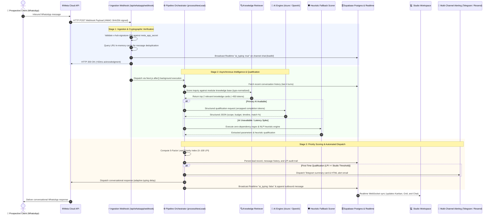
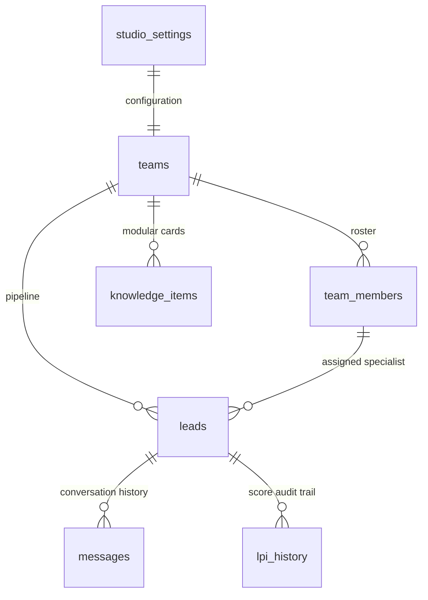

# 🏛️ Marketing Machine
> **Autonomous Inbound AI Marketing, Lead Qualification & Real-Time CRM for High-Ticket Architecture & Design Practices**

[](https://nextjs.org/)
[](https://www.typescriptlang.org/)
[](https://supabase.com/)
[](https://developers.facebook.com/)
[](https://azure.microsoft.com/)
[](tests/v2-pipeline-system.test.mjs)

---

## 📌 System Overview

High-ticket architectural and design practices operate in a high-stakes commercial environment where individual commissions routinely range from **$50,000 to $500,000+**. In this market, inbound prospective clients—property developers, commercial operators, and luxury homeowners—predominantly initiate contact via WhatsApp. Inquiries frequently arrive outside standard studio hours or while senior partners are conducting site inspections or client presentations.

Conventional CRM systems (e.g., Salesforce, HubSpot) rely on static web forms and cold email cadences. They lack the conversational intelligence required to conduct multi-turn WhatsApp discovery, extract nuanced architectural briefs, or evaluate client commercial viability in real time.

**Marketing Machine** provides an autonomous, real-time inbound intelligence infrastructure:
- **Instant Conversational Ingestion**: Engages prospects immediately on WhatsApp with an authentic studio persona, capturing project scope, budget depth, and timeline constraints without robotic friction.
- **Dual-Metric Evaluation**: Computes both semantic service alignment (AI Match: 0–100%) and a commercial **Lead Priority Index (LPI: 0–100)** to distinguish high-value commissions from low-intent inquiries.
- **Sub-Second Multi-Channel Dispatch**: Notifies studio principals via Telegram broadcast cards and branded Resend transactional emails the instant an inquiry meets qualification thresholds.
- **Live Collaborative Control Center**: Synchronizes conversations and pipeline states across drag-and-drop Kanban, high-density spreadsheets, live WhatsApp chat inboxes, and modular knowledge bases via Supabase Realtime WebSockets.

---

## 🚀 Live Demonstration (Evaluation Access)

Evaluators and developers can access the hosted staging environment with pre-configured studio workflows, active pipelines, and live diagnostics:

- **Deployment URL**: [https://marketing-machine.vercel.app](https://marketing-machine.vercel.app)
- **1-Click Authentication**: Navigate to **Sign In** in the top navigation bar &rarr; select **"⚡ 1-Click Hackathon Judge Login"**.
- **Direct Credentials**:
  - **Email**: `demo@archscale.com`
  - **Password**: `Hackathon2026!`

---

## 🏗️ End-to-End System Architecture

The following sequence diagram outlines the end-to-end execution lifecycle of an inbound inquiry—from cryptographic webhook ingestion to background reasoning, priority scoring, automated notification, and real-time frontend synchronization:



---

## ⚙️ Core System Capabilities & Design Innovations

### 1. Conversational Discovery & Contextual Memory
- **Teammate Persona Grounding**: Operates as a senior consultant representing the practice rather than an automated bot, maintaining a collaborative and professional studio tone.
- **Multi-Turn Context Retention**: Accumulates project typology, budget parameters, and scheduling preferences across dialogue turns without prompting the client for redundant inputs.
- **Commercial Steering**: Automatically pivots off-topic or recreational inputs back toward the architectural project brief.
- **Strict Knowledge Anchoring**: Grounded exclusively in verified studio documentation; discards unrelated topics discussed in legacy sessions.

---

### 2. Dual-Metric Qualification Architecture
To avoid the false positives and false negatives inherent in single-score CRM systems, the engine separates **Service Alignment** from **Commercial Priority**:

| Metric | Subsystem | Domain Evaluated | Range | Analytical Purpose |
| :--- | :--- | :--- | :---: | :--- |
| **Semantic Fit** | LLM Extraction | Typology & Portfolio Compatibility | `0 – 100%` | Determines whether the requested project matches the studio's technical capabilities. |
| **Lead Priority Index (LPI)** | Scoring Engine | Weighted Commercial Viability | `0 – 100 pts` | Evaluates overall business value based on budget, scope clarity, timeline, and client history. |

#### Architectural Rationale:
A prospective developer requesting a 10,000 sq ft boutique commercial project may not provide a budget figure in the initial message. A naive scoring model would penalize the lead as low priority. In Marketing Machine, the lead receives a **95% Semantic Match** and an initial **LPI of 64 [HIGH]**, prompting the system to sustain discovery and extract budget parameters without premature disqualification.

---

### 3. Zero-Failure Heuristic Fallback Engine
To safeguard against upstream AI provider outages, regional network partitions, or transient rate limits, the system incorporates an in-memory, deterministic fallback engine:
- **Zero External Dependencies**: Operates entirely in-memory using optimized regular expressions and domain heuristics.
- **Comprehensive Numeric Extraction**: Normalizes varied financial expressions (e.g., `$150k`, `100,000`, `$2.5M`, `50k usd`, standalone numeric values such as `210`).
- **Context-Aware Dialogue Continuity**: Checks conversation state before generating responses; prevents redundant greetings during ongoing exchanges and directly acknowledges numeric or affirmative inputs.

---

### 4. Bidirectional Modular Knowledge Base
Studio knowledge is decoupled from static documents and managed through a bidirectional synchronization architecture:
- **Dual Representation**:
  - **Raw Markdown Mode**: Supports bulk editing of studio literature, catalogs, fee schedules, and policies.
  - **Modular Cards Mode**: Granular CRUD interface partitioned into 5 categorical domains:
    - `overview`: Practice profile, leadership credentials, studio locations, working hours.
    - `catalog`: Architectural typologies, design packages, itemized offerings.
    - `pricing_delivery`: Retainer structures, milestone schedules, project phases.
    - `policies`: Revision limits, site inspection terms, consultation protocols.
    - `faq`: Standard operational inquiries and compliance details.
- **Bidirectional Invariants**:
  - Updates to Raw Markdown trigger automated categorization and upsert of modular cards.
  - Granular edits to modular cards automatically reconstruct the canonical Markdown document.
  - **The Empty Raw Text Invariant**: Clearing the raw Markdown editor flushes all modular records, ensuring no orphaned or hallucinated cards persist in Postgres.
- **Targeted RAG-Lite Retrieval**: Tokenizes client inquiries, filters stop words, normalizes phonetic typos (e.g., `sampoo` &rarr; `shampoo`, `fon` &rarr; `phone`), and injects only the top 2 relevant cards (~450 tokens), reducing prompt overhead by **75–85%**.

---

### 5. Uncapped AI Generation & Input Token Optimization
- **Uncapped Reasoning Tokens**: Advanced reasoning models (Azure `gpt-5-nano`, `o1`, `o3`) require unrestricted completion headroom. Artificial caps (`max_completion_tokens`) are removed, ensuring comprehensive JSON schema generation without payload truncation.
- **Zero Client-Side Timeouts**: Removed artificial `AbortController` timers to allow models to finish complex multi-step reasoning during upstream queue surges.
- **Optimized Prompt Footprint**: Restricts conversation context to the last 4 turns (`slice(-4)`) and leverages targeted knowledge cards, maintaining a lean prompt footprint (~350–550 tokens) with active telemetry logging.

---

### 6. Dynamic Lead Revival State Machine
- Prospects who decline services are marked with status `lost`, and automated replies are deactivated to respect user preference.
- **Dynamic State Recovery**: If an inbound message from a previously lost contact contains a valid project inquiry, the state machine automatically transitions the lead back to active status (`contacted` or `qualified`), re-enables workflow automation, and responds in real time.

---

### 7. Realtime Presence & Humanized Dispatch Cadence
- **WebSocket Typing Indicators**: Upon message ingestion, the system broadcasts an `ai_typing: true` event over Supabase Realtime. Studio operators observe continuous typing state in the dashboard for the duration of AI processing.
- **Adaptive Dispatch Delay**: Outbound WhatsApp dispatches incorporate a computed latency buffer (`Math.min(4000, Math.max(2500, replyText.length * 20))`), presenting a natural typing presence on the client's mobile device rather than an instant robotic transmission.

---

### 8. Bring Your Own Keys (BYOK) Integration Center
Enables non-technical studio directors to configure infrastructure credentials via an administrative dashboard without modifying environment files or triggering redeployments:
- **Meta WhatsApp Cloud API**: Phone Number ID, Permanent System User Access Token, WABA ID, Webhook Verify Token, App Secret.
- **AI Infrastructure Toggle**: 1-click abstraction between **Azure OpenAI** and **OpenAI Direct** with custom endpoint, deployment name, and API version parameters.
- **Multi-Channel Alerting**: Resend API keys, alert destination emails, Telegram Bot Token, and Group Chat ID.
- **Real-Time Health Diagnostics**: 1-click connectivity verification endpoints with discrete latency probes across Database, AI, Meta Graph API, and Telegram.

---

### 9. Typology-Based Specialist Routing
- **Role-Based Access Control**: Supports workspace collaboration across `Owner`, `Partner`, and `Specialist` roles.
- **Secure Onboarding**: Generates unique, cryptographically random 8-character invite codes (`/join/[code]`).
- **Automated Routing Matrix**: Matches extracted project typologies (e.g., *High-End Residential*, *Commercial Hospitality*, *Historic Preservation*) against specialist credentials and assigns lead ownership upon qualification.

---

### 10. Meta 24-Hour Policy Enforcement
- **Customer Care Window Calculation**: Computes the elapsed duration since the prospect's most recent inbound message.
- **Policy Compliance**:
  - **Inside 24 Hours**: Dispatches tailored, dynamic conversational follow-ups.
  - **Outside 24 Hours**: Automatically restricts transmissions to pre-approved Meta HSM templates (`lead_reengagement`), safeguarding the studio's WhatsApp Business Account from compliance sanctions.

---

## 💻 Studio Control Center & Workspace Views

The dashboard architecture provides 9 specialized interfaces tailored to executive oversight, real-time communication, and administrative control:

```
Studio Control Center
├── 1. Kanban Pipeline     ── Visual drag-and-drop workflow progression (6 stages)
├── 2. High-Density Sheet ── Tabular keyboard grid with inline stage management
├── 3. Pipeline Triage     ── Lead list with transparent 5-bar LPI audit modal
├── 4. Real-Time Chat      ── WhatsApp messenger with live typing & 15-min message edit
├── 5. Knowledge Studio    ── Split Markdown editor & modular cards manager
├── 6. Team & Routing      ── Specialist roster, invite links & auto-assignment rules
├── 7. Analytics Hub       ── Conversion funnels, LPI distribution & revenue forecast
├── 8. Settings Center     ── BYOK integrations, API credentials & scoring parameters
└── 9. Platform Health     ── 4-way diagnostic matrix & multi-tenant monitor
```

| View Component | File Location | Key Capabilities |
| :--- | :--- | :--- |
| **Kanban Pipeline** | `KanbanView.tsx` | Drag-and-drop progression across 6 stages: `New`, `Contacted`, `Qualified`, `Consultation Booked`, `Won`, `Archived`. |
| **High-Density Sheet** | `SheetView.tsx` | Virtualized tabular grid for high-volume lead management, inline stage dropdowns, and search filtering. |
| **Pipeline Triage** | `PipelineView.tsx` | Chronological lead list with quick-filter pills and deep-link access to multi-factor LPI audit modals. |
| **Real-Time Chat** | `ChatInbox.tsx` | WhatsApp-style conversation thread with inbound/outbound styling, real-time typing indicators, and lead dossier sidebar. |
| **Knowledge Studio** | `KnowledgeView.tsx` | Dual-mode knowledge manager featuring raw Markdown editing, structured card management, and token estimation. |
| **Team & Routing** | `TeamView.tsx` | Staff directory, invite code generation, role configuration, and typology-to-specialist routing rules. |
| **Analytics Hub** | `AnalyticsView.tsx` | Conversion funnel tracking, LPI score distribution histograms, and Click-to-WhatsApp link generation. |
| **Settings Center** | `SettingsView.tsx` | BYOK credential management with masked inputs, threshold tuning sliders, and live integration testers. |
| **Platform Health** | `PlatformView.tsx` | Multi-tenant administrative overview with independent latency telemetry across database, AI, and messaging APIs. |

---

## 📐 Mathematical Model: Lead Priority Index (LPI)

The Lead Priority Index is a bounded, multi-factor deterministic scoring model ($0 \le \text{LPI} \le 100$) designed to evaluate commercial viability:

$$\text{LPI} = w_q \cdot S_q + w_b \cdot S_b + w_s \cdot S_s + w_t \cdot S_t + w_r \cdot S_r$$

Where default studio weights satisfy $\sum w_i = 1.0$:
- $w_q = 0.40$ (Semantic Fit Weight)
- $w_b = 0.25$ (Budget Depth Weight)
- $w_s = 0.15$ (Scope Clarity Weight)
- $w_t = 0.10$ (Timeline Urgency Weight)
- $w_r = 0.10$ (Returning Client Loyalty Weight)

### Factor Scoring Specifications:

| Factor | Weight | Scoring Logic & Allocation | Maximum Allocation |
| :--- | :---: | :--- | :---: |
| **Semantic Fit ($S_q$)** | **40%** | $\frac{\text{AI Match Percentage}}{100} \times 40$ | **40 pts** |
| **Budget Depth ($S_b$)** | **25%** | $\ge \$100\text{k}$ (25 pts), $\ge \$20\text{k}$ (20 pts), $\ge \$5\text{k}$ (15 pts), $< \$5\text{k}$ (10 pts), Mentioned without figure (7.5 pts) | **25 pts** |
| **Scope Clarity ($S_s$)** | **15%** | Stated architectural typology (e.g., *Residential Villa*, *Commercial Pavilion*, *Interior Renovation*) | **15 pts** |
| **Timeline Urgency ($S_t$)**| **10%** | Immediate / ASAP / Weeks (10 pts), Within Months / Moderate (6 pts), Unspecified (3 pts) | **10 pts** |
| **Client Loyalty ($S_r$)** | **10%** | Returning verified client bonus | **10 pts** |
| **Total Composite LPI** | **100%** | **Comprehensive Weighted Commercial Viability Score** | **0 – 100 pts** |

- **Threshold Promotion**: When $\text{LPI} \ge \text{qualification\_threshold}$ (default: `70`), the system transitions lead status from `contacted` to `qualified`.
- **Alert Gating**: Dispatch alerts fire exclusively upon initial qualification transition (`justQualified = true`), preventing notification flooding during subsequent conversation turns.

---

### Budget Extraction Specification

The fallback extraction engine normalizes raw conversational text into structured numeric values:

| Input Pattern | Extraction Logic | Normalized Representation | Parsed Integer Value |
| :--- | :--- | :---: | :---: |
| **"$150k" / "$150,000"** | Explicit currency symbol and thousands suffix | `"$150K"` | `150,000` |
| **"budget is 2.5m"** | Context keyword + decimal million suffix | `"$2.5M"` | `2,500,000` |
| **"1.5 billion"** | Explicit textual magnitude parsing | `"$1.5B"` | `1,500,000,000` |
| **"100,000 usd"** | Comma-delimited numeric string with ISO currency code | `"$100,000"` | `100,000` |
| **"210" (standalone)** | Conversational short numeric representation | `"210"` | `210` |

---

## 🛠️ Technology Stack

| Component | Technology | Technical Function |
| :--- | :--- | :--- |
| **Application Framework** | **Next.js 16.3.4 (App Router)** | React 19 Server/Client Components, Route Handlers, `after()` background tasks |
| **Language & Tooling** | **TypeScript 5.0 / Node.js 20+** | Strict static type validation across APIs, database schemas, and workflows |
| **Database & Realtime** | **Supabase (PostgreSQL 15)** | Relational persistence, Row-Level Security, WebSocket Realtime broadcast |
| **Primary Inference** | **Azure OpenAI / OpenAI API** | Structured parameter extraction, schema validation, and persona responses |
| **Fallback Inference** | **Deterministic NLP Scorer** | Sub-millisecond offline regex parsing and rule-based heuristic scoring |
| **Styling Architecture** | **Tailwind CSS v4, Lucide Icons** | Hardware-accelerated transitions, responsive layouts, persistent scrollbars |
| **Messaging Channel** | **Meta WhatsApp Cloud API v21.0** | Webhook event ingestion, message delivery, and typing presence |
| **Team Alerts** | **Telegram Bot API & Resend** | Synchronous webhook alerts, HTML lead digests, and notification emails |
| **Test Framework** | **Node.js Native Test Runner** | 45 automated unit and integration test suites |

---

## 🗄️ Database Architecture & Data Models

The system architecture utilizes 7 dedicated PostgreSQL tables managed via Supabase with relational integrity and Row-Level Security:



<details>
<summary><b>📋 Click to inspect full Database Schema & Data Dictionary (7 Tables)</b></summary>

#### 1. `leads` (Core Entity)
| Column | Type | Constraints | Description |
| :--- | :--- | :--- | :--- |
| `id` | UUID | PRIMARY KEY, gen_random_uuid() | Unique lead record identifier |
| `team_id` | UUID | REFERENCES teams(id) | Associated workspace team identifier |
| `name` | TEXT | NOT NULL | Client contact or business display name |
| `contact` | TEXT | NOT NULL | E.164 formatted phone number or email address |
| `source` | TEXT | NOT NULL | Ingestion source (`whatsapp`, `web`, `messenger`, `referral`) |
| `status` | TEXT | DEFAULT 'new' | Pipeline status: `new`, `contacted`, `qualified`, `consultation_booked`, `converted`, `lost`, `dead` |
| `score` | INTEGER | DEFAULT 0 | Computed Lead Priority Index (0–100) |
| `qualification_percentage` | INTEGER | DEFAULT 0 | AI Semantic Service Fit percentage (0–100) |
| `priority_tier` | TEXT | DEFAULT 'medium' | Priority classification: `urgent`, `high`, `medium`, `low` |
| `discovery_stage` | TEXT | DEFAULT 'discovery' | Discovery lifecycle: `discovery`, `needs_scope`, `needs_budget`, `needs_timeline`, `confirmed`, `escorted`, `lost` |
| `budget_mentioned` | BOOLEAN | DEFAULT false | Boolean flag indicating financial disclosure |
| `estimated_budget` | TEXT | NULLABLE | Normalized textual budget representation |
| `project_type` | TEXT | NULLABLE | Extracted project typology |
| `timeline` | TEXT | NULLABLE | Extracted project delivery timeframe |
| `ai_summary` | TEXT | NULLABLE | Executive synthesis of client inquiry |
| `suggested_reply` | TEXT | NULLABLE | Contextual response drafted by qualification engine |
| `is_returning_client` | BOOLEAN | DEFAULT false | Flag indicating historical client engagement |
| `automation_enabled` | BOOLEAN | DEFAULT true | Enables or disables autonomous outbound dispatches |
| `assigned_to` | UUID | REFERENCES team_members(id) | Assigned specialist or partner identifier |
| `last_contacted_at` | TIMESTAMPTZ | DEFAULT now() | Timestamp of most recent inbound or outbound event |
| `created_at` | TIMESTAMPTZ | DEFAULT now() | Ingestion timestamp |

#### 2. `messages` (Communication Logs)
| Column | Type | Constraints | Description |
| :--- | :--- | :--- | :--- |
| `id` | UUID | PRIMARY KEY | Unique message identifier |
| `lead_id` | UUID | REFERENCES leads(id) ON DELETE CASCADE | Target lead identifier |
| `direction` | TEXT | NOT NULL | Directionality: `inbound` or `outbound` |
| `content` | TEXT | NOT NULL | Raw message text content |
| `channel` | TEXT | DEFAULT 'whatsapp' | Communication channel (`whatsapp`, `web`, `email`, `sms`) |
| `whatsapp_message_id` | TEXT | INDEXED, NULLABLE | Meta WAMID used for deduplication |
| `is_edited` | BOOLEAN | DEFAULT false | Indicates post-dispatch correction |
| `sent_at` | TIMESTAMPTZ | DEFAULT now() | Transmission timestamp |

#### 3. `studio_settings` (BYOK Configuration)
Contains workspace-level API keys, threshold weights, and integration endpoints. Sensitive credentials (`whatsapp_access_token`, `meta_app_secret`, `ai_api_key`, `resend_api_key`, `telegram_bot_token`) are masked in client-facing APIs.

#### 4. `knowledge_items` (Modular Cards)
Stores modular knowledge records categorized by `overview`, `catalog`, `pricing_delivery`, `policies`, and `faq`. Supports PostgreSQL GIN indexed tag arrays for high-speed keyword retrieval.

#### 5. `lpi_history` (Audit Trail)
Maintains an immutable historical record of score transitions, tracking `score`, `previous_score`, `priority_tier`, and input parameters for forensic review.

#### 6. `teams` & 7. `team_members` (Multi-Tenant Access)
Maintains multi-tenant workspace isolation, role-based access control (`Owner`, `Partner`, `Specialist`), and cryptographic 8-character workspace invitation links.
</details>

---

## 🔌 API Route Specifications (All 15 Endpoints)

<details>
<summary><b>🌐 Click to inspect full REST API Reference</b></summary>

| HTTP Method | Route Path | Subsystem | Description & Security Validation |
| :--- | :--- | :--- | :--- |
| **POST** | `/api/whatsapp/webhook` | Webhook Ingestion | Ingests Meta WhatsApp Cloud API webhooks. Validates `x-hub-signature-256` HMAC digest. |
| **GET** | `/api/whatsapp/webhook` | Webhook Challenge | Handles Meta verification challenge (`hub.mode`, `hub.verify_token`, `hub.challenge`). |
| **GET** | `/api/cron/followup` | Background Cron | Automated follow-up sweep. Requires `Authorization: Bearer <CRON_SECRET>`. |
| **POST** | `/api/cron/followup` | Pipeline Action | Manual 1-click re-engagement sweep or targeted single-lead follow-up. |
| **GET** | `/api/health` | Diagnostics | Granular 4-way latency and connectivity probe across Database, AI, Meta, and Telegram. |
| **POST** | `/api/integrations/test` | BYOK Diagnostics | Real-time diagnostic verification of credentials (AI, WhatsApp, Telegram, Resend). |
| **GET** | `/api/knowledge` | Knowledge Base | Query modular knowledge cards by studio identifier, category, or search term. |
| **POST** | `/api/knowledge` | Knowledge Base | Create a new categorized modular knowledge card. |
| **PUT** | `/api/knowledge` | Knowledge Base | Update existing card or save canonical raw Markdown with bidirectional synchronization. |
| **DELETE**| `/api/knowledge` | Knowledge Base | Delete a specific modular knowledge card. |
| **GET** | `/api/leads` | Lead Management | Paginated query for leads with multi-parameter filtering (status, priority tier, query). |
| **PATCH** | `/api/leads` | Lead Management | Mutate lead properties (status transition, specialist assignment, notes). |
| **DELETE**| `/api/leads` | Lead Management | Remove a lead record and cascade delete associated message histories. |
| **GET** | `/api/messages` | Communications | Retrieve chronological conversation logs for a given lead. |
| **POST** | `/api/messages` | Communications | Transmit an outbound message via WhatsApp Graph API and persist to database. |
| **PATCH** | `/api/messages` | Communications | Correct outbound message content within the 15-minute operational edit window. |
| **DELETE**| `/api/messages` | Communications | Delete message record and dynamically recalculate lead conversation preview snippet. |
| **POST** | `/api/messages/typing` | Realtime Presence | Broadcast real-time operator or AI typing presence across Supabase channels. |
| **GET** | `/api/settings` | Administration | Retrieve studio configuration parameters with masked authentication tokens. |
| **PUT** | `/api/settings` | Administration | Persist studio settings, BYOK credentials, and scoring weights. |
| **GET** | `/api/teams` | Team Management | Retrieve team directory, member roles, and typology routing rules. |
| **POST** | `/api/teams/invite` | Team Management | Generate an 8-character invitation token and shareable onboarding link. |
| **POST** | `/api/teams/join` | Team Management | Validate invitation token and associate user account with workspace team. |
| **POST** | `/api/telegram/test` | Diagnostics | Transmit an immediate test notification card to verify Telegram Bot configuration. |
| **POST** | `/api/auth/demo` | Authentication | Authenticates evaluator accounts with 1-click access to staging environment. |
</details>

---

## 🔒 Security, Fault Tolerance & Operational Resilience

### 1. Cryptographic Webhook Authentication
- Inbound payloads from Meta Cloud API are validated using **HMAC-SHA256**.
- The raw request buffer is digested against the studio's stored `meta_app_secret`. Payloads missing signatures or with mismatched digests are rejected with HTTP 401 Unauthorized before execution.

### 2. Idempotent Ingestion & Message Deduplication
- Meta Cloud API operates with an at-least-once delivery guarantee, frequently retrying webhooks during transient network events.
- Ingestion endpoints evaluate incoming WhatsApp Message IDs (`wamid`) against an in-memory LRU cache and PostgreSQL indexes. Duplicate deliveries return HTTP 200 immediately, eliminating duplicate AI reasoning charges or redundant client notifications.

### 3. Credential Hierarchy & Precedence
- The application resolves operational credentials dynamically via a tiered hierarchy:
  1. **Tier 1 (Highest Priority)**: Database-stored credentials from `studio_settings` (enables dynamic BYOK runtime updates without redeployment).
  2. **Tier 2 (Fallback)**: Environment variables defined in `process.env` (ensures default development environment functionality).

### 4. Diagnostic & Troubleshooting Matrix

| Operational Symptom | Root Cause Analysis | Corrective Action |
| :--- | :--- | :--- |
| **Webhook HTTP 401 Unauthorized** | Cryptographic signature validation failure; `meta_app_secret` mismatch. | Re-verify Meta App Secret from Meta Developer Dashboard &rarr; Basic Settings and update in Studio Settings. |
| **Webhook HTTP 403 Forbidden** | Verification token mismatch during challenge negotiation. | Verify that `whatsapp_verify_token` matches the token entered in Meta Webhook configuration. |
| **Dispatch HTTP 422 Window Error** | Outbound transmission attempted outside Meta 24-hour window using free-form text. | Ensure re-engagement templates (`lead_reengagement`) are registered in WhatsApp Business Manager. |
| **AI Provider Rate Limiting / Outage** | Upstream OpenAI or Azure OpenAI throttling or endpoint disruption. | System seamlessly executes the in-memory fallback heuristic engine with zero service degradation. |

---

## 💻 Local Development & Verification

### Prerequisites
- **Node.js**: v18.17.0+ or v20.0.0+
- **npm**: v9.0.0+
- **Supabase Account**: Managed cloud project or local Supabase CLI instance

### 1. Clone & Install Dependencies
```bash
git clone https://github.com/your-username/marketing-machine.git
cd "Marketing Machine"
npm install
```

### 2. Environment Configuration
```bash
cp .env.example .env.local
```

Configure primary database credentials in `.env.local`:
```env
NEXT_PUBLIC_SUPABASE_URL=https://your-project.supabase.co
NEXT_PUBLIC_SUPABASE_ANON_KEY=your-anon-key
SUPABASE_SERVICE_ROLE_KEY=your-service-role-key
```
*(Infrastructure credentials for Azure OpenAI, Meta WhatsApp, Telegram, and Resend can be configured in `.env.local` or managed dynamically via the Dashboard Settings Center).*

### 3. Execute Automated Verification Suite
Run the comprehensive 45-suite native automated test runner:
```bash
npm test
```
*Verification assertions validate fallback heuristics, LPI scoring mathematics, HMAC signature verification, LRU deduplication, Meta 24-hour window compliance, bidirectional knowledge synchronization, and realtime presence invariants.*

### 4. Launch Development Server
```bash
npm run dev
```
Navigate to [http://localhost:3000](http://localhost:3000) to access the application.

---

## 👥 Engineering & Architecture Credits

Architected and developed with an unwavering focus on engineering precision, zero-failure resilience, and commercial impact for premier architectural, design, and creative practices.
