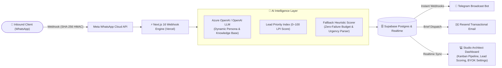

# 🏛️ Marketing Machine
> **Autonomous AI Lead Pipeline & Real-Time CRM for Architecture & Design Studios**

[](https://nextjs.org/)
[](https://www.typescriptlang.org/)
[](https://supabase.com/)
[](https://developers.facebook.com/)
[](https://azure.microsoft.com/)
[](tests/)

---

## 📸 System Architecture & Overview




---

## 🎯 The Problem: Why Architecture Studios Lose High-Value Deals

1. **Lead Leakage**: High-net-worth property developers and homeowners reach out on WhatsApp. In architectural practices, principals and project managers are on job sites or in CAD drafting sessions, taking hours or days to reply.
2. **Architect Burnout**: Senior design architects waste 10–15 hours every week answering inquiries from budget-unrealistic tire-kickers instead of billing design hours.
3. **No Central Qualification**: Traditional generic CRMs (HubSpot, Salesforce) are too bloated and detached from WhatsApp messaging, leading to disconnected chat threads and lost project briefs.

---

## 💡 The Solution: An Autonomous Intelligent Inbound Machine

**Marketing Machine** acts as a 24/7 AI-powered studio director that lives inside your firm's WhatsApp Business line:

- **Conversational Qualification**: Welcomes incoming inquiries with an architectural discovery persona grounded in your studio’s design philosophy, fee structures, and project portfolio.
- **Dynamic Lead Priority Index (LPI)**: Computes a multi-factor 0–100 qualification score evaluating budget depth ($50k–$2M+), scope typology (residential luxury, commercial master plan), timeline urgency, and decision authority.
- **Zero-Failure Fallback Scorer**: If OpenAI experiences an outage or latency spike, a local heuristic regex engine automatically parses budgets and urgency so no high-value client is ever dropped.
- **Real-Time Studio Alerts**: High-priority leads instantly push formatted project briefs to the studio’s private **Telegram group** and dispatch an executive email via **Resend**.
- **Interactive Studio Dashboard**: Real-time pipeline with interactive Kanban board, spreadsheet data view, multi-turn chat inspector, and manual takeover.
- **BYOK (Bring Your Own Keys) Settings Center**: Non-technical studio owners configure their WhatsApp number, AI provider (Azure OpenAI or OpenAI Direct), and qualification threshold without touching code.

---

## 🏗️ The 3-Layer Architecture (Hackathon to Production)


1. **Layer 1: Public GitHub Repository**:
   - Clean, secure codebase with `.gitignore` shielding all environment variables.
   - Comprehensive `.env.example` template with zero hardcoded secrets.
   - 17 automated test suites verifying scoring logic, HMAC authentication, and fallback resilience.
2. **Layer 2: Live Hosted Demo (Vercel + Supabase)**:
   - Zero-friction testing for hackathon judges: Vercel environment fallbacks ensure the app runs immediately on first click with no configuration needed.
   - Real-time WebSocket synchronization across pipeline and analytics views.
3. **Layer 3: Commercial Production Positioning**:
   - Built as a **Turnkey Dedicated Studio Workspace**. Architecture firms handle confidential blueprints and client contracts; our isolated database model guarantees enterprise data privacy and complete sovereignty.

---

## 🔑 Hackathon Judge Live Demo Credentials

Judges can explore the full live platform with pre-configured architectural leads, LPI scores, and test tools:

- **Live URL**: `https://marketing-machine.vercel.app`
- **Method 1 (1-Click)**: Click **"Sign in"** on the top navigation bar and select **"⚡ 1-Click Hackathon Judge Login"**.
- **Method 2 (Email & Password)**:
  - **Email**: `demo@archscale.com`
  - **Password**: `Hackathon2026!`

---

## 🧪 Quickstart & Local Development

### Prerequisites
- Node.js 18+ or 20+
- A Supabase Project (Postgres + Realtime)

### 1. Clone & Install
```bash
git clone https://github.com/your-username/marketing-machine.git
cd "Marketing Machine"
npm install
```

### 2. Configure Environment
```bash
cp .env.example .env.local
```
Populate `.env.local` with your Supabase keys, AI keys, and WhatsApp tokens.

### 3. Run Automated Tests
```bash
npm test
```
*Expected: 17/17 test suites passing.*

### 4. Start Local Development Server
```bash
npm run dev
```
Open [http://localhost:3000/dashboard](http://localhost:3000/dashboard) to explore the studio dashboard.

---

## 🛡️ Enterprise Security & Meta Compliance

- **HMAC-SHA256 Signature Verification**: Inbound WhatsApp webhooks are validated against Meta’s `x-hub-signature-256` header.
- **Meta 24-Hour Messaging Window Compliance**: Automatically checks elapsed time since the client's last inbound message, flagging re-engagement messages for pre-approved Meta HSM templates outside the 24-hour window.
- **Message Deduplication**: In-memory LRU cache eliminates duplicate webhook processing caused by Meta network retries.
- **Dynamic Credential Resolution**: Seamlessly prioritizes database credentials saved by the studio owner over server environment variables.

---

## 👥 Built for Hackathon Excellence
Developed with ❤️ for high-performance architectural practices and design firms worldwide.
