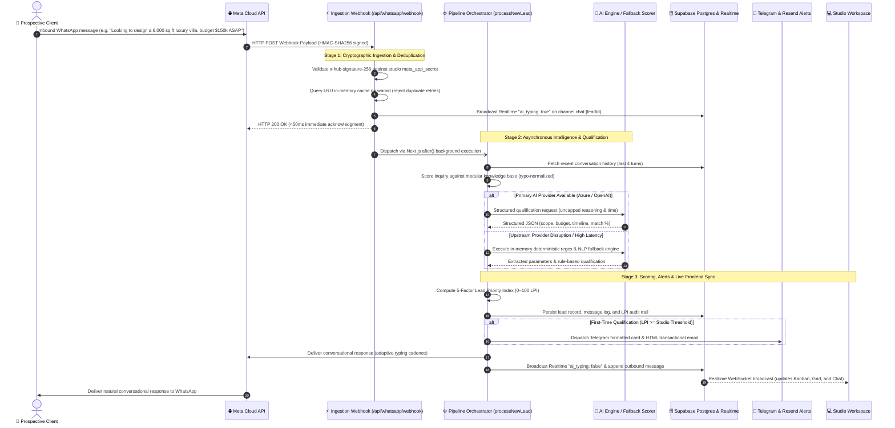

# 🏛️ Marketing Machine
> **Autonomous Inbound AI Marketing, Lead Qualification & Real-Time CRM for High-Ticket Architecture & Design Practices**

[](https://nextjs.org/)
[](https://www.typescriptlang.org/)
[](https://supabase.com/)
[](https://developers.facebook.com/)
[](https://developers.facebook.com/)
[](https://developers.facebook.com/)
[](https://azure.microsoft.com/)
[](https://core.telegram.org/bots/api)
[](tests/v2-pipeline-system.test.mjs)

---

## 📌 Executive & Architectural Overview

High-ticket architectural and design practices operate in a specialized commercial environment where individual commissions routinely range from **$50,000 to $500,000+**. In this market, prospective clients—commercial property developers, luxury homeowners, and corporate buyers—predominantly initiate contact via conversational messaging channels: **WhatsApp, Instagram Direct, and Facebook Messenger**. Inquiries frequently arrive outside standard studio operating hours or while senior partners are conducting site inspections or client presentations.

Conventional CRM systems (e.g., Salesforce, HubSpot) rely on static web forms, manual data entry, and delayed email sequences. They lack the conversational capabilities required to conduct multi-turn omnichannel discovery, extract nuanced architectural briefs, or evaluate client buying power in real time.

**Marketing Machine** delivers an autonomous, real-time inbound intelligence infrastructure:
- **Omnichannel Conversational Ingestion**: Engages prospects immediately across WhatsApp, Instagram Direct DMs, Facebook Messenger, and website landing briefs with an authentic studio persona, capturing project scope, budget depth, and timeline constraints without robotic friction.
- **Dual-Metric Evaluation**: Computes both semantic service alignment (AI Match: 0–100%) and a commercial **Lead Priority Index (LPI: 0–100)** to distinguish high-value commissions from low-intent inquiries.
- **Sub-Second Multi-Channel Dispatch**: Notifies studio principals via Telegram broadcast cards and branded Resend transactional emails the instant an inquiry meets qualification thresholds.
- **Live Collaborative Control Center**: Synchronizes conversations and pipeline states across drag-and-drop Kanban, high-density spreadsheets, live unified chat inboxes, and modular knowledge bases via Supabase Realtime WebSockets.
- **Native Outbound Messaging Engine**: Dispatches direct replies via Meta Graph API v25.0 and WhatsApp Cloud API, supporting operator takeovers and 24-hour customer care window compliance.

---

## 🚀 Live Demonstration (Evaluation Access)

Evaluators and developers can access the hosted staging environment with pre-configured studio workflows, active pipelines, and live diagnostics:

- **Deployment URL**: [https://marketing-machine.vercel.app](https://marketing-machine.vercel.app)
- **1-Click Authentication**: Navigate to **Sign In** in the top navigation bar &rarr; select **"⚡ 1-Click Hackathon Judge Login"**.
- **Direct Credentials**:
  - **Email**: `demo@archscale.com`
  - **Password**: `Hackathon2026!`

---

## 📁 Repository Structure & File System Architecture

The codebase follows the Next.js App Router architecture, cleanly decoupling presentation components, serverless route handlers, domain logic, and data access layers:

```
Marketing Machine/
├── src/
│   ├── app/
│   │   ├── api/
│   │   │   ├── auth/demo/route.ts       # 1-Click judge & evaluator authentication
│   │   │   ├── cron/followup/route.ts   # 24-hr follow-up sweep & Meta window check
│   │   │   ├── health/route.ts          # Granular 7-way health diagnostic matrix (DB, AI, Meta, IG, Msg, TG, Resend)
│   │   │   ├── instagram/webhook/       # Dedicated Instagram Direct inbound webhook intake
│   │   │   │   └── route.ts             # Direct re-export & challenge handler
│   │   │   ├── integrations/test/       # Live connectivity test endpoints (AI, Meta, IG, Msg, TG, Resend)
│   │   │   ├── knowledge/route.ts       # Modular knowledge item CRUD & sync API
│   │   │   ├── leads/route.ts           # REST API for lead management & stage progression
│   │   │   ├── messages/                # Message history, sending & deletion API
│   │   │   │   ├── route.ts             # Inbound/outbound message persistence & multi-channel dispatch
│   │   │   │   └── typing/route.ts      # Realtime typing presence broadcast endpoint
│   │   │   ├── messenger/webhook/       # Dedicated Facebook Messenger inbound webhook intake
│   │   │   │   └── route.ts             # Direct re-export & challenge handler
│   │   │   ├── settings/route.ts        # Studio settings persistence API with masked secrets
│   │   │   ├── teams/                   # Team roster, invitations & join endpoints
│   │   │   │   ├── invite/route.ts      # Cryptographic 8-char invite link generator
│   │   │   │   ├── join/route.ts        # Workspace join validation endpoint
│   │   │   │   └── route.ts             # Team members & routing rules query endpoint
│   │   │   ├── webhook/whatsapp/        # Legacy webhook routing alias
│   │   │   └── whatsapp/webhook/        # Multi-product HMAC-verified Meta webhook endpoint
│   │   ├── dashboard/
│   │   │   ├── page.tsx                 # Master Dashboard orchestrator (state & view routing)
│   │   │   └── platform/page.tsx        # Multi-tenant admin & health monitoring view
│   │   ├── join/[code]/page.tsx         # Public team invitation landing page
│   │   ├── layout.tsx                   # Root HTML layout, font loaders & metadata
│   │   └── page.tsx                     # Landing page & interactive product demo
│   ├── components/
│   │   ├── dashboard/                   # Modular dashboard view subsystem
│   │   │   ├── AnalyticsView.tsx        # Conversion funnels, LPI distribution & link generator
│   │   │   ├── KanbanView.tsx           # Interactive 6-stage drag-and-drop pipeline
│   │   │   ├── KnowledgeView.tsx        # Raw markdown & modular cards editor with token counter
│   │   │   ├── MetricsStrip.tsx         # High-level KPI metric cards strip
│   │   │   ├── PipelineView.tsx         # Unified lead table, channel badges & LPI audit modal
│   │   │   ├── PlatformView.tsx         # Embedded multi-tenant platform health matrix
│   │   │   ├── SettingsView.tsx         # BYOK credentials & integration management center
│   │   │   ├── SheetView.tsx            # High-density spreadsheet data grid with inline stage pills
│   │   │   ├── Sidebar.tsx              # View navigation, studio switcher & status indicators
│   │   │   ├── TeamView.tsx             # Team members & scope-to-specialist routing matrix
│   │   │   ├── index.ts                 # Component exports barrel
│   │   │   ├── modals/
│   │   │   │   ├── KnowledgeItemModal.tsx # Dialog for creating & editing modular knowledge cards
│   │   │   │   └── LeadCaptureModal.tsx   # Dialog for manual lead entry with live AI qualification
│   │   │   └── types.ts                 # Shared TypeScript data models & interface definitions
│   │   ├── AuthModal.tsx                # Email/password authentication dialog
│   │   ├── ChatInbox.tsx                # Omnichannel chat stream (WhatsApp, IG, Messenger) with live typing
│   │   ├── DemoModal.tsx                # Staging demo credentials guide dialog
│   │   ├── FAQ.tsx                      # Landing page FAQ accordion
│   │   ├── Features.tsx                 # Landing page feature showcase
│   │   ├── FinalCTA.tsx                 # Landing page conversion call-to-action
│   │   ├── Footer.tsx                   # Landing page footer
│   │   ├── Hero.tsx                     # Landing page hero with animated visual badge
│   │   ├── HowItWorks.tsx               # Landing page visual workflow section
│   │   ├── Navbar.tsx                   # Top navigation bar with responsive mobile menu
│   │   ├── Pricing.tsx                  # Commercial licensing tiers
│   │   ├── Product.tsx                  # Product interface showcase
│   │   ├── Solutions.tsx                # Architectural practice use cases
│   │   ├── Stats.tsx                    # Commercial performance statistics
│   │   ├── Testimonials.tsx             # Studio director testimonials
│   │   ├── ThemeProvider.tsx            # Dark/light theme context provider
│   │   ├── TrustedBy.tsx                # Client architectural practice logos
│   │   └── WaitlistForm.tsx             # Early access lead capture form
│   ├── hooks/
│   │   └── useInView.ts                 # Intersection observer animation hook
│   └── lib/
│       ├── ai/
│       │   ├── fallbackScorer.ts        # Zero-failure regex & NLP heuristic fallback engine
│       │   ├── knowledgeRetriever.ts    # Keyword extractor, typo normalizer & ranker
│       │   └── qualifyLead.ts           # Uncapped OpenAI/Azure qualification engine
│       ├── email/
│       │   ├── resend.ts                # Resend client wrapper
│       │   └── sendLeadAlert.ts         # Branded studio alert & welcome email templates
│       ├── messages/
│       │   └── messageActions.ts        # Message mutation & deletion logic
│       ├── meta/
│       │   └── messaging.ts             # Meta Graph API v25.0 direct messaging & typing engine
│       ├── telegram/
│       │   └── bot.ts                   # Telegram alert broadcaster & follow-up digests
│       ├── whatsapp/
│       │   ├── api.ts                   # Meta WhatsApp Cloud API client (dispatch & templates)
│       │   └── webhook.ts               # HMAC-SHA256 signature verification & deduplication
│       ├── formatTime.ts                # Date/time formatting helpers
│       ├── settings.ts                  # Settings cache service & multi-tenant accessor
│       ├── settingsResolver.ts          # Tiered credential resolver (DB priority over env)
│       ├── supabase.ts                  # Supabase Admin & client instances
│       └── workflows/
│           └── processNewLead.ts        # Core pipeline orchestration workflow
├── supabase/
│   └── migrations/                      # PostgreSQL relational schema migrations (00001 - 00013)
├── tests/
│   └── v2-pipeline-system.test.mjs      # 48 automated integration test suites
├── public/                              # Static visual assets & diagrams
├── .env.example                         # Environment configuration template
├── package.json                         # Dependencies & project scripts
├── tsconfig.json                        # TypeScript strict compiler configuration
└── README.md                            # Comprehensive technical documentation
```

---

## 🏗️ End-to-End Execution Architecture

The following sequence diagram illustrates the lifecycle of an inbound WhatsApp inquiry. It details the interaction between Meta's Cloud API, cryptographic verification, asynchronous pipeline execution, knowledge retrieval, uncapped AI inference, fallback execution, and real-time frontend replication:



---

## 🔍 How It Works: Step-by-Step Technical Lifecycle

### Step 1: Webhook Ingestion, Cryptographic Verification & Deduplication
1. **Inbound Webhook**: Meta's Graph API transmits a JSON payload to `/api/whatsapp/webhook`.
2. **HMAC-SHA256 Authentication**: The webhook endpoint extracts the `x-hub-signature-256` header and computes a SHA-256 HMAC digest of the raw request buffer using the studio's configured `meta_app_secret`. Payloads with invalid or missing signatures are immediately rejected with HTTP 401 Unauthorized.
3. **In-Memory Message Deduplication**: Meta operates with an at-least-once delivery model. The handler checks the incoming WhatsApp Message ID (`wamid`) against an in-memory LRU cache. Duplicate retry deliveries return HTTP 200 immediately without executing duplicate LLM calls.
4. **Immediate Acknowledgment & Realtime Typing**: The webhook responds with HTTP 200 in under 50ms, broadcasts `ai_typing: true` over Supabase Realtime, and delegates pipeline execution to Next.js background execution (`after()`).

---

### Step 2: Modular Knowledge Ingestion & Intelligent Retrieval
1. **Categorical Knowledge Base**: Studio information is structured across 5 distinct categories: `overview`, `catalog`, `pricing_delivery`, `policies`, and `faq`.
2. **Context-Aware Scoring**: Inbound inquiries are tokenized, stripped of common stop words, and normalized for phonetic misspellings (e.g., `sampoo` &rarr; `shampoo`, `fon` &rarr; `phone`).
3. **Lean Context Injection**: Rather than injecting the entire studio document into the prompt, the retrieval engine extracts only the top 2 highest-scoring cards (~450 tokens), reducing prompt token overhead by **75–85%**.
4. **Strict Knowledge Anchoring**: The AI model is strictly instructed to evaluate inquiries against verified studio offerings, ignoring unlisted services or off-topic topics discussed in previous chat turns.

---

### Step 3: AI Qualification with Uncapped Reasoning
1. **Model Invocation**: Leverages Azure OpenAI (`gpt-5-nano`, `gpt-4o-mini`) or OpenAI Direct.
2. **Uncapped Reasoning Tokens**: Reasoning models require natural completion headroom to reason through multi-step briefs. Artificial `max_completion_tokens` limits are removed, ensuring comprehensive JSON output without truncated payloads.
3. **Zero Client-Side Timeouts**: Client-side `AbortController` timers are eliminated, allowing the model to complete complex qualification during provider queue spikes without premature aborts.
4. **Structured JSON Output**: The model extracts:
   - `project_type` (e.g., *Residential Villa*, *Commercial Hospitality*)
   - `estimated_budget` (normalized string, e.g. *"$150K"*)
   - `timeline` (e.g., *"Immediate / ASAP"*, *"Within 6 months"*)
   - `qualification_percentage` (0–100% semantic fit against studio portfolio)
   - `ai_summary` (concise executive summary for the dashboard)
   - `suggested_reply` (conversational response tailored to studio persona)

---

### Step 4: Zero-Failure Heuristic Fallback Engine
If the primary AI provider experiences an outage, network partition, or rate limit, the system seamlessly routes the inquiry to an in-memory fallback engine:
1. **Zero External Dependencies**: Executes in-memory with sub-millisecond execution time.
2. **Regex Budget Extraction**: Normalizes varied currency syntax (`$150k`, `$2.5M`, `100,000 usd`, standalone `210`).
3. **Scope & Urgency Detection**: Identifies architectural typologies and schedule indicators through curated keyword matrices.
4. **Context-Aware Chat Continuity**: Checks conversation state to ensure returning clients who send single numbers or affirmations receive direct contextual acknowledgments rather than repeated first-turn greetings.

---

### Step 5: The 5-Factor Lead Priority Index (LPI) Math & Promotion
The system calculates a deterministic Lead Priority Index ($0 \le \text{LPI} \le 100$):

$$\text{LPI} = w_q \cdot S_q + w_b \cdot S_b + w_s \cdot S_s + w_t \cdot S_t + w_r \cdot S_r$$

| Factor | Weight | Allocation Criteria | Max Points |
| :--- | :---: | :--- | :---: |
| **Semantic Fit ($S_q$)** | **40%** | $\frac{\text{AI Match Percentage}}{100} \times 40$ | **40 pts** |
| **Budget Depth ($S_b$)** | **25%** | $\ge \$100\text{k}$ (25 pts), $\ge \$20\text{k}$ (20 pts), $\ge \$5\text{k}$ (15 pts), $< \$5\text{k}$ (10 pts), Mentioned without figure (7.5 pts) | **25 pts** |
| **Scope Clarity ($S_s$)** | **15%** | Identified architectural typology | **15 pts** |
| **Timeline Urgency ($S_t$)**| **10%** | Immediate / ASAP / Weeks (10 pts), Moderate (6 pts), Unspecified (3 pts) | **10 pts** |
| **Client Loyalty ($S_r$)** | **10%** | Verified returning client relationship | **10 pts** |
| **Composite LPI Score** | **100%** | **Comprehensive Weighted Commercial Viability Score** | **0 – 100 pts** |

- **Automatic Promotion**: When $\text{LPI} \ge \text{qualification\_threshold}$ (default: `70`), the lead status automatically transitions from `contacted` to `qualified`.
- **Alert Deduplication**: Alerts fire exclusively on the initial qualification transition (`justQualified = true`), preventing alert fatigue during ongoing chats.

---

### Step 6: Autonomous Conversational Reply & Typing Cadence
1. **Studio Persona**: Replies are crafted in the voice of a professional architectural consultant representing the practice.
2. **Adaptive Dispatch Cadence**: Rather than an unnatural sub-second robotic response, the engine introduces an adaptive delay based on response length:
   $$\text{delayMs} = \min(4000, \max(2500, \text{length} \times 20))$$
   This simulates authentic human typing on the client's WhatsApp interface.
3. **Presence Dismissal**: Upon transmission, the engine updates `messages` in Supabase and broadcasts `ai_typing: false`, cleanly removing the typing bubble in the dashboard.

---

### Step 7: Multi-Channel Alerts (Telegram & Resend)
When an inquiry qualifies:
- **Telegram Broadcast Card**: Dispatches an instant markdown summary card to the studio partners' Telegram group with lead name, contact, LPI score, budget, and project typology.
- **Branded Resend HTML Email**: Delivers an executive briefing email formatted with high-contrast priority chips, discovery parameters, and direct dashboard deep-links.

---

### Step 8: Dynamic Lead Revival State Machine
- If a client states they are not interested, the system flags their record as `lost` and deactivates automated replies.
- If that same contact subsequently messages with a new architectural inquiry, the state machine automatically revives the lead: transitions status back to active (`contacted` or `qualified`), re-enables automation, and replies in real time.

---

### Step 9: Meta 24-Hour Messaging Policy Compliance
- **Customer Care Window**: Evaluates the time delta between the current timestamp and the client's last inbound message.
- **Enforcement**:
  - **$\le$ 24 Hours**: Transmits dynamic conversational messages.
  - **$>$ 24 Hours**: Automatically restricts transmissions to pre-approved Meta HSM templates (`lead_reengagement`), safeguarding the studio's WhatsApp Business Account from policy sanctions.

---

### Step 10: Real-Time Event Bus & Bi-directional State Synchronization
The application maintains continuous, zero-latency synchronization across browser tabs and backend workers using **Supabase Realtime WebSockets**:
- **Scoped Channel Architecture**:
  - `chat:${leadId}`: Dedicated communication topic per active lead thread.
  - `public:leads`: Studio-wide channel tracking global pipeline mutations.
  - `public:studio_settings`: Studio-wide channel tracking dynamic configuration updates.
- **Real-Time Broadcast Protocol**:
  - `ai_typing` (`{ leadId, isTyping: boolean, timestamp }`): Dispatched during uncapped AI inference and knowledge retrieval to render an authentic typing indicator to operators before dispatch.
  - `customer_typing` (`{ leadId, isTyping: boolean, timestamp }`): Dispatched by the typing API (`/api/messages/typing`) or inbound webhooks when prospective clients are composing inquiries.
- **Postgres Change Data Capture (CDC)**:
  - `public.leads` (`INSERT`, `UPDATE`): Dynamically updates Kanban card positions, High-Density Sheet rows, and Metrics Strip totals across all active team sessions without browser reloads.
  - `public.messages` (`INSERT`, `UPDATE`, `DELETE`): Instantly streams incoming and outgoing messages, reflects 15-minute message edits in place, and updates thread preview snippets upon deletion.
  - `public.studio_settings` (`UPDATE`): Synchronizes qualification thresholds, time zones, and automation toggles across staff instantly.

---

## 💻 The 9 Studio Control Center Workspace Views

The dashboard architecture provides 9 specialized interfaces tailored to executive oversight, real-time communication, and administrative control:

```
Studio Control Center
├── 1. Kanban Pipeline     ── Visual drag-and-drop workflow progression (6 stages)
├── 2. High-Density Sheet ── Tabular keyboard grid with inline stage management
├── 3. Pipeline Triage     ── Lead list with transparent 5-bar LPI audit modal
├── 4. Real-Time Chat      ── WhatsApp messenger with live typing & 15-min message edit
├── 5. Knowledge Studio    ── Split Markdown editor & modular cards manager
├── 6. Team & Routing      ── Specialist roster, invite links & auto-assignment rules
├── 7. Analytics Hub       ── Conversion funnels, LPI distribution & revenue forecast
├── 8. Settings Center     ── BYOK integrations, API credentials & scoring parameters
└── 9. Platform Health     ── 7-way diagnostic matrix & multi-tenant monitor
```

| View Component | Source File | Technical & Operational Capabilities |
| :--- | :--- | :--- |
| **1. Kanban Pipeline** | `KanbanView.tsx` | Visual 6-stage drag-and-drop pipeline (`New`, `Contacted`, `Qualified`, `Consultation Booked`, `Won`, `Archived`) with color-coded priority chips (`🚨 Urgent`, `🔥 High`, `⚡ Medium`, `Low`) and 1-click stage advancement. |
| **2. High-Density Sheet** | `SheetView.tsx` | Virtualized tabular grid for high-volume lead operations. Supports inline stage dropdowns, specialist assignment, quick search, column sorting, and always-visible horizontal scrollbars. |
| **3. Pipeline Triage** | `PipelineView.tsx` | Chronological lead list with search, channel badges (WhatsApp, Instagram, Messenger, Telegram, Website), and relative timestamps (`2m ago`, `1h ago`). Clicking any lead opens the **LPI Audit Modal** showing the full 5-factor mathematical breakdown. |
| **4. Real-Time Chat** | `ChatInbox.tsx` | Live multi-turn omnichannel conversation stream (WhatsApp, Instagram Direct, Facebook Messenger) with inbound/outbound styling, persistent AI typing animation via Supabase Realtime, 15-minute message editing, message deletion, and lead dossier sidebar. |
| **5. Knowledge Studio** | `KnowledgeView.tsx` | Dual-mode manager supporting raw Markdown editing and categorized modular cards with live prompt token estimation, category filtering, and bidirectional sync. |
| **6. Team & Routing** | `TeamView.tsx` | Studio staff roster showing active roles (`Owner`, `Partner`, `Specialist`), 1-click 8-character invite code generation (`/join/[code]`), and typology-to-architect routing rules. |
| **7. Analytics Hub** | `AnalyticsView.tsx` | Commercial conversion funnels (Inbound &rarr; Contacted &rarr; Qualified &rarr; Won), LPI distribution histograms, pipeline velocity metrics, and Click-to-WhatsApp link generator. |
| **8. Settings Center** | `SettingsView.tsx` | BYOK interface for Meta WhatsApp, Instagram Direct, Facebook Messenger, AI Provider (Azure/OpenAI toggle), Resend Email, and Telegram Bot. Includes 1-click connection diagnostic testers, threshold sliders, and masked secret protection. |
| **9. Platform Health** | `PlatformView.tsx` | Multi-tenant administrative overview with independent real-time latency probes across Database, AI, Meta Graph API (WhatsApp), Instagram Direct, Facebook Messenger, Telegram, and Resend. |

---

## 🗄️ Complete Database Schema & Entity-Relationship Architecture

Marketing Machine runs on a relational PostgreSQL 15 database hosted on Supabase, equipped with Row-Level Security (RLS) and real-time WebSocket replication publications.

### Entity-Relationship Diagram (ERD)

```mermaid
erDiagram
    teams ||--o{ team_members : "has roster"
    teams ||--o{ leads : "owns pipeline"
    team_members ||--o{ leads : "assigned specialist"
    leads ||--o{ messages : "conversation logs"
    leads ||--o{ lpi_history : "score audit trail"
    studio_settings ||--|| teams : "studio configuration"
    teams ||--o{ knowledge_items : "modular knowledge cards"

    teams {
        uuid id PK
        text name
        uuid owner_id FK
        text invite_code UK
        jsonb routing_rules
        timestamptz created_at
    }

    team_members {
        uuid id PK
        uuid team_id FK
        uuid user_id FK
        text name
        text email
        text contact
        text role
        text specialty
        text status
        timestamptz created_at
    }

    leads {
        uuid id PK
        uuid team_id FK
        text name
        text contact
        text source
        text message
        text status
        int score
        int qualification_percentage
        text priority_tier
        text discovery_stage
        boolean budget_mentioned
        text estimated_budget
        text project_type
        text timeline
        text ai_summary
        text suggested_reply
        boolean is_returning_client
        boolean automation_enabled
        uuid assigned_to FK
        text campaign_tag
        timestamptz last_contacted_at
        timestamptz created_at
    }

    messages {
        uuid id PK
        uuid lead_id FK
        text direction
        text content
        text channel
        text whatsapp_message_id
        boolean is_edited
        timestamptz sent_at
    }

    lpi_history {
        uuid id PK
        uuid lead_id FK
        int score
        int previous_score
        text priority_tier
        jsonb inputs
        timestamptz scored_at
    }

    studio_settings {
        text id PK
        boolean auto_reply_enabled
        boolean email_alerts_enabled
        boolean discovery_interviewer_enabled
        text returning_client_mode
        text time_format
        text timezone
        text knowledge_base
        int followup_interval_hours
        int qualification_threshold
        int weight_qualification
        int weight_budget
        int weight_scope
        int weight_timeline
        int weight_returning
        text whatsapp_phone_number_id
        text whatsapp_access_token
        text whatsapp_business_account_id
        text meta_app_secret
        text whatsapp_verify_token
        text whatsapp_followup_template_name
        text ai_provider
        text ai_api_key
        text ai_endpoint
        text ai_deployment_name
        text ai_api_version
        text resend_api_key
        text notification_email
        text telegram_bot_token
        text telegram_chat_id
        boolean telegram_enabled
        text instagram_account_id
        text instagram_page_access_token
        text instagram_verify_token
        boolean instagram_enabled
        text messenger_page_id
        text messenger_page_access_token
        text messenger_verify_token
        boolean messenger_enabled
        timestamptz updated_at
    }

    knowledge_items {
        uuid id PK
        text studio_id
        text category
        text title
        text content
        text[] tags
        boolean is_active
        timestamptz created_at
        timestamptz updated_at
    }
```



---

### Data Dictionary & Table Specifications

#### 1. `public.leads`
Stores prospective clients, qualification intelligence, and commercial pipeline status.

| Column | Type | Constraints / Default | Description |
| :--- | :--- | :--- | :--- |
| `id` | `UUID` | Primary Key, `gen_random_uuid()` | Unique lead record identifier |
| `team_id` | `UUID` | FK &rarr; `teams(id)`, `ON DELETE CASCADE` | Associated studio workspace |
| `name` | `TEXT` | `NOT NULL` | Client contact or business display name |
| `contact` | `TEXT` | `NOT NULL` | Phone number (E.164) or email address |
| `source` | `TEXT` | `NOT NULL`, `CHECK (source IN ('whatsapp','web','messenger','referral','manual'))` | Inbound acquisition channel |
| `message` | `TEXT` | Nullable | Initial customer inquiry text |
| `status` | `TEXT` | `DEFAULT 'new'`, `CHECK (status IN ('new','contacted','qualified','consultation_booked','converted','lost','dead'))` | Pipeline stage |
| `score` | `INTEGER` | `DEFAULT 0`, range `0 – 100` | Lead Priority Index (LPI) score |
| `qualification_percentage` | `INTEGER` | `DEFAULT 0`, range `0 – 100` | AI semantic service match percentage |
| `priority_tier` | `TEXT` | `DEFAULT 'medium'`, `CHECK (priority_tier IN ('low','medium','high','urgent'))` | Commercial priority classification |
| `discovery_stage` | `TEXT` | `DEFAULT 'discovery'`, `CHECK (discovery_stage IN ('discovery','needs_scope','needs_budget','needs_timeline','confirmed','escorted','lost'))` | Conversational discovery stage |
| `budget_mentioned` | `BOOLEAN` | `DEFAULT false` | Boolean flag indicating financial disclosure |
| `estimated_budget` | `TEXT` | Nullable | Normalized budget representation (e.g. `"$150K"`, `"210"`) |
| `project_type` | `TEXT` | Nullable | Extracted architectural typology |
| `timeline` | `TEXT` | Nullable | Client project delivery schedule |
| `ai_summary` | `TEXT` | Nullable | Executive brief of lead inquiry for dashboard |
| `suggested_reply` | `TEXT` | Nullable | Contextual response drafted by qualification engine |
| `is_returning_client` | `BOOLEAN` | `DEFAULT false` | Flag indicating historical client engagement |
| `automation_enabled` | `BOOLEAN` | `DEFAULT true` | Switch enabling autonomous outbound dispatches |
| `assigned_to` | `UUID` | FK &rarr; `team_members(id)`, `ON DELETE SET NULL` | Assigned specialist or partner identifier |
| `campaign_tag` | `TEXT` | Nullable | Marketing campaign attribution tag |
| `campaign` | `TEXT` | Nullable | Meta Click-to-WhatsApp / ad campaign name |
| `ad_id` | `TEXT` | Nullable | Meta Ad identifier for attribution tracking |
| `utm_source` | `TEXT` | Nullable | Acquisition channel parameter (`meta_ads`, `google`, etc.) |
| `last_inbound_message_at` | `TIMESTAMPTZ` | Nullable | Timestamp of customer's last incoming message (drives Meta 24-hr window check) |
| `last_contacted_at` | `TIMESTAMPTZ` | `DEFAULT now()` | Timestamp of most recent inbound or outbound event |
| `created_at` | `TIMESTAMPTZ` | `DEFAULT now()` | Lead ingestion timestamp |

#### 2. `public.messages`
Logs full bidirectional conversations across all communication channels.

| Column | Type | Constraints / Default | Description |
| :--- | :--- | :--- | :--- |
| `id` | `UUID` | Primary Key, `gen_random_uuid()` | Unique message identifier |
| `lead_id` | `UUID` | `NOT NULL`, FK &rarr; `leads(id)`, `ON DELETE CASCADE` | Associated lead record |
| `direction` | `TEXT` | `NOT NULL`, `CHECK (direction IN ('inbound','outbound'))` | Inbound client vs. outbound studio reply |
| `content` | `TEXT` | `NOT NULL` | Raw message text content |
| `channel` | `TEXT` | `DEFAULT 'whatsapp'` | Channel (`whatsapp`, `web`, `email`, `sms`) |
| `whatsapp_message_id` | `TEXT` | Indexed, Nullable | Meta WAMID used for message deduplication |
| `is_edited` | `BOOLEAN` | `DEFAULT false` | Indicates post-dispatch correction |
| `sent_at` | `TIMESTAMPTZ` | `DEFAULT now()` | Message transmission timestamp |

#### 3. `public.studio_settings`
Stores studio configuration parameters, scoring weights, and BYOK credentials.

| Column | Type | Constraints / Default | Description |
| :--- | :--- | :--- | :--- |
| `id` | `TEXT` | Primary Key, `DEFAULT 'default'` | Studio configuration identifier |
| `auto_reply_enabled` | `BOOLEAN` | `DEFAULT true` | Master toggle for autonomous WhatsApp replies |
| `email_alerts_enabled` | `BOOLEAN` | `DEFAULT true` | Toggle for partner email notifications |
| `discovery_interviewer_enabled` | `BOOLEAN` | `DEFAULT true` | Toggle for multi-turn discovery persona |
| `returning_client_mode` | `TEXT` | `DEFAULT 'draft_only'` | Policy for returning clients (`auto_reply` vs `draft_only`) |
| `knowledge_base` | `TEXT` | Nullable | Canonical Raw Markdown knowledge document |
| `followup_interval_hours` | `INTEGER` | `DEFAULT 24` | Staged re-engagement cadence in hours |
| `qualification_threshold` | `INTEGER` | `DEFAULT 70` | LPI score threshold for `Qualified` promotion |
| `weight_qualification` | `INTEGER` | `DEFAULT 40` | Scoring weight for semantic fit |
| `weight_budget` | `INTEGER` | `DEFAULT 25` | Scoring weight for budget depth |
| `weight_scope` | `INTEGER` | `DEFAULT 15` | Scoring weight for scope clarity |
| `weight_timeline` | `INTEGER` | `DEFAULT 10` | Scoring weight for timeline urgency |
| `weight_returning` | `INTEGER` | `DEFAULT 10` | Scoring weight for returning client bonus |
| `whatsapp_phone_number_id` | `TEXT` | Nullable | Meta WhatsApp Phone Number ID |
| `whatsapp_access_token` | `TEXT` | Nullable | Permanent System User Access Token |
| `whatsapp_business_account_id` | `TEXT` | Nullable | Meta WABA Account ID |
| `meta_app_secret` | `TEXT` | Nullable | Meta App Secret for HMAC-SHA256 verification |
| `whatsapp_verify_token` | `TEXT` | Nullable | Webhook subscription verification token |
| `whatsapp_followup_template_name`| `TEXT` | `DEFAULT 'lead_reengagement'` | Approved Meta HSM template name |
| `ai_provider` | `TEXT` | `DEFAULT 'azure'` | Active AI provider (`azure` vs `openai`) |
| `ai_api_key` | `TEXT` | Nullable | API authentication key for AI provider |
| `ai_endpoint` | `TEXT` | Nullable | Azure OpenAI resource endpoint URL |
| `ai_deployment_name` | `TEXT` | `DEFAULT 'gpt-5-nano'` | Target model deployment identifier |
| `ai_api_version` | `TEXT` | `DEFAULT '2024-12-01-preview'` | Azure OpenAI API version string |
| `resend_api_key` | `TEXT` | Nullable | Resend transactional email API key |
| `notification_email` | `TEXT` | Nullable | Destination email address for qualified lead briefs |
| `telegram_bot_token` | `TEXT` | Nullable | Telegram Bot authentication token |
| `telegram_chat_id` | `TEXT` | Nullable | Target Telegram chat/group identifier |
| `telegram_enabled` | `BOOLEAN` | `DEFAULT false` | Master switch for Telegram broadcasts |
| `instagram_account_id` | `TEXT` | Nullable | Instagram Professional Account ID |
| `instagram_page_access_token` | `TEXT` | Nullable | Dedicated Instagram / Page Access Token (falls back to WhatsApp token) |
| `instagram_verify_token` | `TEXT` | Nullable | Instagram Webhook subscription verification token |
| `instagram_enabled` | `BOOLEAN` | `DEFAULT true` | Master switch for Instagram Direct messaging |
| `messenger_page_id` | `TEXT` | Nullable | Facebook Page ID |
| `messenger_page_access_token` | `TEXT` | Nullable | Dedicated Facebook Page Access Token (falls back to WhatsApp token) |
| `messenger_verify_token` | `TEXT` | Nullable | Facebook Messenger Webhook subscription verification token |
| `messenger_enabled` | `BOOLEAN` | `DEFAULT true` | Master switch for Facebook Messenger |

#### 4. `public.knowledge_items`
Stores structured modular knowledge cards with category tagging.

| Column | Type | Constraints / Default | Description |
| :--- | :--- | :--- | :--- |
| `id` | `UUID` | Primary Key, `gen_random_uuid()` | Unique knowledge card identifier |
| `studio_id` | `TEXT` | `DEFAULT 'default'` | Associated studio workspace |
| `category` | `TEXT` | `CHECK (category IN ('overview','catalog','pricing_delivery','policies','faq'))` | Categorical partition |
| `title` | `TEXT` | `NOT NULL` | Card title or topic header |
| `content` | `TEXT` | `NOT NULL` | Markdown body content |
| `tags` | `TEXT[]` | GIN Indexed | Keyword tags for high-speed retrieval |
| `is_active` | `BOOLEAN` | `DEFAULT true` | Activation flag |

#### 5. `public.lpi_history`
Maintains an immutable audit trail of all Lead Priority Index score calculations.

| Column | Type | Constraints / Default | Description |
| :--- | :--- | :--- | :--- |
| `id` | `UUID` | Primary Key, `gen_random_uuid()` | Unique audit record identifier |
| `lead_id` | `UUID` | FK &rarr; `leads(id)`, `ON DELETE CASCADE` | Associated lead record |
| `score` | `INTEGER` | `NOT NULL` | Newly calculated LPI score (0–100) |
| `previous_score` | `INTEGER` | Nullable | Prior LPI score before re-scoring |
| `priority_tier` | `TEXT` | `NOT NULL` | Calculated tier (`urgent`, `high`, `medium`, `low`) |
| `inputs` | `JSONB` | `NOT NULL` | Full snapshot of scoring weights and extracted inputs |
| `scored_at` | `TIMESTAMPTZ` | `DEFAULT now()` | Calculation timestamp |

#### 6. `public.teams` & 7. `public.team_members`
- `teams`: Workspace tenant identifier (`id`), display name (`name`), owner (`owner_id`), unique 8-character invitation code (`invite_code`), and typology assignment rules (`routing_rules`).
- `team_members`: Individual staff records linked to `teams`, storing `name`, `email`, `contact`, `role` (`Owner`, `Partner`, `Specialist`), and architectural `specialty`.

---

## 🔌 API Route Specifications (All 19 Endpoints)

| HTTP Method | Route Path | Subsystem | Description & Security Protocol |
| :--- | :--- | :--- | :--- |
| **POST** | `/api/whatsapp/webhook` | Ingestion | Ingests Meta WhatsApp webhooks. Validates `x-hub-signature-256` HMAC-SHA256 digest & deduplicates on `mid`. |
| **GET** | `/api/whatsapp/webhook` | Ingestion | Responds to Meta WhatsApp verification challenge (`hub.mode`, `hub.verify_token`, `hub.challenge`). |
| **POST** | `/api/instagram/webhook` | Ingestion | Dedicated Instagram Direct DM webhook intake with HMAC-SHA256 verification and `mid` deduplication. |
| **GET** | `/api/instagram/webhook` | Ingestion | Responds to Instagram webhook challenge using `instagram_verify_token`. |
| **POST** | `/api/messenger/webhook` | Ingestion | Dedicated Facebook Messenger webhook intake with HMAC-SHA256 verification and `mid` deduplication. |
| **GET** | `/api/messenger/webhook` | Ingestion | Responds to Facebook Messenger webhook challenge using `messenger_verify_token`. |
| **GET** | `/api/cron/followup` | Cron Automation | Automated 24-hr follow-up sweep. Requires `Authorization: Bearer <CRON_SECRET>`. |
| **POST** | `/api/cron/followup` | Pipeline Action | Manual 1-click re-engagement sweep or targeted single-lead follow-up. |
| **GET** | `/api/health` | Diagnostics | Granular 7-way latency probe across Database, AI, Meta WhatsApp, Instagram Direct, Facebook Messenger, Telegram, and Resend. |
| **POST** | `/api/integrations/test` | Diagnostics | Real-time diagnostic verification of credentials (AI, WhatsApp, Instagram, Messenger, Telegram, Resend). |
| **GET** | `/api/knowledge` | Knowledge Base | Query modular knowledge cards by studio identifier, category, or search query. |
| **POST** | `/api/knowledge` | Knowledge Base | Create a new categorized modular knowledge card. |
| **PUT** | `/api/knowledge` | Knowledge Base | Update existing card or save canonical raw Markdown with bidirectional sync. |
| **DELETE**| `/api/knowledge` | Knowledge Base | Remove a specific modular knowledge card. |
| **GET** | `/api/leads` | Lead Management | Paginated query for leads with multi-parameter filtering (status, tier, query). |
| **PATCH** | `/api/leads` | Lead Management | Mutate lead properties (status transition, specialist assignment, notes). |
| **DELETE**| `/api/leads` | Lead Management | Cascade delete a lead record and associated conversation logs. |
| **GET** | `/api/messages` | Chat | Retrieve chronological conversation logs for a given lead. |
| **POST** | `/api/messages` | Chat | Transmit outbound message via Meta Graph API v25.0 (WhatsApp, Instagram Direct, or Messenger). |
| **PATCH** | `/api/messages` | Chat | Correct outbound message content within the 15-minute operational edit window. |
| **DELETE**| `/api/messages` | Chat | Delete message record and dynamically recompute lead conversation preview snippet. |
| **POST** | `/api/messages/typing` | Presence | Broadcast real-time operator or AI typing presence across Supabase channels. |
| **GET** | `/api/settings` | Administration | Retrieve studio configuration parameters with masked authentication tokens. |
| **PUT** | `/api/settings` | Administration | Persist studio settings, BYOK credentials, and scoring weights. |
| **GET** | `/api/teams` | Team Roster | Retrieve team directory, member roles, and typology routing rules. |
| **POST** | `/api/teams/invite` | Team Roster | Generate an 8-character invitation token and shareable onboarding link. |
| **POST** | `/api/teams/join` | Team Roster | Validate invitation token and associate user account with workspace team. |
| **POST** | `/api/telegram/test` | Diagnostics | Transmit an immediate test notification card to verify Telegram Bot configuration. |
| **POST** | `/api/auth/demo` | Authentication | Authenticates evaluator accounts with 1-click access to staging environment. |

---

## 📱 Meta Omnichannel Messaging Setup & Webhook Runbook

Marketing Machine provides native, unified intake across **WhatsApp Cloud API**, **Instagram Direct**, and **Facebook Messenger**.

### 1. Meta WhatsApp Cloud API Setup
1. **Developer Portal Configuration**:
   - Create a **Business App** on [developers.facebook.com](https://developers.facebook.com/) and add the **WhatsApp** product.
   - In **WhatsApp &rarr; Configuration**, set your **Callback URL**:
     ```
     https://<your-domain>/api/whatsapp/webhook
     ```
   - Provide a secure **Verify Token** (e.g. `archscale_meta_verify_2026`) and subscribe to the `messages` field.
2. **Configure Studio Settings**:
   - In the Dashboard, navigate to **Settings &rarr; WhatsApp Business API**.
   - Input your Phone Number ID, WABA Account ID, System User Access Token, and Verify Token.
   - Click **Test Connection** for instant verification.

### 2. Instagram Direct Messaging Setup
1. **Link Professional Account**:
   - In **Meta Business Suite**, connect your Instagram Professional / Creator account to your Facebook Page.
2. **Add Instagram Product to Meta App**:
   - In your Meta Developer App, add the **Instagram** product.
   - Under **Webhooks**, set the Callback URL:
     ```
     https://<your-domain>/api/instagram/webhook
     ```
   - Enter your configured **Verify Token** and subscribe to `messages`.
3. **Save Credentials in Studio Settings**:
   - In the Dashboard, open **Settings &rarr; Instagram Direct Messaging**.
   - Paste your **Instagram Professional Account ID** and **Page Access Token** (or reuse your shared System User token).
   - Click **Test Connection** to confirm live API handshake.

### 3. Facebook Messenger Setup
1. **Add Messenger Product**:
   - In your Meta Developer App, add **Messenger**.
   - Under **Messenger API Settings**, link your Facebook Page and generate a **Page Access Token**.
2. **Subscribe Webhooks**:
   - Set Callback URL to:
     ```
     https://<your-domain>/api/messenger/webhook
     ```
   - Subscribe your Page to `messages` and `messaging_postbacks`.
3. **Configure Studio Settings**:
   - In the Dashboard, open **Settings &rarr; Facebook Messenger**.
   - Input your **Facebook Page ID** and **Page Access Token**, then click **Test Connection**.

### 4. Telegram Broadcast Bot Setup
1. Message **@BotFather** on Telegram with `/newbot` to generate a **Bot Token**.
2. **Critical Step**: Search for your bot username and press **Start** (Telegram requires the recipient to start the conversation before bots can dispatch messages).
3. Message **@userinfobot** to obtain your personal or group numeric **Chat ID**.
4. In **Settings &rarr; Telegram Alerts**, enter your Bot Token and Chat ID, toggle **Enable Telegram Alerts**, and click **Test Connection**.

---

## 🛡️ Enterprise Security, Fault Tolerance & Troubleshooting

### Security Safeguards
- **HMAC-SHA256 Signature Verification**: Every inbound byte from Meta is validated against the studio's stored `meta_app_secret`. Payloads missing signatures or containing mismatched digests are rejected with HTTP 401 Unauthorized before execution.
- **Dual-Layer Deduplication**: An in-memory cache and Postgres unique constraints track `mid` / `wamid` headers, ensuring network retries from Meta never trigger duplicate AI processing or multiple client replies.
- **Dynamic Credential Hierarchy**: Credentials configured in `studio_settings` in Supabase take precedence over environment variables, allowing multi-tenant updates without redeployment.
- **Client Secret Masking**: Sensitive keys (`whatsapp_access_token`, `instagram_page_access_token`, `messenger_page_access_token`, `meta_app_secret`, `ai_api_key`, `telegram_bot_token`) are masked as `••••••••••••••••••••••••` in client-facing APIs, preventing accidental exposure.

### Troubleshooting Matrix

| Operational Symptom | Root Cause Analysis | Remediation Protocol |
| :--- | :--- | :--- |
| **Webhook HTTP 401 Unauthorized** | `x-hub-signature-256` mismatch; `meta_app_secret` in settings differs from Meta portal. | Re-copy App Secret from Meta Developer Dashboard &rarr; Basic Settings and update in Studio Settings. |
| **Webhook HTTP 403 Forbidden** | Verification token mismatch during challenge negotiation. | Ensure exact case-sensitive string match between Meta portal and verify tokens in Settings. |
| **Dispatch HTTP 422 Window Error** | Outbound transmission attempted outside Meta 24-hour window using free-form text. | Register and approve template `lead_reengagement` in WhatsApp Business Manager, or wait for client reply. |
| **AI Provider Outage / Latency** | Upstream OpenAI or Azure OpenAI service disruption. | Zero-failure heuristic fallback engine automatically activates, scoring the lead with 0 downtime. |

---

## 💻 Local Development & Automated Verification

### Prerequisites
- **Node.js**: v18.17.0+ or v20.0.0+
- **npm**: v9.0.0+
- **Supabase Account**: Managed cloud project or local Supabase instance

### 1. Clone & Install Dependencies
```bash
git clone https://github.com/your-username/marketing-machine.git
cd "Marketing Machine"
npm install
```

### 2. Environment Configuration
```bash
cp .env.example .env.local
```

Configure primary Supabase credentials in `.env.local`:
```env
NEXT_PUBLIC_SUPABASE_URL=https://your-project.supabase.co
NEXT_PUBLIC_SUPABASE_ANON_KEY=your-anon-key
SUPABASE_SERVICE_ROLE_KEY=your-service-role-key
```
*(Infrastructure credentials for Azure OpenAI, Meta WhatsApp, Instagram, Messenger, Telegram, and Resend can be configured in `.env.local` or managed dynamically via the Dashboard Settings Center).*

#### Complete Environment Variable Reference Matrix (All 22 Variables)

| Variable Name | Status | Subsystem | Default / Example Value | Dynamic DB Override | Description & Operational Purpose |
| :--- | :--- | :--- | :--- | :--- | :--- |
| `NEXT_PUBLIC_SUPABASE_URL` | **Required** | Supabase | `https://xyz.supabase.co` | No | Base URL for Supabase REST API, Auth, and Realtime WebSocket engine. |
| `NEXT_PUBLIC_SUPABASE_ANON_KEY` | **Required** | Supabase | `eyJhbGciOiJIUzI1...` | No | Public anonymous JWT for browser Realtime channel subscriptions and client queries. |
| `SUPABASE_SERVICE_ROLE_KEY` | **Required** | Supabase | `eyJhbGciOiJIUzI1...` | No | Privileged backend admin JWT to bypass RLS for webhook ingestion and cron dispatches. |
| `WHATSAPP_ACCESS_TOKEN` | Optional | Meta WhatsApp | `EAAG...` | `whatsapp_access_token` | Permanent Meta System User Bearer Token for Graph API v25.0 dispatches. |
| `WHATSAPP_PHONE_NUMBER_ID` | Optional | Meta WhatsApp | `100512345678901` | `whatsapp_phone_number_id` | Meta Phone Number ID representing the studio's verified WhatsApp sender. |
| `WHATSAPP_BUSINESS_ACCOUNT_ID`| Optional | Meta WhatsApp | `100812345678902` | `whatsapp_business_account_id` | Meta WABA ID for managing business profile assets and approved templates. |
| `META_APP_SECRET` | Optional | Meta Security | `a1b2c3d4e5f6...` | `meta_app_secret` | Secret key used to compute and verify `x-hub-signature-256` HMAC digests. |
| `WHATSAPP_WEBHOOK_VERIFY_TOKEN`| Optional | Meta Ingestion | `custom_verify_token` | `whatsapp_verify_token` | Shared token negotiated during GET webhook challenge handshake. |
| `WHATSAPP_FOLLOWUP_TEMPLATE_NAME`| Optional | Meta Compliance | `lead_reengagement` | `whatsapp_followup_template_name` | Name of pre-approved Meta HSM template used outside the 24-hr care window. |
| `AZURE_OPENAI_ENDPOINT` | Optional | AI Intelligence | `https://studio.openai.azure.com/` | `ai_endpoint` | HTTPS resource endpoint when `ai_provider` is set to Azure OpenAI. |
| `AZURE_OPENAI_API_KEY` | Optional | AI Intelligence | `your-azure-api-key` | `ai_api_key` | Primary authentication key for Azure OpenAI service. |
| `AZURE_OPENAI_DEPLOYMENT_NAME`| Optional | AI Intelligence | `gpt-5-nano` | `ai_deployment_name` | Azure deployment model name for structured qualification inference. |
| `AZURE_OPENAI_API_VERSION` | Optional | AI Intelligence | `2024-12-01-preview` | `ai_api_version` | Target API version string for Azure OpenAI model endpoints. |
| `OPENAI_API_KEY` | Optional | AI Intelligence | `sk-proj-...` | `ai_api_key` | Direct OpenAI API key used when running in standalone OpenAI mode. |
| `OPENAI_MODEL_NAME` | Optional | AI Intelligence | `gpt-4o-mini` | `ai_deployment_name` | Model name identifier when using direct OpenAI provider. |
| `TELEGRAM_BOT_TOKEN` | Optional | Telegram Alerts | `123456:ABCdef...` | `telegram_bot_token` | Bot authentication token generated via @BotFather. |
| `TELEGRAM_CHAT_ID` | Optional | Telegram Alerts | `-1001234567890` | `telegram_chat_id` | Target chat or group identifier for qualified lead push alert broadcasts. |
| `RESEND_API_KEY` | Optional | Email Alerts | `re_123456789...` | `resend_api_key` | API key for dispatching transactional partner briefing emails. |
| `NOTIFICATION_EMAIL` | Optional | Email Alerts | `owner@studio.com` | `notification_email` | Studio partner email recipient for qualified lead briefs and alerts. |
| `INSTAGRAM_ACCOUNT_ID` | Optional | Meta Instagram | `178414000000000` | `instagram_account_id` | Instagram Professional Account ID for direct messaging. |
| `INSTAGRAM_PAGE_ACCESS_TOKEN` | Optional | Meta Instagram | `EAAG...` | `instagram_page_access_token` | Dedicated Page Access Token (falls back to WhatsApp token if blank). |
| `INSTAGRAM_VERIFY_TOKEN` | Optional | Meta Instagram | `ig_verify_token` | `instagram_verify_token` | Dedicated verify token for Instagram webhook subscription verification. |
| `MESSENGER_PAGE_ID` | Optional | Meta Messenger | `102345678901234` | `messenger_page_id` | Facebook Page ID representing the studio's Messenger presence. |
| `MESSENGER_PAGE_ACCESS_TOKEN` | Optional | Meta Messenger | `EAAG...` | `messenger_page_access_token` | Dedicated Page Access Token (falls back to WhatsApp token if blank). |
| `MESSENGER_VERIFY_TOKEN` | Optional | Meta Messenger | `msg_verify_token` | `messenger_verify_token` | Dedicated verify token for Messenger webhook subscription verification. |
| `AI_QUALIFIED_THRESHOLD` | Optional | Pipeline Scoring | `70` | `qualification_threshold` | Default LPI score (0–100) required to promote lead to `qualified` status. |
| `CRON_SECRET` | **Required in Prod** | Automation Security | `your-cron-secret` | No | Secret bearer token required to authorize `/api/cron/followup` executions. |

> [!TIP]
> **Runtime Credential Hierarchy**: Credentials stored in the Supabase `studio_settings` table dynamically take precedence over `.env.local` values. Studio owners can input and rotate tokens in the **Dashboard Settings Center** without server restarts or CI/CD redeployments.

### 3. Execute Automated Verification Suite
Run the 48-suite native automated test runner:
```bash
npm test
```
*Expected Output: `✔ 49 passed, 0 failed` across all pipeline subsystems:*
- **Suites 1–4**: Fallback Heuristic Scorer, Multi-Turn Timeline Urgency & Typo Normalization.
- **Suites 5, 20–22**: Dynamic 5-Factor LPI Calculation Math & Status Promotion.
- **Suites 6–8**: Webhook HMAC-SHA256 Cryptographic Verification & Meta 24-Hour Policy Check.
- **Suites 9–14, 26–28, 32**: Dynamic Studio Settings Hierarchy, Secret Masking & Live Test Handshakes.
- **Suites 15–16, 29–31, 40–42, 45**: Modular Knowledge Base RAG Token Optimization & Uncapped AI Inference.
- **Suites 23–25, 34–38, 44**: Realtime Typing Presence, Lead Revival & Scope-to-Specialist Routing.
- **Suites 46–48**: Native Instagram Direct & Facebook Messenger Credential Resolution, Webhook Normalization & Outbound Dispatch.
- **Suite 49**: Scope-to-Specialist Routing Matrix Persistence, DB Fallbacks, Self-Hydration & Refresh Preservation.

### 4. Launch Development Server
```bash
npm run dev
```
Navigate to [http://localhost:3000](http://localhost:3000) to access the application.

---

## 👥 Engineering & Architecture Credits

Architected and developed with an unwavering focus on engineering precision, zero-failure resilience, and commercial impact for premier architectural, design, and creative practices.
