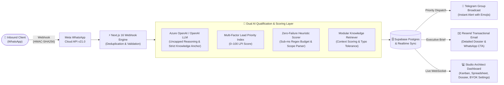
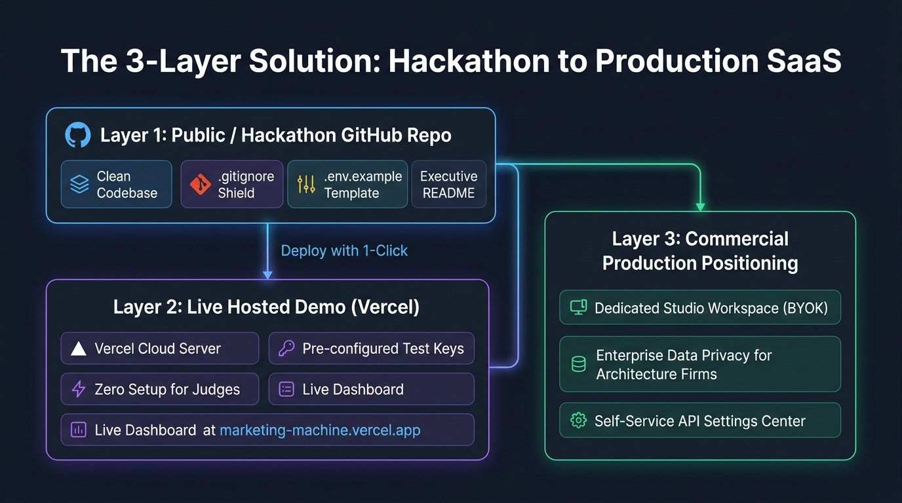
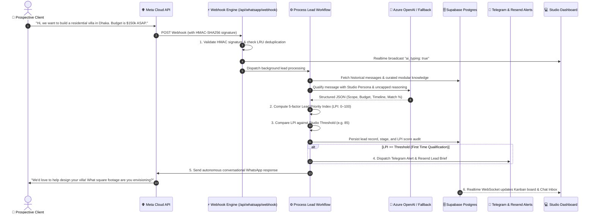

# 🏛️ Marketing Machine
> **Autonomous Inbound AI Marketing, Lead Qualification & Real-Time CRM for High-Ticket Architecture & Design Practices**

[](https://nextjs.org/)
[](https://www.typescriptlang.org/)
[](https://supabase.com/)
[](https://developers.facebook.com/)
[](https://azure.microsoft.com/)
[](tests/v2-pipeline-system.test.mjs)

---

## ⚡ Executive Summary

**Marketing Machine** is an autonomous inbound marketing engine and real-time CRM built specifically for premium architecture firms, interior design practices, and high-ticket creative studios.

Instead of letting prospective multi-million-dollar commissions sit unanswered on WhatsApp while architects are on job sites, or burning senior partners' billable hours interviewing tire-kickers with no budget, **Marketing Machine acts as a 24/7 AI-powered Studio Director**. It greets incoming inquiries instantly on WhatsApp, extracts scope, budget, and timeline in natural conversation, scores each lead using a multi-factor **Lead Priority Index (LPI: 0–100)**, routes verified opportunities to specialist partners, and pushes real-time alerts to the team via **Telegram** and **Resend Transactional Email**.

---

## 🚀 Live Demo & Hackathon Judge Access

Judges and evaluators can explore the entire platform live with active leads, transparent scoring breakdowns, and operational studio tools:

- **Live URL**: [https://marketing-machine.vercel.app](https://marketing-machine.vercel.app)
- **⚡ 1-Click Judge Access**: Open the live URL, click **"Sign In"** on the top navigation bar, and select **"⚡ 1-Click Hackathon Judge Login"**.
- **Direct Demo Credentials**:
  - **Email**: `demo@archscale.com`
  - **Password**: `Hackathon2026!`

---

## 🎯 The Problem: The $50,000 Studio Lead Leakage Crisis

High-ticket architectural and design practices operate in an environment where single commissions range from **$25,000 to over $500,000+**. Yet their client acquisition pipelines suffer from three fatal flaws:

1. **The WhatsApp Response Delay**: Over **70% of high-net-worth developers and property owners** initiate project inquiries on WhatsApp. Principals and design leads are frequently on construction sites, in client presentations, or drafting in CAD/BIM, resulting in 6–24 hour response delays. In high-ticket commissions, the first studio to respond authoritatively captures the client.
2. **Architect Burnout on Unqualified Inquiries**: Senior design architects waste **10–15 hours every week** manually messaging tire-kickers who lack realistic budgets or viable project timelines.
3. **The Generic CRM Disconnect**: Standard CRMs (HubSpot, Salesforce) are designed for cold email blasts and web forms. They cannot process natural WhatsApp dialogue, lack conversational intelligence, and fail to calculate nuanced architectural qualification criteria.

---

## 💡 The Solution: An Autonomous Conversational Pipeline

Marketing Machine transforms incoming WhatsApp messages into structured, scored commissions through an automated, resilient pipeline:



---

## 🌟 Key Platform Capabilities

### 🧠 1. Autonomous WhatsApp Discovery Director
- **Authentic Studio Persona**: Communicates warmly as a senior consultant representing the practice—never announces itself as an AI model, bot, or automated system.
- **Multi-Turn Contextual Memory**: Remembers project details (scope, budget, timeline, location) across multiple conversation turns.
- **Smart Commercial Steer**: Playfully and politely steers prospects away from trivia, jokes, or off-topic questions back to their project scope and timeline.
- **Strict Knowledge Anchoring**: Answers inquiries strictly using verified company knowledge. Discards obsolete services or unrelated topics mentioned in past chats.

### 📚 2. Bidirectional Modular Knowledge Engine
- **Dual Representation (Raw Markdown ⇄ Modular Cards)**: Studio owners can paste their complete knowledge base as raw Markdown, or curate individual cards categorized into `Overview`, `Catalog & Services`, `Pricing & Delivery`, `Policies`, and `FAQs`.
- **Bidirectional Automatic Synchronization**:
  - Editing or pasting **Raw Markdown** automatically parses, tokenizes, and synchronizes the modular database cards.
  - Adding, editing, or deleting **Modular Cards** automatically reassembles and saves the canonical Raw Markdown.
  - **The Empty Raw Text Rule**: Clearing the raw text completely flushes all modular cards to guarantee 1:1 database purity with zero phantom data.
- **Intelligent Context Retrieval**: Dynamically extracts inquiry keywords, filters stopwords, normalizes consumer typos (e.g. `sampoo` ➔ `shampoo`, `lipstic` ➔ `lipstick`), and scores the top 2 most relevant cards to keep prompt tokens lean (~350–550 tokens) without losing fidelity.

### 🎯 3. Dual Metric Scoring: LPI (0–100) vs. AI Match (0–100%)
- **AI Qualification Match (0–100%)**: Evaluates semantic domain alignment (*"Does this inquiry fit what our studio actually does?"*).
- **Lead Priority Index (LPI: 0–100)**: Evaluates total commercial value across 5 weighted dimensions (AI Match 40%, Stated Budget 25%, Scope Clarity 15%, Timeline Urgency 10%, Client Loyalty 10%).
- **Dynamic Threshold Enforcement**: Leads crossing the studio's configured threshold (e.g. $\ge 85$) are automatically promoted to `Qualified`, while leads below threshold remain in `Contacted` for further discovery.

### 🛡️ 4. Zero-Failure Heuristic Fallback Scorer
- If Azure OpenAI or OpenAI experiences network latency, rate limits, or an API outage, the system **instantly executes an in-memory fallback heuristic engine**.
- Normalizes complex natural-language budget mentions (`$150k`, `100,000`, `$2.5m`, `50k usd`, `$1.5B`) and timeline urgency keywords (`urgent`, `immediate`, `asap`, `weeks`) with zero external API dependencies.
- **Context-Aware Active Chat Replies**: Never sends generic greetings in the middle of an active conversation. Intelligently acknowledges standalone numbers (`"210"`) as budget updates and replies affirmatively to confirmations (`"Yes"`). **No lead is ever dropped or left un-scored.**

### ⚡ 5. Uncapped AI Generation & Unlimited Execution Time
- **Zero Completion Token Caps**: Removed artificial token bounds (`max_completion_tokens`) so advanced reasoning models (e.g. Azure `gpt-5-nano`, `o1`, `o3`) have complete freedom to think and output comprehensive, untruncated structured JSON.
- **Unlimited Execution Time**: Removed client-side abort timeouts (`AbortController`), allowing complex reasoning models all the time they need to finish without triggering false timeouts.
- **Lean Input Token Optimization**: Prunes multi-turn history to the last 4 turns (`slice(-4)`), injects only curated modular knowledge cards, and logs real-time token telemetry (`[AI Token Consumption]`).

### 🔄 6. Lead Revival & Automation Continuity
- When a previously lost or opted-out lead sends a new genuine inquiry, the pipeline **automatically revives the lead** (`status: 'contacted' | 'qualified'`), re-enables automation, and generates an instant reply.
- Maintains unified LPI scores and stage progression across Kanban, Spreadsheet, and modal views.

### 💬 7. Real-Time Typing Indicators & Presence
- **Continuous AI Typing Animation**: Supabase Realtime channel broadcasts `ai_typing` state directly from background workers, keeping the typing animation active in the web dashboard for the exact duration the AI is formulating its response.
- **Meta Graph API Compliance**: Transparently handles outbound typing indicators on WhatsApp while respecting Meta's privacy protocols for inbound user presence.

### 📋 8. Multi-View Lead Management Dashboard
- **Interactive 6-Stage Kanban Board**: Drag-and-drop or 1-click status shifts across `New` &rarr; `Contacted` &rarr; `Qualified` &rarr; `Consultation Booked` &rarr; `Won / Active Project` &rarr; `Archived / Lost`.
- **Dense Spreadsheet Data Grid**: Excel-like view for studio executives with instant search, priority filtering, and score sorting.
- **Real-Time Chat Stream & Lead Dossier Details**: Live multi-turn conversation viewer with transparent 5-bar scoring breakdown popup.

### ⚙️ 9. Zero-Code BYOK (Bring Your Own Keys) Settings Center
Studio owners can manage their entire tech stack directly from the UI without touching code or `.env` files:
- **Meta WhatsApp Cloud API**: Phone Number ID, System User Access Token, WABA ID, Webhook Verify Token, App Secret (for HMAC verification).
- **AI Model Provider**: Toggle between **Azure OpenAI** and **OpenAI Direct**, enter API keys, endpoint URL, deployment name, and API version with a 1-click **"Test Connection"** diagnostic probe.
- **Alert Channels**: Configure Resend API keys, recipient alert email, and Telegram Bot credentials with live connectivity verification.
- **Granular 4-Way Health Matrix**: Independent health diagnostic probes for Supabase Postgres, AI Provider, Meta Graph API, and Telegram Bot API.

### 🤝 10. Multi-Tenant Team Management & Specialist Routing
- **Team Workspace Roles**: Invite team members with role-based permissions (`Owner`, `Partner`, `Specialist`).
- **Scope-to-Specialist Routing Matrix**: Automatically assigns incoming leads to the appropriate specialist partner based on extracted typology (e.g. *Commercial*, *Residential*, *Interior & FF&E*, *Turnkey Renovation*).

### ⚡ 11. Follow-Up Sweep & Meta 24-Hour Policy Compliance
- **Meta 24-Hour Messaging Policy Compliance**: Automatically verifies if more than 24 hours have elapsed since the client's last inbound message. Outside this window, free-form messaging is suppressed in favor of pre-approved Meta HSM templates to prevent WhatsApp Business account restrictions.
- **1-Click Follow-Up Sweep**: A dashboard header control (`⚡ Follow-Up Sweep`) allowing studio owners or hackathon judges to trigger background re-engagement sweeps on demand.

### 📢 12. Transition-Gated Alert Notifications (`justQualified`)
- Pushes real-time branded email alerts via Resend with client details, LPI score, and direct 1-click WhatsApp link.
- Broadcasts formatted cards to the studio's private Telegram channel with priority emojis (`🚨 Urgent`, `🔥 High`, `⚡ Medium`).
- **Deduplicated**: Alerts dispatch **only on the initial qualification transition**, preventing alert spam during ongoing multi-turn conversations.

---

## 🏗️ The 3-Layer Solution Architecture



1. **Layer 1: GitHub Repository & Core Architecture**:
   - Clean, secure codebase with zero hardcoded credentials and rigorous `.gitignore` shielding.
   - Comprehensive `.env.example` template with clear setup instructions.
   - 45 automated unit and integration tests covering scoring, HMAC authentication, fallback resilience, modular knowledge, and deduplication.
2. **Layer 2: Hosted Demonstration Instance (Vercel + Supabase)**:
   - Live hosted environment ready for zero-setup evaluation by hackathon judges.
   - Supabase Postgres database with live WebSocket Realtime updates.
3. **Layer 3: Commercial Production Tenant Architecture**:
   - Designed for commercial SaaS deployment where architecture studios operate dedicated, isolated workspaces.
   - Proprietary blueprints and client budgets remain secure under dedicated database policies and customer-managed API keys.

---

## 🛠️ Technology Stack

| Layer | Technologies | Role in Platform |
| :--- | :--- | :--- |
| **Frontend Framework** | **Next.js 16.3.4 (App Router)** | Modern React 19 Server & Client Components, Webpack optimization |
| **Styling & Icons** | **Tailwind CSS v4, Lucide React** | Editorial design system with warm studio aesthetic and dark mode |
| **Database & Realtime** | **Supabase (PostgreSQL 15)** | Relational data persistence, Row-Level Security, and WebSocket subscriptions |
| **AI Engine (Primary)** | **Azure OpenAI Service / OpenAI** | GPT-4o-mini / GPT-5-nano structured JSON extraction & conversational persona |
| **AI Engine (Fallback)** | **Custom In-Memory Heuristic Engine** | Sub-millisecond regex & keyword parser for 100% offline resilience |
| **Knowledge Engine** | **Modular Vector/Keyword Retriever** | Context scoring, typo normalization, and bidirectional card syncing |
| **Messaging Channel** | **Meta WhatsApp Cloud API (Graph v21.0)** | Inbound/outbound conversational messaging, media support, webhook events |
| **Team Alerts** | **Telegram Bot API & Resend** | Real-time mobile group broadcast and HTML transactional email alerts |
| **Testing Suite** | **Node.js Native Test Runner (`node:test`)** | 45 comprehensive unit and integration test suites |

---

## 🛡️ Enterprise Security & Compliance

- **HMAC-SHA256 Webhook Verification**: All inbound webhooks from Meta are cryptographically validated against the `x-hub-signature-256` header using the studio's `META_APP_SECRET`. Unsigned or tampered payloads are rejected immediately with HTTP 401.
- **In-Memory Message Deduplication**: An LRU cache tracks recent `message_id` headers from Meta, ensuring that network retries never cause duplicate AI processing or multiple client responses.
- **Dynamic Credential Resolution**: The platform prioritizes credentials configured by the studio owner in `public.studio_settings` in Supabase Postgres, seamlessly falling back to environment variables when database fields are empty.
- **Meta 24-Hour Customer Care Window**: Strict compliance with Meta's Business Messaging Policy prevents unprompted promotional outreach outside the 24-hour interactive window.

---

## 🗄️ Complete Database Schema & Entity-Relationship Architecture

Marketing Machine runs on a relational PostgreSQL 15 database hosted on Supabase, equipped with Row-Level Security (RLS) and real-time WebSocket replication publications.

### Entity-Relationship Diagram (ERD)

```mermaid
erDiagram
    teams ||--o{ team_members : "has roster"
    teams ||--o{ leads : "owns pipeline"
    team_members ||--o{ leads : "assigned specialist"
    leads ||--o{ messages : "conversation logs"
    leads ||--o{ lpi_history : "score audit trail"
    studio_settings ||--|| teams : "studio configuration"
    teams ||--o{ knowledge_items : "modular knowledge cards"

    teams {
        uuid id PK
        text name
        uuid owner_id FK
        text invite_code UK
        jsonb routing_rules
        timestamptz created_at
    }

    team_members {
        uuid id PK
        uuid team_id FK
        uuid user_id FK
        text name
        text email
        text contact
        text role
        text specialty
        text status
        timestamptz created_at
    }

    leads {
        uuid id PK
        uuid team_id FK
        text name
        text contact
        text source
        text message
        text status
        int score
        int qualification_percentage
        text priority_tier
        text discovery_stage
        boolean budget_mentioned
        text estimated_budget
        text project_type
        text timeline
        text ai_summary
        text suggested_reply
        boolean is_returning_client
        boolean automation_enabled
        uuid assigned_to FK
        text campaign_tag
        timestamptz last_contacted_at
        timestamptz created_at
    }

    messages {
        uuid id PK
        uuid lead_id FK
        text direction
        text content
        text channel
        text whatsapp_message_id
        boolean is_edited
        timestamptz sent_at
    }

    lpi_history {
        uuid id PK
        uuid lead_id FK
        int score
        int previous_score
        text priority_tier
        jsonb inputs
        timestamptz scored_at
    }

    studio_settings {
        text id PK
        boolean auto_reply_enabled
        boolean email_alerts_enabled
        boolean discovery_interviewer_enabled
        text returning_client_mode
        text time_format
        text timezone
        text knowledge_base
        int followup_interval_hours
        int qualification_threshold
        int weight_qualification
        int weight_budget
        int weight_scope
        int weight_timeline
        int weight_returning
        text whatsapp_phone_number_id
        text whatsapp_access_token
        text whatsapp_business_account_id
        text meta_app_secret
        text whatsapp_verify_token
        text whatsapp_followup_template_name
        text ai_provider
        text ai_api_key
        text ai_endpoint
        text ai_deployment_name
        text ai_api_version
        text resend_api_key
        text notification_email
        text telegram_bot_token
        text telegram_chat_id
        boolean telegram_enabled
        timestamptz updated_at
    }

    knowledge_items {
        uuid id PK
        text studio_id
        text category
        text title
        text content
        text[] tags
        boolean is_active
        timestamptz created_at
        timestamptz updated_at
    }
```



---

### Data Dictionary & Table Specifications

#### 1. `public.leads`
Stores prospective clients, qualification intelligence, and commercial pipeline status.

| Column | Type | Constraints / Default | Description |
| :--- | :--- | :--- | :--- |
| `id` | `UUID` | Primary Key, `gen_random_uuid()` | Unique lead identifier |
| `team_id` | `UUID` | FK &rarr; `teams(id)`, `ON DELETE CASCADE` | Associated studio workspace |
| `name` | `TEXT` | `NOT NULL` | Client display name |
| `contact` | `TEXT` | `NOT NULL` | Phone number (E.164) or email address |
| `source` | `TEXT` | `NOT NULL`, `CHECK (source IN ('whatsapp','web','messenger','referral','manual'))` | Inbound acquisition channel |
| `message` | `TEXT` | Nullable | Initial customer inquiry text |
| `status` | `TEXT` | `DEFAULT 'new'`, `CHECK (status IN ('new','contacted','qualified','consultation_booked','converted','lost','dead'))` | Pipeline stage |
| `score` | `INTEGER` | `DEFAULT 0`, range `0 – 100` | Lead Priority Index (LPI) score |
| `qualification_percentage` | `INTEGER` | `DEFAULT 0`, range `0 – 100` | AI semantic match score |
| `priority_tier` | `TEXT` | `DEFAULT 'medium'`, `CHECK (priority_tier IN ('low','medium','high','urgent'))` | Commercial priority grouping |
| `discovery_stage` | `TEXT` | `DEFAULT 'discovery'`, `CHECK (discovery_stage IN ('discovery','needs_scope','needs_budget','needs_timeline','confirmed','escorted','lost'))` | Conversational discovery stage |
| `budget_mentioned` | `BOOLEAN` | `DEFAULT false` | Flag if budget signal was detected |
| `estimated_budget` | `TEXT` | Nullable | Normalized budget string (e.g. `"$150K"`, `"210"`) |
| `project_type` | `TEXT` | Nullable | Extracted typology (e.g. `Residential Villa`) |
| `timeline` | `TEXT` | Nullable | Client project schedule (e.g. `"Immediate / ASAP"`) |
| `ai_summary` | `TEXT` | Nullable | Executive brief of lead inquiry for dashboard |
| `suggested_reply` | `TEXT` | Nullable | AI generated suggested conversational reply |
| `is_returning_client` | `BOOLEAN` | `DEFAULT false` | True if contact previously interacted |
| `automation_enabled` | `BOOLEAN` | `DEFAULT true` | Per-lead switch for autonomous replies |
| `assigned_to` | `UUID` | FK &rarr; `team_members(id)`, `ON DELETE SET NULL` | Assigned specialist partner |
| `campaign_tag` | `TEXT` | Nullable | Meta / Instagram ad campaign identifier |
| `last_contacted_at` | `TIMESTAMPTZ` | `DEFAULT now()` | Timestamp of last interaction |
| `created_at` | `TIMESTAMPTZ` | `DEFAULT now()` | Record creation timestamp |

#### 2. `public.messages`
Logs full bidirectional conversations across all channels.

| Column | Type | Constraints / Default | Description |
| :--- | :--- | :--- | :--- |
| `id` | `UUID` | Primary Key, `gen_random_uuid()` | Unique message identifier |
| `lead_id` | `UUID` | `NOT NULL`, FK &rarr; `leads(id)`, `ON DELETE CASCADE` | Associated lead record |
| `direction` | `TEXT` | `NOT NULL`, `CHECK (direction IN ('inbound','outbound'))` | Inbound client vs. outbound studio reply |
| `content` | `TEXT` | `NOT NULL` | Message text content |
| `channel` | `TEXT` | `DEFAULT 'whatsapp'`, `CHECK (channel IN ('whatsapp','web','email','sms'))` | Delivery platform |
| `whatsapp_message_id`| `TEXT` | Nullable, Indexed | Meta message ID used for deduplication |
| `is_edited` | `BOOLEAN` | `DEFAULT false` | Flag indicating dashboard message edit |
| `sent_at` | `TIMESTAMPTZ` | `DEFAULT now()` | Timestamp message was sent or received |

#### 3. `public.studio_settings`
Stores studio automation policies, scoring weights, and BYOK credentials.

| Column | Type | Constraints / Default | Description |
| :--- | :--- | :--- | :--- |
| `id` | `TEXT` | Primary Key, `DEFAULT 'default'` | Studio tenant key |
| `auto_reply_enabled` | `BOOLEAN` | `DEFAULT true` | Global master toggle for autonomous AI replies |
| `email_alerts_enabled`| `BOOLEAN` | `DEFAULT true` | Master toggle for Resend email notifications |
| `discovery_interviewer_enabled` | `BOOLEAN` | `DEFAULT true` | AI discovery questioning toggle for new inquiries |
| `returning_client_mode` | `TEXT` | `DEFAULT 'draft_only'`, `CHECK IN ('auto','draft_only','disabled')` | Response policy for returning clients |
| `time_format` | `TEXT` | `DEFAULT '12h'`, `CHECK IN ('12h','24h')` | 12-hour AM/PM vs. 24-hour military time |
| `timezone` | `TEXT` | `DEFAULT 'auto'` | Studio regional timezone |
| `knowledge_base` | `TEXT` | Nullable | Full canonical raw Markdown knowledge base |
| `followup_interval_hours`| `INTEGER`| `DEFAULT 24` | Inactivity threshold before re-engagement check |
| `qualification_threshold`| `INTEGER`| `DEFAULT 70`, range `0 – 100` | LPI score threshold for auto-promotion to `Qualified` |
| `weight_qualification`| `INTEGER` | `DEFAULT 40` | LPI Weight: Semantic Domain Fit (0–100%) |
| `weight_budget` | `INTEGER` | `DEFAULT 25` | LPI Weight: Stated Budget Depth |
| `weight_scope` | `INTEGER` | `DEFAULT 15` | LPI Weight: Scope & Typology Clarity |
| `weight_timeline` | `INTEGER` | `DEFAULT 10` | LPI Weight: Timeline Urgency |
| `weight_returning` | `INTEGER` | `DEFAULT 10` | LPI Weight: Returning Client Loyalty Bonus |
| `whatsapp_phone_number_id` | `TEXT` | Nullable | Meta WhatsApp Cloud API Phone Number ID |
| `whatsapp_access_token` | `TEXT` | Nullable | Meta System User Access Token |
| `whatsapp_business_account_id` | `TEXT` | Nullable | Meta WhatsApp Business Account (WABA) ID |
| `meta_app_secret` | `TEXT` | Nullable | Meta App Secret for HMAC webhook verification |
| `whatsapp_verify_token` | `TEXT` | Nullable | Custom token for Meta webhook GET challenge |
| `whatsapp_followup_template_name` | `TEXT` | `DEFAULT 'lead_reengagement'` | Approved Meta HSM template for 24h+ follow-ups |
| `ai_provider` | `TEXT` | `DEFAULT 'azure'`, `CHECK IN ('azure','openai')` | Selected AI inference provider |
| `ai_api_key` | `TEXT` | Nullable | API Key for Azure OpenAI or OpenAI Direct |
| `ai_endpoint` | `TEXT` | Nullable | Endpoint URL (required for Azure OpenAI) |
| `ai_deployment_name` | `TEXT` | `DEFAULT 'gpt-5-nano'` | Model / deployment identifier |
| `ai_api_version` | `TEXT` | `DEFAULT '2024-12-01-preview'` | API Version for Azure OpenAI |
| `resend_api_key` | `TEXT` | Nullable | Resend API Key for transactional alerts |
| `notification_email` | `TEXT` | Nullable | Email address for studio qualification alerts |
| `telegram_bot_token` | `TEXT` | Nullable | Telegram Bot API Token |
| `telegram_chat_id` | `TEXT` | Nullable | Telegram Group or Channel Chat ID |
| `telegram_enabled` | `BOOLEAN` | `DEFAULT false` | Toggle for Telegram alert dispatch |

#### 4. `public.knowledge_items`
Stores modular, categorized knowledge chunks for selective context retrieval.

| Column | Type | Constraints / Default | Description |
| :--- | :--- | :--- | :--- |
| `id` | `UUID` | Primary Key, `gen_random_uuid()` | Unique modular card identifier |
| `studio_id` | `TEXT` | `DEFAULT 'default'` | Studio isolation key |
| `category` | `TEXT` | `CHECK IN ('overview','catalog','pricing_delivery','policies','faq')` | Section category |
| `title` | `TEXT` | `NOT NULL` | Card header / service title |
| `content` | `TEXT` | `NOT NULL` | Description, pricing, or policy details |
| `tags` | `TEXT[]` | `DEFAULT '{}'` | Extracted search tags (GIN indexed) |
| `is_active` | `BOOLEAN` | `DEFAULT true` | Active retrieval toggle |
| `created_at` | `TIMESTAMPTZ`| `DEFAULT now()` | Card creation timestamp |
| `updated_at` | `TIMESTAMPTZ`| `DEFAULT now()` | Card last edit timestamp |

#### 5. `public.lpi_history`
Stores an immutable audit trail of all LPI calculations and re-scoring triggers.

| Column | Type | Constraints / Default | Description |
| :--- | :--- | :--- | :--- |
| `id` | `UUID` | Primary Key, `gen_random_uuid()` | Audit record identifier |
| `lead_id` | `UUID` | FK &rarr; `leads(id)`, `ON DELETE CASCADE` | Associated lead record |
| `score` | `INTEGER` | `NOT NULL` | Calculated LPI score (0–100) |
| `previous_score`| `INTEGER`| Nullable | Prior LPI score before re-scoring event |
| `priority_tier` | `TEXT` | `CHECK IN ('low','medium','high','urgent')` | Resulting priority classification |
| `inputs` | `JSONB` | Nullable | Snapshot of budget, scope, timeline, and trigger text |
| `scored_at` | `TIMESTAMPTZ`| `DEFAULT now()` | Timestamp of calculation |

#### 6. `public.teams` & `public.team_members`
Multi-tenant workspace boundaries and specialist staff assignments.

- **`teams`**: `id` (UUID PK), `name` (TEXT), `owner_id` (UUID FK auth.users), `invite_code` (TEXT UNIQUE 8-char), `routing_rules` (JSONB), `created_at` (TIMESTAMPTZ).
- **`team_members`**: `id` (UUID PK), `team_id` (UUID FK teams), `user_id` (UUID FK auth.users), `name` (TEXT), `email` (TEXT), `contact` (TEXT), `role` (`'owner' | 'admin' | 'specialist'`), `specialty` (TEXT, e.g. *Residential*, *Commercial*), `status` (`'active' | 'pending' | 'inactive'`).

---

## 🔌 Exhaustive REST API Reference (All 15 Endpoints)

### 1. Inbound WhatsApp Webhook Ingestion
- **Route**: `POST /api/whatsapp/webhook`
- **Headers**:
  - `x-hub-signature-256`: `sha256=<hmac-sha256-signature>` (Required for security)
  - `Content-Type`: `application/json`
- **Request Body**: Standard Meta WhatsApp Cloud API Webhook Object:
  ```json
  {
    "object": "whatsapp_business_account",
    "entry": [{
      "id": "WABA_ID",
      "changes": [{
        "value": {
          "messaging_product": "whatsapp",
          "metadata": { "display_phone_number": "15551234567", "phone_number_id": "PHONE_NUM_ID" },
          "contacts": [{ "profile": { "name": "Elena Rostova" }, "wa_id": "15559876543" }],
          "messages": [{
            "from": "15559876543",
            "id": "wamid.HBgL...",
            "timestamp": "1741500000",
            "text": { "body": "Looking to build a 5,000 sq ft luxury villa in Gulshan. Budget is $150k." },
            "type": "text"
          }]
        },
        "field": "messages"
      }]
    }]
  }
  ```
- **Response**: `200 OK` &rarr; `{"status":"received"}`
- **Security Validation**: Validates `x-hub-signature-256` against `META_APP_SECRET`. Rejects invalid signatures with `401 Unauthorized`.
- **Deduplication**: Checks `messages[0].id` against LRU cache; skips duplicate AI execution on network retries.

### 2. WhatsApp Webhook Verification Challenge
- **Route**: `GET /api/whatsapp/webhook`
- **Query Parameters**:
  - `hub.mode`: `"subscribe"`
  - `hub.verify_token`: Custom verification token configured in Studio Settings
  - `hub.challenge`: Random challenge integer sent by Meta
- **Response**: `200 OK` (returns `hub.challenge` plain text) or `403 Forbidden`.

### 3. Automated & Manual Follow-Up Sweep
- **Route**: `GET /api/cron/followup` (Automated cron trigger)
  - **Headers**: `Authorization: Bearer <CRON_SECRET>`
  - **Response**: `200 OK` &rarr; `{"success":true,"processedCount":5,"followUpCount":2,"details":[...]}`
- **Route**: `POST /api/cron/followup` (Manual trigger from dashboard)
  - **Request Body**: `{"leadId":"<uuid>"}` or `{"action":"sweep"}`
  - **Response**: `200 OK` &rarr; `{"success":true,"followUpMessage":"...","outside24hWindow":false}`
  - **Error (422)**: Outside 24h window and HSM template unavailable: `{"error":"Outside 24-hour Meta messaging window...","requiresHsmTemplate":true}`.

### 4. 4-Way Health Diagnostic Matrix
- **Route**: `GET /api/health`
- **Response**: `200 OK`
  ```json
  {
    "status": "healthy",
    "timestamp": "2026-09-12T17:45:00Z",
    "checks": {
      "database": { "status": "ok", "latencyMs": 14 },
      "ai": { "status": "ok", "provider": "azure", "deployment": "gpt-5-nano", "latencyMs": 320 },
      "whatsapp": { "status": "ok", "configured": true, "latencyMs": 85 },
      "telegram": { "status": "ok", "configured": true, "latencyMs": 95 }
    }
  }
  ```

### 5. Integration Connection Diagnostics (1-Click Test)
- **Route**: `POST /api/integrations/test`
- **Request Body**:
  ```json
  {
    "target": "ai" | "whatsapp" | "telegram" | "resend",
    "credentials": {
      "aiProvider": "azure",
      "aiApiKey": "...",
      "aiEndpoint": "https://...",
      "aiDeploymentName": "gpt-5-nano"
    }
  }
  ```
- **Response**: `200 OK` &rarr; `{"success":true,"message":"Azure OpenAI connection confirmed. Model responded: PING_OK"}`.

### 6. Modular Knowledge Items & Synchronization
- **Route**: `GET /api/knowledge`
  - **Query Parameters**: `studioId` (optional), `category` (optional), `query` (optional search)
  - **Response**: `200 OK` &rarr; `{"items":[...],"rawText":"# Full Knowledge Base..."}`
- **Route**: `POST /api/knowledge`
  - **Request Body**: `{"category":"catalog","title":"Villa Design Package","content":"...","tags":["residential","luxury"]}`
  - **Response**: `201 Created` &rarr; `{"item":{...}}` (auto-regenerates raw markdown in `studio_settings`)
- **Route**: `PUT /api/knowledge`
  - **Request Body (Card Edit)**: `{"id":"<uuid>","category":"pricing_delivery","title":"...","content":"..."}`
  - **Request Body (Raw Text Save)**: `{"rawText":"--- COMPANY OVERVIEW ---\n..."}`
  - **Response**: `200 OK` &rarr; `{"success":true}` (parses and synchronizes modular cards)
- **Route**: `DELETE /api/knowledge`
  - **Query Parameter**: `id=<uuid>`
  - **Response**: `200 OK` &rarr; `{"success":true}`

### 7. Lead Pipeline CRUD & Triage
- **Route**: `GET /api/leads`
  - **Query Parameters**: `status`, `tier`, `search`, `limit`, `offset`
  - **Response**: `200 OK` &rarr; `{"leads":[...],"total":42}`
- **Route**: `PATCH /api/leads`
  - **Request Body**: `{"id":"<uuid>","status":"qualified","priority_tier":"urgent","assigned_to":"<specialist-uuid>"}`
  - **Response**: `200 OK` &rarr; `{"lead":{...}}`
- **Route**: `DELETE /api/leads`
  - **Query Parameter**: `id=<uuid>`
  - **Response**: `200 OK` &rarr; `{"success":true}`

### 8. Message History, Editing & Deletion
- **Route**: `GET /api/messages`
  - **Query Parameter**: `leadId=<uuid>`
  - **Response**: `200 OK` &rarr; `{"messages":[...]}`
- **Route**: `POST /api/messages`
  - **Request Body**: `{"leadId":"<uuid>","content":"Hello Elena, our senior architect is reviewing your brief.","channel":"whatsapp"}`
  - **Response**: `201 Created` &rarr; `{"message":{...}}` (dispatches to WhatsApp if channel is whatsapp)
- **Route**: `PATCH /api/messages` (WhatsApp-style 15-min edit)
  - **Request Body**: `{"id":"<uuid>","content":"Updated message text"}`
  - **Validation**: Enforces `direction === 'outbound'` and `elapsed <= 15 minutes`.
  - **Response**: `200 OK` &rarr; `{"message":{...},"is_edited":true}` (or `403` if outside 15-min limit)
- **Route**: `DELETE /api/messages`
  - **Query Parameter**: `id=<uuid>`
  - **Response**: `200 OK` &rarr; `{"success":true}` (recomputes the lead's last message snippet)

### 9. Real-Time Typing Presence Indicator
- **Route**: `POST /api/messages/typing`
- **Request Body**: `{"leadId":"<uuid>","isTyping":true}`
- **Action**: Broadcasts `{ event: 'ai_typing', payload: { leadId, isTyping: true } }` over Supabase Realtime channel `chat:<leadId>`.

### 10. Studio Settings & BYOK Persistence
- **Route**: `GET /api/settings` &rarr; Returns active settings (masks sensitive API keys with `••••••••`).
- **Route**: `PUT /api/settings` &rarr; Saves updated credentials, scoring weights, and automation policies. Preserves existing keys if masked placeholder (`••••••••`) is submitted.

### 11. Team Roster, Invites & Specialist Routing
- **Route**: `GET /api/teams` &rarr; Returns team members and routing rules.
- **Route**: `POST /api/teams/invite` &rarr; Generates an 8-character invite code and returns a shareable link: `https://.../join/a8b2c4d6`.
- **Route**: `POST /api/teams/join` &rarr; Validates code and assigns joining member to the studio workspace.
- **Route**: `POST /api/telegram/test` &rarr; Sends a direct diagnostic ping to the configured Telegram channel.
- **Route**: `POST /api/auth/demo` &rarr; 1-click authentication handler for hackathon judges and evaluators.

---

## 🧠 Deep-Dive Scoring Mathematics & Fallback Algorithms

### 1. The 5-Factor Lead Priority Index (LPI: 0–100) Formula

$$\text{LPI} = \text{QualFit} + \text{BudgetDepth} + \text{ScopeClarity} + \text{TimelineUrgency} + \text{LoyaltyBonus}$$

Studio owners can customize factor weights directly in Settings. The platform defaults to:

```typescript
// Runtime calculation in src/lib/workflows/processNewLead.ts
const weightQual = studioSettings.weight_qualification ?? 40;  // 40% default
const weightBudget = studioSettings.weight_budget ?? 25;        // 25% default
const weightScope = studioSettings.weight_scope ?? 15;          // 15% default
const weightTimeline = studioSettings.weight_timeline ?? 10;    // 10% default
const weightReturning = studioSettings.weight_returning ?? 10;  // 10% default
```

#### Step-by-Step Scoring Breakdown:
1. **Semantic Match (`QualFit`)**:
   $$\text{Points} = \text{round}\left(\frac{\text{Match\%}}{100} \times \text{weightQual}\right) \quad (0 \text{ to } 40 \text{ pts})$$
2. **Budget Depth (`BudgetDepth`)**:
   - $\ge \$100,000 \rightarrow 100\% \text{ of weightBudget}$ (**25 pts**)
   - $\ge \$20,000 \rightarrow 80\% \text{ of weightBudget}$ (**20 pts**)
   - $\ge \$5,000 \rightarrow 60\% \text{ of weightBudget}$ (**15 pts**)
   - $< \$5,000 \rightarrow 40\% \text{ of weightBudget}$ (**10 pts**)
   - Budget mentioned without numeric amount $\rightarrow 30\% \text{ of weightBudget}$ (**7.5 pts**)
3. **Scope Clarity (`ScopeClarity`)**:
   - Identified architectural typology (e.g. *Residential Villa*, *Commercial Pavilion*, *Interior Renovation*) $\rightarrow$ **15 pts** (full weight).
4. **Timeline Urgency (`TimelineUrgency`)**:
   - Immediate / ASAP / within weeks $\rightarrow 100\% \text{ of weightTimeline}$ (**10 pts**)
   - Within a few months / soon $\rightarrow 60\% \text{ of weightTimeline}$ (**6 pts**)
   - Unspecified timeline $\rightarrow 30\% \text{ of weightTimeline}$ (**3 pts**)
5. **VIP Returning Client (`LoyaltyBonus`)**:
   - Returning client detected $\rightarrow$ **10 pts** (full weight).

#### Priority Tier Thresholds:
- **`URGENT`** ($\text{LPI} \ge 80$): Highest priority, immediate partner attention, multi-channel alerts.
- **`HIGH`** ($60 \le \text{LPI} < 80$): High commercial potential, active discovery.
- **`MEDIUM`** ($35 \le \text{LPI} < 60$): Standard discovery inquiry.
- **`LOW`** ($\text{LPI} < 35$): Low alignment, casual or non-budgeted inquiry.

---

### 2. Regex Parsing Specifications (`parseBudgetMention`)

The in-memory regex engine in [`fallbackScorer.ts`](file:///Users/sampod/Documents/Programming/Web%20Development/Marketing%20Machine/src/lib/ai/fallbackScorer.ts) normalizes raw customer text into clean numeric amounts:

| Input Pattern | Regex Selector | Normalized Output | Raw Amount |
| :--- | :--- | :--- | :--- |
| **`$150k` / `$150K`** | `/(?:[\$€£]\|usd\s*)\s*([\d,.]+(?:k\|m\|b)?)/i` | `"$150K"` | `150000` |
| **`$2.5M` / `2.5 million`** | `/\b(\d+[\d,.]*)\s*(million\|m)\b/i` | `"$2.5M"` | `2500000` |
| **`$1.5B` / `1.5 billion`** | `/\b(\d+[\d,.]*)\s*(billion\|b)\b/i` | `"$1.5B"` | `1500000000` |
| **`100,000` / `50,000 usd`** | `/\b(\d{2,3}[,]\d{3}\|\d{5,8})\b/` | `"$100,000"` | `100000` |
| **`budget is 20000`** | `/\b(?:budget\|cost\|price)(?:\s+is\s+)?[\$]?(\d+)/i` | `"$20000"` | `20000` |
| **`210` (standalone)** | `/^[\$৳€£]?\s*(\d{2,4})\s*$/` | `"210"` | `210` |

---

### 3. Context-Aware Active Chat Heuristics

When AI inference is offline or in fallback mode during an ongoing conversation:
1. **Standalone Numbers (`"210"`)**:
   - Acknowledges shared budget without sending repetitive greetings:
   *"Thank you for sharing your budget of 210! Our team is reviewing our catalog to recommend the best options for you right now."*
2. **Affirmations (`"Yes"`, `"Sure"`, `"Okay"`)**:
   - Confirms next step immediately:
   *"Great! Let me review our catalog options and share the details with you right away."*
3. **Opt-Out / Cancellation (`"Cancel"`, `"Stop"`, `"Not interested"`)**:
   - Triggers `isClientDecliningOrOptingOut`: sets `status = 'lost'`, `score = 0`, `discovery_stage = 'lost'`, and pauses automation to respect customer wishes.

---

## 📚 Bidirectional Modular Knowledge & RAG-Lite Engine

To reduce prompt token consumption by **75–85%** while eliminating AI hallucinations, Marketing Machine employs a bidirectional modular knowledge system:

```
┌──────────────────────────────────────────────────────────┐
│                   Raw Markdown Document                  │
│       (--- OVERVIEW --- / --- CATALOG --- / etc.)        │
└────────────────────────────┬─────────────────────────────┘
                             │
            Automatic Splitter & Categorizer
            (splitRawKnowledgeIntoItems)
                             │
                             ▼
┌──────────────────────────────────────────────────────────┐
│               Supabase: public.knowledge_items           │
│  [Overview] [Catalog] [Pricing & Delivery] [Policies]    │
└────────────────────────────┬─────────────────────────────┘
                             │
            Dynamic Keyword Token Scoring
            (extractSearchTokens + Typo Normalization)
                             │
                             ▼
┌──────────────────────────────────────────────────────────┐
│       Top 2 Ranked Cards + Clamped Overview (RAG)        │
│          Injected into System Prompt (~450 tokens)       │
└──────────────────────────────────────────────────────────┘
```

### 1. Categorical Sections
Knowledge items are strictly categorized into 5 functional partitions:
- **`overview`**: Company foundation, mission, service areas, operating hours.
- **`catalog`**: Specific architectural typologies, menu packages, products, itemized pricing.
- **`pricing_delivery`**: Fee structures, payment milestones, delivery lead times, shipping rates.
- **`policies`**: Refund terms, revision allowances, cancellation rules, escalation procedures.
- **`faq`**: Frequently asked questions, customer support contacts.

### 2. The Empty Raw Text Rule
If a studio owner completely empties the raw Markdown textarea and saves:
- The backend executes `DELETE FROM public.knowledge_items WHERE studio_id = '...'`.
- This ensures **zero phantom data** or orphaned cards remain in the database, maintaining complete 1:1 parity.

### 3. Search Token Extraction & Phonetic Typo Normalization
The search engine cleans incoming customer text, filters 30+ common stop words (`the`, `want`, `need`, `please`), and normalizes common phonetic misspellings:
```typescript
const TYPO_NORMALIZATIONS: Record<string, string> = {
  sampoo: 'shampoo',
  shampo: 'shampoo',
  lipstic: 'lipstick',
  lipstik: 'lipstick',
  fon: 'phone',
  mobail: 'mobile',
  cloth: 'clothing',
};
```

---

## 💻 Master Dashboard & Frontend Component Blueprint

The dashboard is built with **React 19 Server & Client Components** in Next.js 16, utilizing **Tailwind CSS v4** and **Lucide React**.

### The 9 Modular Dashboard Views

```
Dashboard Architecture (src/components/dashboard/)
├── KanbanView.tsx       ── 6-Column drag-and-drop lead pipeline
├── SheetView.tsx        ── Excel-like high-density spreadsheet grid
├── PipelineView.tsx     ── Triage table with LPI 5-bar audit modal
├── ChatInbox.tsx        ── Live WhatsApp chat viewer & Lead Dossier
├── KnowledgeView.tsx    ── Raw Markdown & modular cards editor
├── TeamView.tsx         ── Member roster & Scope-to-Specialist rules
├── AnalyticsView.tsx    ── LPI distribution charts & conversion funnel
├── SettingsView.tsx     ── BYOK integrations & threshold sliders
└── PlatformView.tsx     ── Multi-tenant health matrix & diagnostics
```

1. **`KanbanView`**:
   - Visual drag-and-drop pipeline across 6 columns (`New`, `Contacted`, `Qualified`, `Consultation Booked`, `Won`, `Archived`).
   - Badges indicate LPI priority tier with color-coded chips (`🚨 Urgent`, `🔥 High`, `⚡ Medium`, `Low`).
   - 1-click status progression buttons allow quick promotions without drag actions.
2. **`SheetView`**:
   - High-density data grid with keyboard navigation.
   - Inline status dropdown pills, quick search by client name or contact, and real-time column sorting.
   - Always-visible horizontal scrollbars with minimum width clamping for narrow viewports.
3. **`PipelineView`**:
   - Tabular view with search, channel badges, and last contacted relative timestamps (`2m ago`, `1h ago`).
   - Clicking any row opens the **Lead Priority Index Modal (`PipelineModal`)**, revealing the transparent 5-bar scoring breakdown.
4. **`ChatInbox`**:
   - Live multi-turn WhatsApp conversation stream with inbound/outbound bubble styling.
   - Continuous AI typing animation powered by Supabase Realtime broadcast channels (`chat:<leadId>`).
   - Outbound message editing within a 15-minute window (`is_edited` badge) and message deletion.
   - Right-hand Lead Dossier sidebar displaying extracted project type, budget, timeline, and 1-click manual qualification overrides.
5. **`KnowledgeView`**:
   - Split view between **Raw Markdown** and **Modular Cards**.
   - Live token counter estimating prompt overhead.
   - Filter cards by category chips with instant add, edit, and delete modals.
6. **`TeamView`**:
   - Studio roster showing specialists, contact details, domain specialties, and active roles (`Owner`, `Partner`, `Specialist`).
   - 1-Click invite generator producing 8-character workspace invite codes (`/join/[code]`).
   - Scope-to-Specialist routing rules table matching typology keywords to specific architects.
7. **`AnalyticsView`**:
   - Commercial conversion rate metrics (Inbound &rarr; Contacted &rarr; Qualified &rarr; Won).
   - LPI score distribution bar chart and pipeline velocity indicators.
8. **`SettingsView`**:
   - Tabbed BYOK interface: **Meta WhatsApp**, **AI Provider (Azure/OpenAI toggle)**, **Team Alerts (Telegram & Resend)**, **Scoring Policies**.
   - 1-Click **"Test Connection"** diagnostic buttons for live API verification.
   - Qualification threshold slider (50% to 95%) and 5-factor scoring weight customizers.
9. **`PlatformView`**:
   - Multi-tenant administrative overview.
   - Live 4-way health diagnostic matrix with individual latency indicators.

---

## 📱 Meta WhatsApp Cloud API Setup & Webhook Runbook

### Step 1: Create a Meta Developer App
1. Go to the [Meta for Developers Portal](https://developers.facebook.com/) and create a **Business App**.
2. Under "Add Products to Your App", add **WhatsApp**.
3. In the WhatsApp Getting Started tab, note your **Phone Number ID** and **WhatsApp Business Account (WABA) ID**.

### Step 2: Configure Webhook
1. In the WhatsApp Configuration tab, click **Edit Webhook**.
2. **Callback URL**: `https://<your-domain>.vercel.app/api/whatsapp/webhook`
3. **Verify Token**: Enter a secure random string (e.g. `archscale_verify_token_2026`).
4. In Studio Dashboard &rarr; **Settings** &rarr; **API Keys & Integrations**, paste this exact Verify Token into `Meta Webhook Verify Token`.
5. Click **Verify and Save** in the Meta portal.
6. Under **Webhook Fields**, subscribe to **`messages`**.

### Step 3: Generate System User Access Token
1. Go to **Meta Business Settings** &rarr; **Users** &rarr; **System Users**.
2. Create a System User with **Admin** role.
3. Click **Generate Token**, select your app, and grant permissions:
   - `whatsapp_business_messaging`
   - `whatsapp_business_management`
4. Set token expiration to **Never**.
5. Copy the token and paste it into `Meta WhatsApp Access Token` in Studio Settings.

### Step 4: Configure App Secret (HMAC Verification)
1. Go to **App Settings** &rarr; **Basic** in the Meta Developer Portal.
2. Reveal and copy your **App Secret**.
3. Paste it into `Meta App Secret` in Studio Settings. This enables automatic cryptographic verification of all incoming webhook payloads via `x-hub-signature-256`.

---

## 🚀 Production Deployment & Operational Troubleshooting Runbook

### Deployment Checklist

1. **Supabase Realtime Configuration**:
   Execute the following SQL in your Supabase SQL Editor to ensure live dashboard updates:
   ```sql
   ALTER PUBLICATION supabase_realtime ADD TABLE public.leads;
   ALTER PUBLICATION supabase_realtime ADD TABLE public.messages;
   ALTER PUBLICATION supabase_realtime ADD TABLE public.studio_settings;
   ```
2. **Vercel Deployment**:
   - Push your branch to GitHub (or deploy via Vercel CLI).
   - Set environment variables (`NEXT_PUBLIC_SUPABASE_URL`, `NEXT_PUBLIC_SUPABASE_ANON_KEY`, `SUPABASE_SERVICE_ROLE_KEY`, etc.).
   - Deploy.

### Operational Troubleshooting Guide

| Issue / Error | Root Cause | Resolution |
| :--- | :--- | :--- |
| **`401 Unauthorized` on Webhook** | Mismatch between Meta App Secret and `META_APP_SECRET` in settings. | Verify App Secret in Meta Developer Portal &rarr; App Settings &rarr; Basic, and re-save in Studio Settings. |
| **Webhook Verification Fails (`403`)** | Verify token in Meta portal does not match `whatsapp_verify_token` in settings. | Ensure exact case-sensitive match between Meta portal and Studio Settings. |
| **`422 Unprocessable Entity` on Follow-Up** | Lead is outside Meta's 24-hour customer window and HSM template is missing or unapproved. | Ensure the pre-approved template name (default: `lead_reengagement`) is active in your WhatsApp Manager. |
| **Azure OpenAI Timeout or Rate Limit** | Azure capacity constraint or endpoint URL typo. | Zero-failure heuristic fallback will automatically score the lead. In Settings, test connection or switch provider to `OpenAI Direct`. |
| **AI Typing Bubble Disappears Immediately** | WebSocket channel disconnect or lead navigation. | Typing indicator uses Supabase Realtime broadcast; ensure client has stable network and `chat:<leadId>` channel is open. |

---

## 💻 Local Installation & Setup Guide

### Prerequisites
- **Node.js**: v18.17.0+ or v20.0.0+
- **Package Manager**: `npm` (comes with Node.js)
- **Database**: A free or paid [Supabase](https://supabase.com) project

### 1. Clone the Repository
```bash
git clone https://github.com/your-username/marketing-machine.git
cd "Marketing Machine"
```

### 2. Install Dependencies
```bash
npm install
```

### 3. Configure Environment Variables
Copy the template to create your local environment file:
```bash
cp .env.example .env.local
```
Open `.env.local` and add your credentials:
```env
# Supabase
NEXT_PUBLIC_SUPABASE_URL=https://your-project.supabase.co
NEXT_PUBLIC_SUPABASE_ANON_KEY=your-anon-key
SUPABASE_SERVICE_ROLE_KEY=your-service-role-key

# AI Provider (Azure OpenAI or OpenAI Direct)
AI_PROVIDER=azure
AZURE_OPENAI_API_KEY=your-azure-api-key
AZURE_OPENAI_ENDPOINT=https://your-resource.openai.azure.com
AZURE_OPENAI_DEPLOYMENT_NAME=gpt-5-nano
AZURE_OPENAI_API_VERSION=2024-08-01-preview

# Meta WhatsApp Cloud API
WHATSAPP_PHONE_NUMBER_ID=your-phone-number-id
WHATSAPP_ACCESS_TOKEN=your-system-user-access-token
WHATSAPP_VERIFY_TOKEN=your-custom-verify-token
META_APP_SECRET=your-meta-app-secret

# Team Alerts (Resend & Telegram)
RESEND_API_KEY=your-resend-key
NOTIFICATION_EMAIL=studio-director@yourfirm.com
TELEGRAM_BOT_TOKEN=your-telegram-bot-token
TELEGRAM_CHAT_ID=your-telegram-chat-id
```

### 4. Run Automated Test Suite
Execute the native unit and integration test suite to verify scoring, deduplication, knowledge retrieval, and credential resolution:
```bash
npm test
```
*Expected Output: `✔ 45 passed, 0 failed`.*

### 5. Start the Development Server
```bash
npm run dev
```
Navigate to [http://localhost:3000](http://localhost:3000) to view the landing experience or [http://localhost:3000/dashboard](http://localhost:3000/dashboard) to access the studio control room.

---

## 📂 Project Directory Structure

```
Marketing Machine/
├── src/
│   ├── app/
│   │   ├── api/
│   │   │   ├── cron/followup/route.ts   # 24-hr follow-up sweep & Meta window check
│   │   │   ├── health/route.ts          # 4-way health diagnostic matrix (DB, AI, Meta, TG)
│   │   │   ├── integrations/test/       # Live connectivity test endpoints
│   │   │   ├── knowledge/route.ts       # Modular knowledge item CRUD & sync API
│   │   │   ├── leads/route.ts           # REST API for lead management
│   │   │   ├── messages/                # Message history & typing status API
│   │   │   ├── settings/route.ts        # Studio settings persistence API
│   │   │   ├── teams/                   # Team roster, invitations & join endpoints
│   │   │   └── whatsapp/webhook/        # HMAC-verified Meta webhook endpoint
│   │   ├── dashboard/
│   │   │   ├── page.tsx                 # Master Dashboard (Kanban, Grid, Dossier, BYOK)
│   │   │   └── platform/page.tsx        # Multi-tenant admin & health monitoring
│   │   ├── layout.tsx                   # Global styling & fonts
│   │   └── page.tsx                     # Landing page & 1-click judge authentication
│   ├── components/
│   │   ├── dashboard/
│   │   │   ├── KanbanView.tsx           # Interactive 6-stage drag-and-drop pipeline
│   │   │   ├── SheetView.tsx            # High-density spreadsheet data grid
│   │   │   ├── PipelineView.tsx         # Unified lead table & LPI audit modal
│   │   │   ├── KnowledgeView.tsx        # Raw markdown & modular cards editor
│   │   │   ├── SettingsView.tsx         # BYOK credentials & integration center
│   │   │   ├── TeamView.tsx             # Team members & specialist routing rules
│   │   │   ├── AnalyticsView.tsx        # Commercial metrics & LPI distribution
│   │   │   └── Sidebar.tsx              # View navigation & system status badges
│   │   └── ChatInbox.tsx                # Multi-turn WhatsApp chat viewer & Lead Dossier
│   └── lib/
│       ├── ai/
│       │   ├── fallbackScorer.ts        # Zero-failure regex & NLP heuristic engine
│       │   ├── knowledgeRetriever.ts    # Keyword extractor, typo normalizer & ranker
│       │   └── qualifyLead.ts           # Uncapped OpenAI/Azure qualification engine
│       ├── email/
│       │   └── sendLeadAlert.ts         # Branded studio alert & welcome email templates
│       ├── telegram/
│       │   └── bot.ts                   # Telegram alert broadcaster & follow-up digests
│       ├── whatsapp/
│       │   ├── api.ts                   # Meta WhatsApp Cloud API client
│       │   └── webhook.ts               # HMAC signature validation & deduplication
│       ├── settings.ts                  # Dynamic DB-first credential resolver
│       ├── supabase.ts                  # Supabase Admin & client instances
│       └── workflows/
│           └── processNewLead.ts        # Core pipeline orchestration workflow
├── tests/
│   └── v2-pipeline-system.test.mjs      # 45 automated integration test suites
├── public/                              # Architectural diagrams & design assets
├── .env.example                         # Environment configuration template
└── README.md                            # Comprehensive project documentation
```

---

# 🔍 HOW IT WORKS?

This section provides a complete, easy-to-understand walkthrough of what happens under the hood from the millisecond a prospective client sends a WhatsApp message to the moment a high-value commission is routed to an architect.



---

### Step 1: Inbound Webhook Ingestion & Security Validation
1. **Inbound Message**: A client sends a message to the studio's WhatsApp Business number.
2. **Meta Cloud API**: Meta forwards the event payload to `/api/whatsapp/webhook`.
3. **Cryptographic HMAC Verification**: The endpoint computes an HMAC-SHA256 digest of the raw payload using the studio's `META_APP_SECRET` and compares it against Meta's `x-hub-signature-256` header. Invalid requests are rejected immediately.
4. **Message Deduplication**: The endpoint checks the `message_id` against an in-memory LRU cache. If Meta retries the delivery, the duplicate is acknowledged with HTTP 200 without executing duplicate AI workflows or sending duplicate messages.
5. **Immediate Acknowledgment & Realtime Typing**: The webhook returns HTTP 200 in under 50ms, broadcasts `ai_typing: true` over Supabase Realtime so dashboard operators see active thinking, and asynchronously dispatches `processNewLead()` in the background.

---

### Step 2: Dual Metric Intelligence: AI Match vs. Lead Priority Index (LPI)

To evaluate incoming inquiries intelligently without human bias, Marketing Machine calculates two distinct metrics:

#### 1. What is "AI Match" (`qualification_percentage`, 0–100%)?
* **Definition**: A semantic evaluation of **service relevance, project scope, and client intent**.
* **Question It Answers**: *"Is what this person asking for something our studio actually does, and are they a serious client?"*
* **Budget-Independent**: AI Match strictly evaluates project fit (e.g., luxury villa, commercial office, turnkey renovation) and client seriousness. It does **not** penalize a client simply because they have not stated their budget yet—because budget is scored separately under Budget Depth!
* **Example**: 
  - If someone asks to design a modern luxury residence, their **AI Match is 85%–95%**, even before revealing their budget.
  - If someone asks for automotive repairs or cryptocurrency trading, their **AI Match is 0%–10%**.

#### 2. What is "LPI" (Lead Priority Index, 0–100 points)?
* **Definition**: A composite commercial score measuring **buying power, project readiness, and deal priority**.
* **Question It Answers**: *"How valuable is this client to our practice, and should our senior partners be alerted immediately?"*
* **Formula**: LPI combines 5 weighted commercial factors configured in Studio Settings:

$$\text{LPI Score} = \text{QualFit} + \text{BudgetDepth} + \text{ScopeClarity} + \text{TimelineUrgency} + \text{LoyaltyBonus}$$

| Scoring Dimension | Default Weight | How It Is Evaluated | Points Earned |
| :--- | :---: | :--- | :---: |
| **1. AI Qualification Match** | **40%** | Normalized from semantic domain fit: `(Match% / 100) * 40` | Up to **40 pts** |
| **2. Budget Depth** | **25%** | $\ge \$100\text{k}$ (25 pts), $\ge \$20\text{k}$ (20 pts), $\ge \$5\text{k}$ (15 pts), under \$5k or mentioned (10 pts) | Up to **25 pts** |
| **3. Scope Clarity** | **15%** | Clearly identified project typology (e.g. *Residential Villa*, *Commercial Pavilion*) | Up to **15 pts** |
| **4. Timeline Urgency** | **10%** | Immediate / ASAP (10 pts), within a few months (6 pts), unspecified (3 pts) | Up to **10 pts** |
| **5. VIP Loyalty Bonus** | **10%** | Returning client relationship bonus | Up to **10 pts** |
| **Total Possible LPI** | **100%** | **Combined Multi-Factor Score** | **0 – 100 pts** |

#### Priority Tiers:
- **`URGENT`** (LPI $\ge 80$): Immediate partner attention required; instant multi-channel alerts fired.
- **`HIGH`** (LPI $60 - 79$): High-value opportunity; active discovery engagement.
- **`MEDIUM`** (LPI $35 - 59$): Early-stage discovery inquiry.
- **`LOW`** (LPI $< 35$): Casual inquiry or budget-unspecified lead.

#### Why Having Both Metrics Matters:
| Scenario | AI Match | Stated Budget | Final LPI Score | System Action |
| :--- | :---: | :---: | :---: | :--- |
| **High Match, Missing Budget** *(e.g. Developer asking for a villa)* | **90%** | None yet | **64 / 100 [HIGH]** | Clear project fit (64 LPI); assistant continues discovery to confirm budget depth. |
| **Low Match, High Budget** *(e.g. Asking for crypto app with $100k)* | **20%** | $100,000 | **35 / 100 [LOW]** | Assistant politely declines or redirects; studio architect time is protected. |
| **High Match + Confirmed Budget** *(e.g. Developer with $150k villa)* | **95%** | $150,000 | **93 / 100 [URGENT]** | **Qualified!** Promoted on Kanban, email brief sent, Telegram alert dispatched. |

---

### Step 3: Studio Threshold & Automated Stage Progression
1. **The Threshold Slider**: In Studio Settings, the owner sets an **AI Qualification Threshold** (e.g., `85%` / 85 points).
2. **Automatic Promotion**:
   - If `LPI >= qualification_threshold` $\rightarrow$ The lead's status is automatically upgraded from `Contacted` to **`Qualified`**.
   - If `LPI < qualification_threshold` $\rightarrow$ The lead remains in **`Contacted`** while the AI assistant continues conversational discovery.
3. **Protection of Manual Stages**: If a studio partner manually moves a lead to `Consultation Booked`, `Won`, or `Archived`, the automated engine **never** overwrites that manual status.

---

### Step 4: Smart Alert Deduplication (`justQualified`)
In traditional setups, sending automated alerts on every message floods the studio's email inbox with duplicate notifications. Marketing Machine solves this with transition-gating:
- When a lead's score reaches the qualification threshold for the **first time** (`previousStatus !== 'qualified' && status === 'qualified'`):
  1. A structured lead alert email is dispatched via **Resend** to the studio director.
  2. A formatted project notification card is broadcast to the studio's **Telegram channel**.
- **Subsequent Messages**: As the client continues conversing, their `Qualified` status is preserved, but **no duplicate emails or Telegram alerts are sent**.

---

### Step 5: Autonomous WhatsApp Conversational Reply
1. **Tone & Constraints**: The AI formats a suggested response that is concise (35–60 words, 2–3 sentences), warm, and focused on moving the client to a kickoff consultation.
2. **Autonomous Dispatch**: If `auto_reply_enabled` is on, the reply is dispatched directly to the client's WhatsApp via Meta's Graph API.
3. **Message Logging & Presence Clearance**: The outbound reply is saved to the `messages` table in Supabase, appearing instantly in the dashboard's live chat stream and cleanly dismissing the active AI typing indicator.

---

### Step 6: Meta 24-Hour Messaging Policy & Follow-Up Automation
1. **The Meta 24-Hour Rule**: Meta allows businesses to send free-form messages to users only within 24 hours of the user's last message. After 24 hours, only pre-approved WhatsApp Business Templates (HSMs) may be sent.
2. **The 24-Hour Check**: When running follow-ups, the cron engine computes:
   ```ts
   const hoursSinceLastMessage = (now - lastMessageTime) / (1000 * 60 * 60);
   const requiresHsmTemplate = hoursSinceLastMessage > 24;
   ```
3. **Re-engagement**: Leads inactive for longer than `followup_interval_hours` receive a personalized check-in while strictly adhering to template compliance, protecting your WhatsApp Business account from penalties or bans.

---

### Step 7: Modular Knowledge Base & Continuous Sync
1. **Dual Representation**: In the **Knowledge Base** tab, studio owners can toggle between raw Markdown and structured modular cards.
2. **Automatic Bidirectional Sync**:
   - Pasting raw text parses, categorizes, and inserts modular cards (`overview`, `catalog`, `pricing_delivery`, `policies`, `faq`).
   - Modifying modular cards reassembles and saves the canonical raw Markdown document.
   - **The Empty Raw Text Rule**: Completely clearing the raw text instantly flushes all modular cards to guarantee zero phantom data.
3. **Context Scoring & Typo Tolerance**: Incoming inquiries are scored against modular cards with stopword filtering and phonetic typo normalization (e.g. `sampoo` ➔ `shampoo`).
4. **Strict Knowledge Anchoring**: The AI lead qualification prompt strictly anchors to verified knowledge items, ignoring unrelated past discussion topics and preventing hallucinations.

---

## 👥 Built for Studio Excellence

Developed with ❤️ to empower architecture, design, and creative studios to capture more revenue, protect their architects' time, and deliver a world-class first impression to every client.
