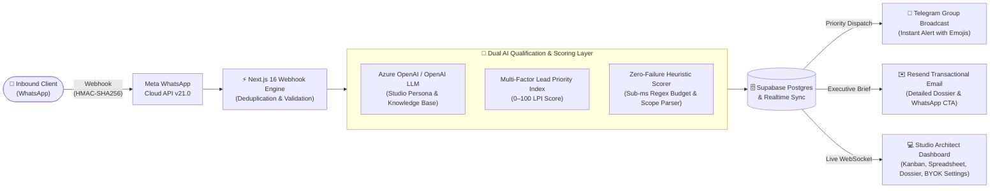
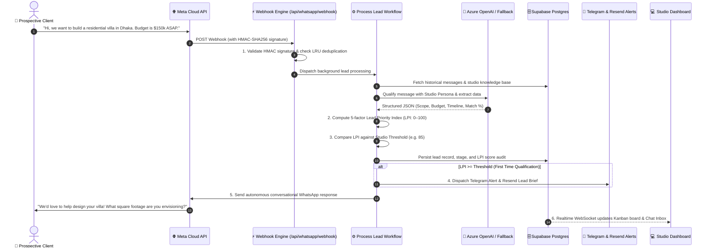

# 🏛️ Marketing Machine
> **Autonomous Inbound AI Marketing, Lead Qualification & Real-Time CRM for High-Ticket Architecture & Design Practices**

[](https://nextjs.org/)
[](https://www.typescriptlang.org/)
[](https://supabase.com/)
[](https://developers.facebook.com/)
[](https://azure.microsoft.com/)
[](tests/v2-pipeline-system.test.mjs)
[](LICENSE)

---

## ⚡ Executive Summary

**Marketing Machine** is an autonomous inbound marketing engine and real-time CRM built specifically for premium architecture firms, interior design practices, and high-ticket creative studios.

Instead of letting prospective multi-million-dollar commissions sit unanswered on WhatsApp while architects are on job sites, or burning senior partners' billable hours interviewing tire-kickers with no budget, **Marketing Machine acts as a 24/7 AI-powered Studio Director**. It greets incoming inquiries instantly on WhatsApp, extracts scope, budget, and timeline in natural conversation, scores each lead using a multi-factor **Lead Priority Index (LPI: 0–100)**, routes verified opportunities to specialist partners, and pushes real-time alerts to the team via **Telegram** and **Resend Transactional Email**.

---

## 🚀 Live Demo & Hackathon Judge Access

Judges and evaluators can explore the entire platform live with active leads, transparent scoring breakdowns, and operational studio tools:

- **Live URL**: [https://marketing-machine.vercel.app](https://marketing-machine.vercel.app)
- **⚡ 1-Click Judge Access**: Open the live URL, click **"Sign In"** on the top navigation bar, and select **"⚡ 1-Click Hackathon Judge Login"**.
- **Direct Demo Credentials**:
  - **Email**: `demo@archscale.com`
  - **Password**: `Hackathon2026!`

---

## 🎯 The Problem: The $50,000 Studio Lead Leakage Crisis

High-ticket architectural and design practices operate in an environment where single commissions range from **$25,000 to over $500,000+**. Yet their client acquisition pipelines suffer from three fatal flaws:

1. **The WhatsApp Response Delay**: Over **70% of high-net-worth developers and property owners** initiate project inquiries on WhatsApp. Principals and design leads are frequently on construction sites, in client presentations, or drafting in CAD/BIM, resulting in 6–24 hour response delays. In high-ticket commissions, the first studio to respond authoritatively captures the client.
2. **Architect Burnout on Unqualified Inquiries**: Senior design architects waste **10–15 hours every week** manually messaging tire-kickers who lack realistic budgets or viable project timelines.
3. **The Generic CRM Disconnect**: Standard CRMs (HubSpot, Salesforce) are designed for cold email blasts and web forms. They cannot process natural WhatsApp dialogue, lack conversational intelligence, and fail to calculate nuanced architectural qualification criteria.

---

## 💡 The Solution: An Autonomous Conversational Pipeline

Marketing Machine transforms incoming WhatsApp messages into structured, scored commissions through an automated, resilient pipeline:



---

## 🌟 Key Platform Capabilities

### 🧠 1. Autonomous WhatsApp Discovery Director
- **Authentic Studio Persona**: Communicates warmly as a senior consultant representing the practice—never announces itself as an AI model, bot, or automated system.
- **Multi-Turn Contextual Memory**: Remembers project details (scope, budget, timeline, location) across multiple conversation turns.
- **Smart Commercial Steer**: Playfully and politely steers prospects away from trivia, jokes, or off-topic questions back to their project scope and timeline.
- **Dynamic Studio Knowledge Base**: Studio owners can paste their custom portfolio, services, fee tiers, and FAQs in Markdown to immediately guide the AI's responses.

### 🎯 2. Dual Metric Scoring: LPI (0–100) vs. AI Match (0–100%)
- **AI Qualification Match (0–100%)**: Evaluates semantic domain alignment (*"Does this inquiry fit what our studio actually does?"*).
- **Lead Priority Index (LPI: 0–100)**: Evaluates total commercial value across 5 weighted dimensions (AI Match 40%, Stated Budget 25%, Scope Clarity 15%, Timeline Urgency 10%, Client Loyalty 10%).
- **Dynamic Threshold Enforcement**: Leads crossing the studio's configured threshold (e.g. $\ge 85$) are automatically promoted to `Qualified`, while leads below threshold remain in `Contacted` for further discovery.

### 🛡️ 3. Zero-Failure Heuristic Fallback Scorer
- If Azure OpenAI or OpenAI experiences network latency, rate limits, or an API outage, the system **instantly executes an in-memory fallback heuristic engine**.
- Normalizes complex natural-language budget mentions (`$150k`, `100,000`, `$2.5m`, `50k usd`, `$1.5B`) and timeline urgency keywords (`urgent`, `immediate`, `asap`, `weeks`) with zero external API dependencies. **No lead is ever dropped or left un-scored.**

### 📋 4. Multi-View Lead Management Dashboard
- **Interactive 6-Stage Kanban Board**: Drag-and-drop or 1-click status shifts across `New` &rarr; `Contacted` &rarr; `Qualified` &rarr; `Consultation Booked` &rarr; `Won / Active Project` &rarr; `Archived / Lost`.
- **Dense Spreadsheet Data Grid**: Excel-like view for studio executives with instant search, priority filtering, and score sorting.
- **Real-Time Chat Stream & Lead Dossier Details**: Live multi-turn conversation viewer with a transparent 5-bar scoring breakdown popup.

### ⚙️ 5. Zero-Code BYOK (Bring Your Own Keys) Settings Center
Studio owners can manage their entire tech stack directly from the UI without touching code or `.env` files:
- **Meta WhatsApp Cloud API**: Phone Number ID, System User Access Token, WABA ID, Webhook Verify Token, App Secret (for HMAC verification).
- **AI Model Provider**: Toggle between **Azure OpenAI** and **OpenAI Direct**, enter API keys, endpoint URL, deployment name, and API version with a 1-click **"Test Connection"** diagnostic probe.
- **Alert Channels**: Configure Resend API keys, recipient alert email, and Telegram Bot credentials with live connectivity verification.
- **Threshold & Weight Customizer**: Visual slider to adjust the LPI qualification threshold (50% to 95%) and customize scoring weights.

### 🚀 6. Click-to-WhatsApp Campaign Link Generator
- Studio marketers can generate trackable Meta Ads / Instagram destination URLs with embedded campaign parameters (e.g., `https://wa.me/<phone>?text=Hi,%20I%20saw%20your%20campaign...`).
- Incoming messages automatically bind to the campaign name (e.g., `luxury_villas_2026`) for complete acquisition attribution.

### 🤝 7. Scope-to-Specialist Partner Routing Matrix
- Analyzes the lead's extracted typology (e.g. *Commercial Architecture*, *High-End Residential*, *Interior Architecture & FF&E*, *Turnkey Renovation*, *Urban Master Planning*).
- Matches and auto-assigns the inquiry to the appropriate specialist partner from the studio's team roster.

### ⚡ 8. Follow-Up Sweep & Meta 24-Hour Policy Compliance
- **Meta 24-Hour Messaging Policy Compliance**: Automatically verifies if more than 24 hours have elapsed since the client's last inbound message. Outside this window, free-form messaging is suppressed in favor of pre-approved Meta HSM templates to prevent WhatsApp Business account restrictions.
- **1-Click Follow-Up Sweep**: A dashboard header control (`⚡ Follow-Up Sweep`) allowing studio owners or hackathon judges to trigger background re-engagement sweeps on demand.

### 📢 9. Transition-Gated Alert Notifications (`justQualified`)
- Pushes real-time branded email alerts via Resend with client details, LPI score, and direct 1-click WhatsApp link.
- Broadcasts formatted cards to the studio's private Telegram channel with priority emojis (`🚨 Urgent`, `🔥 High`, `⚡ Medium`).
- **Deduplicated**: Alerts dispatch **only on the initial qualification transition**, preventing alert spam during ongoing multi-turn conversations.

---

## 🏗️ The 3-Layer Solution Architecture


1. **Layer 1: Public Open-Source Repository (GitHub)**:
   - Clean, secure codebase with zero hardcoded credentials and rigorous `.gitignore` shielding.
   - Comprehensive `.env.example` template with clear setup instructions.
   - 22 automated unit and integration tests covering scoring, HMAC authentication, fallback resilience, and deduplication.
2. **Layer 2: Hosted Demonstration Instance (Vercel + Supabase)**:
   - Live hosted environment ready for zero-setup evaluation by hackathon judges.
   - Supabase Postgres database with live WebSocket Realtime updates.
3. **Layer 3: Commercial Production Tenant Architecture**:
   - Designed for commercial SaaS deployment where architecture studios operate dedicated, isolated workspaces.
   - Proprietary blueprints and client budgets remain secure under dedicated database policies and customer-managed API keys.

---

## 🛠️ Technology Stack

| Layer | Technologies | Role in Platform |
| :--- | :--- | :--- |
| **Frontend Framework** | **Next.js 16.3.4 (App Router)** | Modern React 19 Server & Client Components, Webpack optimization |
| **Styling & Icons** | **Tailwind CSS v4, Lucide React** | Editorial design system with warm studio aesthetic and dark mode |
| **Database & Realtime** | **Supabase (PostgreSQL 15)** | Relational data persistence, Row-Level Security, and WebSocket subscriptions |
| **AI Engine (Primary)** | **Azure OpenAI Service / OpenAI** | GPT-4o-mini / GPT-5-nano structured JSON extraction & conversational persona |
| **AI Engine (Fallback)** | **Custom In-Memory Heuristic Engine** | Sub-millisecond regex & keyword parser for 100% offline resilience |
| **Messaging Channel** | **Meta WhatsApp Cloud API (Graph v21.0)** | Inbound/outbound conversational messaging, media support, webhook events |
| **Team Alerts** | **Telegram Bot API & Resend** | Real-time mobile group broadcast and HTML transactional email alerts |
| **Testing Suite** | **Node.js Native Test Runner (`node:test`)** | 22 comprehensive unit and integration test suites |

---

## 🛡️ Enterprise Security & Compliance

- **HMAC-SHA256 Webhook Verification**: All inbound webhooks from Meta are cryptographically validated against the `x-hub-signature-256` header using the studio's `META_APP_SECRET`. Unsigned or tampered payloads are rejected immediately with HTTP 401.
- **In-Memory Message Deduplication**: An LRU cache tracks recent `message_id` headers from Meta, ensuring that network retries never cause duplicate AI processing or multiple client responses.
- **Dynamic Credential Resolution**: The platform prioritizes credentials configured by the studio owner in `public.studio_settings` in Supabase Postgres, seamlessly falling back to environment variables when database fields are empty.
- **Meta 24-Hour Customer Care Window**: Strict compliance with Meta's Business Messaging Policy prevents unprompted promotional outreach outside the 24-hour interactive window.

---

## 💻 Local Installation & Setup Guide

### Prerequisites
- **Node.js**: v18.17.0+ or v20.0.0+
- **Package Manager**: `npm` (comes with Node.js)
- **Database**: A free or paid [Supabase](https://supabase.com) project

### 1. Clone the Repository
```bash
git clone https://github.com/your-username/marketing-machine.git
cd "Marketing Machine"
```

### 2. Install Dependencies
```bash
npm install
```

### 3. Configure Environment Variables
Copy the template to create your local environment file:
```bash
cp .env.example .env.local
```
Open `.env.local` and add your credentials:
```env
# Supabase
NEXT_PUBLIC_SUPABASE_URL=https://your-project.supabase.co
NEXT_PUBLIC_SUPABASE_ANON_KEY=your-anon-key
SUPABASE_SERVICE_ROLE_KEY=your-service-role-key

# AI Provider (Azure OpenAI or OpenAI Direct)
AI_PROVIDER=azure
AZURE_OPENAI_API_KEY=your-azure-api-key
AZURE_OPENAI_ENDPOINT=https://your-resource.openai.azure.com
AZURE_OPENAI_DEPLOYMENT_NAME=gpt-4o-mini
AZURE_OPENAI_API_VERSION=2024-08-01-preview

# Meta WhatsApp Cloud API
WHATSAPP_PHONE_NUMBER_ID=your-phone-number-id
WHATSAPP_ACCESS_TOKEN=your-system-user-access-token
WHATSAPP_VERIFY_TOKEN=your-custom-verify-token
META_APP_SECRET=your-meta-app-secret

# Team Alerts (Resend & Telegram)
RESEND_API_KEY=your-resend-key
NOTIFICATION_EMAIL=studio-director@yourfirm.com
TELEGRAM_BOT_TOKEN=your-telegram-bot-token
TELEGRAM_CHAT_ID=your-telegram-chat-id
```

### 4. Run Automated Test Suite
Execute the native unit and integration test suite to verify scoring, deduplication, and credential resolution:
```bash
npm test
```
*Expected Output: `✔ 22 passed, 0 failed`.*

### 5. Start the Development Server
```bash
npm run dev
```
Navigate to [http://localhost:3000](http://localhost:3000) to view the landing experience or [http://localhost:3000/dashboard](http://localhost:3000/dashboard) to access the studio control room.

---

## 📂 Project Directory Structure

```
Marketing Machine/
├── src/
│   ├── app/
│   │   ├── api/
│   │   │   ├── cron/followup/route.ts   # 24-hr follow-up sweep & Meta window check
│   │   │   ├── health/route.ts          # 4-way health diagnostic matrix (DB, AI, Meta, TG)
│   │   │   ├── integrations/test/       # Live connectivity test endpoints
│   │   │   ├── leads/route.ts           # REST API for lead management
│   │   │   └── whatsapp/webhook/        # HMAC-verified Meta webhook endpoint
│   │   ├── dashboard/
│   │   │   ├── page.tsx                 # Master Dashboard (Kanban, Grid, Dossier, BYOK)
│   │   │   └── platform/page.tsx        # Multi-tenant admin & health monitoring
│   │   ├── layout.tsx                   # Global styling & fonts
│   │   └── page.tsx                     # Landing page & 1-click judge authentication
│   ├── components/
│   │   └── ChatInbox.tsx                # Multi-turn WhatsApp chat viewer & Lead Dossier
│   └── lib/
│       ├── ai/
│       │   ├── client.ts                # Unified AI client factory (Azure / OpenAI)
│       │   ├── fallbackScorer.ts        # Zero-failure regex & NLP heuristic engine
│       │   └── qualifyLead.ts           # OpenAI structured qualification prompt
│       ├── email/
│       │   ├── resend.ts                # Resend client wrapper
│       │   └── sendLeadAlert.ts         # Branded studio alert & welcome email templates
│       ├── telegram/
│       │   └── bot.ts                   # Telegram alert broadcaster & follow-up digests
│       ├── whatsapp/
│       │   ├── api.ts                   # Meta WhatsApp Cloud API client
│       │   └── webhook.ts               # HMAC signature validation & deduplication
│       ├── settings.ts                  # Dynamic DB-first credential resolver
│       ├── supabase.ts                  # Supabase Admin & client instances
│       └── workflows/
│           └── processNewLead.ts        # Core pipeline orchestration workflow
├── tests/
│   └── v2-pipeline-system.test.mjs      # 22 automated integration test suites
├── public/                              # Architectural diagrams & design assets
├── .env.example                         # Environment configuration template
└── README.md                            # Comprehensive project documentation
```

---

# 🔍 HOW IT WORKS?

This section provides a complete, easy-to-understand walkthrough of what happens under the hood from the millisecond a prospective client sends a WhatsApp message to the moment a high-value commission is routed to an architect.



---

### Step 1: Inbound Webhook Ingestion & Security Validation
1. **Inbound Message**: A client sends a message to the studio's WhatsApp Business number.
2. **Meta Cloud API**: Meta forwards the event payload to `/api/whatsapp/webhook`.
3. **Cryptographic HMAC Verification**: The endpoint computes an HMAC-SHA256 digest of the raw payload using the studio's `META_APP_SECRET` and compares it against Meta's `x-hub-signature-256` header. Invalid requests are rejected immediately.
4. **Message Deduplication**: The endpoint checks the `message_id` against an in-memory LRU cache. If Meta retries the delivery, the duplicate is acknowledged with HTTP 200 without executing duplicate AI workflows or sending duplicate messages.
5. **Immediate Acknowledgment**: The webhook returns HTTP 200 in under 50ms, while asynchronously dispatching `processNewLead()` in the background.

---

### Step 2: Dual Metric Intelligence: AI Match vs. Lead Priority Index (LPI)

To evaluate incoming inquiries intelligently without human bias, Marketing Machine calculates two distinct metrics:

#### 1. What is "AI Match" (`qualification_percentage`, 0–100%)?
* **Definition**: A semantic evaluation of **service relevance, project scope, and client intent**.
* **Question It Answers**: *"Is what this person asking for something our studio actually does, and are they a serious client?"*
* **Budget-Independent**: AI Match strictly evaluates project fit (e.g., luxury villa, commercial office, turnkey renovation) and client seriousness. It does **not** penalize a client simply because they have not stated their budget yet—because budget is scored separately under Budget Depth!
* **Example**: 
  - If someone asks to design a modern luxury residence, their **AI Match is 85%–95%**, even before revealing their budget.
  - If someone asks for automotive repairs or cryptocurrency trading, their **AI Match is 0%–10%**.

#### 2. What is "LPI" (Lead Priority Index, 0–100 points)?
* **Definition**: A composite commercial score measuring **buying power, project readiness, and deal priority**.
* **Question It Answers**: *"How valuable is this client to our practice, and should our senior partners be alerted immediately?"*
* **Formula**: LPI combines 5 weighted commercial factors configured in Studio Settings:

$$\text{LPI Score} = \text{QualFit} + \text{BudgetDepth} + \text{ScopeClarity} + \text{TimelineUrgency} + \text{LoyaltyBonus}$$

| Scoring Dimension | Default Weight | How It Is Evaluated | Points Earned |
| :--- | :---: | :--- | :---: |
| **1. AI Qualification Match** | **40%** | Normalized from semantic domain fit: `(Match% / 100) * 40` | Up to **40 pts** |
| **2. Budget Depth** | **25%** | $\ge \$100\text{k}$ (25 pts), $\ge \$20\text{k}$ (20 pts), $\ge \$5\text{k}$ (15 pts), under \$5k or mentioned (10 pts) | Up to **25 pts** |
| **3. Scope Clarity** | **15%** | Clearly identified project typology (e.g. *Residential Villa*, *Commercial Pavilion*) | Up to **15 pts** |
| **4. Timeline Urgency** | **10%** | Immediate / ASAP (10 pts), within a few months (6 pts), unspecified (3 pts) | Up to **10 pts** |
| **5. VIP Loyalty Bonus** | **10%** | Returning client relationship bonus | Up to **10 pts** |
| **Total Possible LPI** | **100%** | **Combined Multi-Factor Score** | **0 – 100 pts** |

#### Priority Tiers:
- **`URGENT`** (LPI $\ge 80$): Immediate partner attention required; instant multi-channel alerts fired.
- **`HIGH`** (LPI $60 - 79$): High-value opportunity; active discovery engagement.
- **`MEDIUM`** (LPI $35 - 59$): Early-stage discovery inquiry.
- **`LOW`** (LPI $< 35$): Casual inquiry or budget-unspecified lead.

#### Why Having Both Metrics Matters:
| Scenario | AI Match | Stated Budget | Final LPI Score | System Action |
| :--- | :---: | :---: | :---: | :--- |
| **High Match, Missing Budget** *(e.g. Developer asking for a villa)* | **90%** | None yet | **64 / 100 [HIGH]** | Clear project fit (64 LPI); assistant continues discovery to confirm budget depth. |
| **Low Match, High Budget** *(e.g. Asking for crypto app with $100k)* | **20%** | $100,000 | **35 / 100 [LOW]** | Assistant politely declines or redirects; studio architect time is protected. |
| **High Match + Confirmed Budget** *(e.g. Developer with $150k villa)* | **95%** | $150,000 | **93 / 100 [URGENT]** | **Qualified!** Promoted on Kanban, email brief sent, Telegram alert dispatched. |

---

### Step 3: Studio Threshold & Automated Stage Progression
1. **The Threshold Slider**: In Studio Settings, the owner sets an **AI Qualification Threshold** (e.g., `85%` / 85 points).
2. **Automatic Promotion**:
   - If `LPI >= qualification_threshold` $\rightarrow$ The lead's status is automatically upgraded from `Contacted` to **`Qualified`**.
   - If `LPI < qualification_threshold` $\rightarrow$ The lead remains in **`Contacted`** while the AI assistant continues conversational discovery.
3. **Protection of Manual Stages**: If a studio partner manually moves a lead to `Consultation Booked`, `Won`, or `Archived`, the automated engine **never** overwrites that manual status.

---

### Step 4: Smart Alert Deduplication (`justQualified`)
In traditional setups, sending automated alerts on every message floods the studio's email inbox with duplicate notifications. Marketing Machine solves this with transition-gating:
- When a lead's score reaches the qualification threshold for the **first time** (`previousStatus !== 'qualified' && status === 'qualified'`):
  1. A structured lead alert email is dispatched via **Resend** to the studio director.
  2. A formatted project notification card is broadcast to the studio's **Telegram channel**.
- **Subsequent Messages**: As the client continues conversing, their `Qualified` status is preserved, but **no duplicate emails or Telegram alerts are sent**.

---

### Step 5: Autonomous WhatsApp Conversational Reply
1. **Tone & Constraints**: The AI formats a suggested response that is concise (35–60 words, 2–3 sentences), warm, and focused on moving the client to a kickoff consultation.
2. **Autonomous Dispatch**: If `auto_reply_enabled` is on, the reply is dispatched directly to the client's WhatsApp via Meta's Graph API.
3. **Message Logging**: The outbound reply is saved to the `messages` table in Supabase, appearing instantly in the dashboard's live chat stream.

---

### Step 6: Meta 24-Hour Messaging Policy & Follow-Up Automation
1. **The Meta 24-Hour Rule**: Meta allows businesses to send free-form messages to users only within 24 hours of the user's last message. After 24 hours, only pre-approved WhatsApp Business Templates (HSMs) may be sent.
2. **The 24-Hour Check**: When running follow-ups, the cron engine computes:
   ```ts
   const hoursSinceLastMessage = (now - lastMessageTime) / (1000 * 60 * 60);
   const requiresHsmTemplate = hoursSinceLastMessage > 24;
   ```
3. **Re-engagement**: Leads inactive for longer than `followup_interval_hours` receive a personalized check-in while strictly adhering to template compliance, protecting your WhatsApp Business account from penalties or bans.

---

### Step 7: Dynamic Studio Knowledge Base Ingestion
- In the **Knowledge Base** tab of the dashboard, studio owners can type or drag-and-drop their firm's brochure, fee guidelines, and service descriptions in Markdown.
- Once saved, this text is stored in `studio_settings.knowledge_base` in Supabase.
- The AI qualification prompt immediately incorporates this custom text, replacing the default prompt and ensuring that all subsequent WhatsApp replies accurately reflect the studio's genuine fees, offerings, and brand philosophy.

---

## 👥 Built for Studio Excellence

Developed with ❤️ to empower architecture, design, and creative studios to capture more revenue, protect their architects' time, and deliver a world-class first impression to every client.
