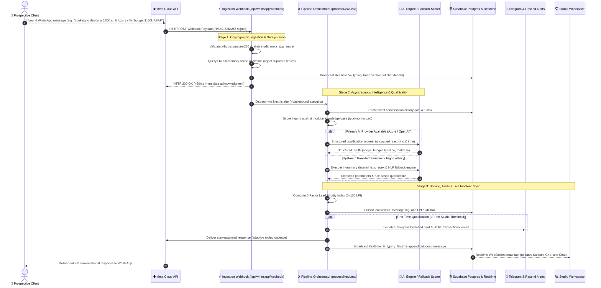

# 🏛️ Marketing Machine
> **Autonomous Inbound AI Marketing, Lead Qualification & Real-Time CRM for High-Ticket Architecture & Design Practices**

[](https://nextjs.org/)
[](https://www.typescriptlang.org/)
[](https://supabase.com/)
[](https://developers.facebook.com/)
[](https://developers.facebook.com/)
[](https://developers.facebook.com/)
[](https://azure.microsoft.com/)
[](https://core.telegram.org/bots/api)
[](tests/v2-pipeline-system.test.mjs)

---

## 📌 Executive & Architectural Overview

High-ticket architectural and design practices operate in a specialized commercial environment where individual commissions routinely range from **$50,000 to $500,000+**. In this market, prospective clients—commercial property developers, luxury homeowners, and corporate buyers—predominantly initiate contact via conversational messaging channels: **WhatsApp, Instagram Direct, and Facebook Messenger**. Inquiries frequently arrive outside standard studio operating hours or while senior partners are conducting site inspections or client presentations.

Conventional CRM systems (e.g., Salesforce, HubSpot) rely on static web forms, manual data entry, and delayed email sequences. They lack the conversational capabilities required to conduct multi-turn omnichannel discovery, extract nuanced architectural briefs, or evaluate client buying power in real time.

**Marketing Machine** delivers an autonomous, real-time inbound intelligence infrastructure:
- **Omnichannel Conversational Ingestion**: Engages prospects immediately across WhatsApp, Instagram Direct DMs, Facebook Messenger, and website landing briefs with an authentic studio persona, capturing project scope, budget depth, and timeline constraints without robotic friction.
- **Dual-Metric Evaluation**: Computes both semantic service alignment (AI Match: 0–100%) and a commercial **Lead Priority Index (LPI: 0–100)** to distinguish high-value commissions from low-intent inquiries.
- **Sub-Second Multi-Channel Dispatch**: Notifies studio principals via Telegram broadcast cards and branded Resend transactional emails the instant an inquiry meets qualification thresholds.
- **Live Collaborative Control Center**: Synchronizes conversations and pipeline states across drag-and-drop Kanban, high-density spreadsheets, live unified chat inboxes, and modular knowledge bases via Supabase Realtime WebSockets.
- **Native Outbound Messaging Engine**: Dispatches direct replies via Meta Graph API v25.0 and WhatsApp Cloud API, supporting operator takeovers and 24-hour customer care window compliance.

---

## 🚀 Live Demonstration (Evaluation Access)

Evaluators and developers can access the hosted staging environment with pre-configured studio workflows, active pipelines, and live diagnostics:

- **Deployment URL**: [https://scale.sampod.site/dashboard](https://scale.sampod.site/dashboard)
- **1-Click Authentication**: Navigate to **Sign In** in the top navigation bar &rarr; select **"⚡ 1-Click Hackathon Judge Login"**.
- **Direct Credentials**:
  - **Email**: `demo@archscale.com`
  - **Password**: `Hackathon2026!`

---

## 🏗️ End-to-End Execution Architecture

The following sequence diagram illustrates the lifecycle of an inbound inquiry across Meta Cloud APIs, cryptographic verification, asynchronous pipeline execution, knowledge retrieval, uncapped AI inference, fallback execution, and real-time frontend replication:



---

## 💻 The 9 Studio Control Center Workspace Views

The dashboard architecture provides 9 specialized interfaces tailored to executive oversight, real-time communication, and administrative control:

```
Studio Control Center
├── 1. Kanban Pipeline     ── Visual drag-and-drop workflow progression (6 stages)
├── 2. High-Density Sheet ── Tabular keyboard grid with inline stage management
├── 3. Pipeline Triage     ── Lead list with transparent 5-bar LPI audit modal
├── 4. Real-Time Chat      ── Omnichannel messenger (WhatsApp, IG, Messenger) with live typing & 15-min edit
├── 5. Knowledge Studio    ── Split Markdown editor & modular cards manager with token counter
├── 6. Team & Routing      ── Specialist roster, invite links & auto-assignment rules
├── 7. Analytics Hub       ── Conversion funnels, LPI distribution & revenue forecast
├── 8. Settings Center     ── BYOK integrations, API credentials & scoring parameters
└── 9. Platform Health     ── 7-way diagnostic matrix & multi-tenant monitor
```

| View Component | Source File | Technical & Operational Capabilities |
| :--- | :--- | :--- |
| **1. Kanban Pipeline** | `KanbanView.tsx` | Visual 6-stage drag-and-drop pipeline (`New`, `Contacted`, `Qualified`, `Consultation Booked`, `Won`, `Archived`) with color-coded priority chips (`🚨 Urgent`, `🔥 High`, `⚡ Medium`, `Low`) and 1-click stage advancement. |
| **2. High-Density Sheet** | `SheetView.tsx` | Virtualized tabular grid for high-volume lead operations. Supports inline stage dropdowns, specialist assignment, quick search, column sorting, and always-visible horizontal scrollbars. |
| **3. Pipeline Triage** | `PipelineView.tsx` | Chronological lead list with search, channel badges (WhatsApp, Instagram, Messenger, Telegram, Website), and relative timestamps (`2m ago`, `1h ago`). Clicking any lead opens the **LPI Audit Modal** showing the full 5-factor mathematical breakdown. |
| **4. Real-Time Chat** | `ChatInbox.tsx` | Live multi-turn omnichannel conversation stream (WhatsApp, Instagram Direct, Facebook Messenger) with inbound/outbound styling, persistent AI typing animation via Supabase Realtime, 15-minute message editing, message deletion, and lead dossier sidebar. |
| **5. Knowledge Studio** | `KnowledgeView.tsx` | Dual-mode manager supporting raw Markdown editing and categorized modular cards with live prompt token estimation, category filtering, and bidirectional sync. |
| **6. Team & Routing** | `TeamView.tsx` | Studio staff roster showing active roles (`Owner`, `Partner`, `Specialist`), 1-click 8-character invite code generation (`/join/[code]`), and typology-to-architect routing rules with persistent database synchronization. |
| **7. Analytics Hub** | `AnalyticsView.tsx` | Commercial conversion funnels (Inbound &rarr; Contacted &rarr; Qualified &rarr; Won), LPI distribution histograms, pipeline velocity metrics, and Click-to-WhatsApp link generator. |
| **8. Settings Center** | `SettingsView.tsx` | BYOK interface for Meta WhatsApp, Instagram Direct, Facebook Messenger, AI Provider (Azure/OpenAI toggle), Resend Email, and Telegram Bot. Includes 1-click connection diagnostic testers, threshold sliders, and masked secret protection. |
| **9. Platform Health** | `PlatformView.tsx` | Multi-tenant administrative overview with independent real-time latency probes across Database, AI, Meta Graph API (WhatsApp), Instagram Direct, Facebook Messenger, Telegram, and Resend. |

---

## 📖 Complete Technical Architecture & Deep-Dive Specifications

For the comprehensive technical whitepaper, system design specifications, mathematical formulations, and runbooks, refer to **[EXPLANATION.md](file:///Users/sampod/Documents/Programming/Web%20Development/Marketing%20Machine/EXPLANATION.md)**:

- **[Repository File Tree](EXPLANATION.md#📁-repository-structure--file-system-architecture)**: Complete annotated listing of all routes, components, and libraries.
- **[Step-by-Step Technical Lifecycle](EXPLANATION.md#🔍-step-by-step-technical-lifecycle)**:
  - Step 1: Cryptographic Ingestion & LRU Deduplication
  - Step 2: Uncapped AI Intelligence, Knowledge RAG & Lean Token Injection
  - Step 3: Dynamic 5-Factor Lead Prioritization Index (0–100 LPI Math)
  - Step 4: Zero-Failure Heuristic Fallback Engine
  - Step 5: Multi-Turn Contextual Follow-Up Engine
  - Step 6: Scope-to-Specialist Routing Matrix
  - Step 7: Multi-Channel Alerts (Telegram & Resend)
  - Step 8: Dynamic Lead Revival State Machine
  - Step 9: Meta 24-Hour Messaging Policy Compliance
  - Step 10: Real-Time Event Bus & Bi-directional State Synchronization
- **[Complete Database Schema & ERD](EXPLANATION.md#🗄️-complete-database-schema--entity-relationship-architecture)**: Full Mermaid entity diagram and 7-table Data Dictionary.
- **[All 19 API Route Specifications](EXPLANATION.md#🔌-api-route-specifications-all-19-endpoints)**: Complete HTTP routes, security protocols, and payload specifications.
- **[Meta Omnichannel Setup Runbooks](EXPLANATION.md#📱-meta-omnichannel-messaging-setup--webhook-runbook)**: Production guides for WhatsApp Cloud API, Instagram Direct, Messenger, and Telegram Bot.
- **[Enterprise Security & Troubleshooting Matrix](EXPLANATION.md#🛡️-enterprise-security-fault-tolerance--troubleshooting)**: Security safeguards and remediation protocols.
- **[Complete 22-Variable Environment Matrix](EXPLANATION.md#⚙️-complete-environment-variable-reference-matrix-all-22-variables)**: Full variables reference with dynamic database override hierarchy.

---

## 💻 Local Development & Automated Verification

### Prerequisites
- **Node.js**: v18.17.0+ or v20.0.0+
- **npm**: v9.0.0+
- **Supabase Account**: Managed cloud project or local Supabase instance

### 1. Clone & Install Dependencies
```bash
git clone https://github.com/your-username/marketing-machine.git
cd "Marketing Machine"
npm install
```

### 2. Environment Configuration
```bash
cp .env.example .env.local
```

Configure primary Supabase credentials in `.env.local`:
```env
NEXT_PUBLIC_SUPABASE_URL=https://your-project.supabase.co
NEXT_PUBLIC_SUPABASE_ANON_KEY=your-anon-key
SUPABASE_SERVICE_ROLE_KEY=your-service-role-key
```
*(All remaining infrastructure credentials for Azure OpenAI, Meta WhatsApp, Instagram, Messenger, Telegram, and Resend can be configured in `.env.local` or managed dynamically via the Dashboard Settings Center without server restarts).*

### 3. Execute Automated Verification Suite
Run the 50-suite native automated test runner:
```bash
npm test
```
*Expected Output: `✔ 50 passed, 0 failed` across all pipeline subsystems:*
- **Suites 1–4**: Fallback Heuristic Scorer, Multi-Turn Timeline Urgency & Typo Normalization.
- **Suites 5, 20–22**: Dynamic 5-Factor LPI Calculation Math & Status Promotion.
- **Suites 6–8**: Webhook HMAC-SHA256 Cryptographic Verification & Meta 24-Hour Policy Check.
- **Suites 9–14, 26–28, 32**: Dynamic Studio Settings Hierarchy, Secret Masking & Live Test Handshakes.
- **Suites 15–16, 29–31, 40–42, 45**: Modular Knowledge Base RAG Token Optimization & Uncapped AI Inference.
- **Suites 23–25, 34–38, 44**: Realtime Typing Presence, Lead Revival & Scope-to-Specialist Routing.
- **Suites 46–48**: Native Instagram Direct & Facebook Messenger Credential Resolution, Webhook Normalization & Outbound Dispatch.
- **Suite 49**: Scope-to-Specialist Routing Matrix Persistence, DB Fallbacks, Self-Hydration & Refresh Preservation.
- **Suite 50**: Inbound Message Debounce, Multi-Message Coalescing & In-Flight Preemption Engine.

### 4. Launch Development Server
```bash
npm run dev
```
Navigate to [http://localhost:3000](http://localhost:3000) to access the application.

---

## 👥 Engineering & Architecture Credits

Architected and developed with an unwavering focus on engineering precision, zero-failure resilience, and commercial impact for premier architectural, design, and creative practices.
