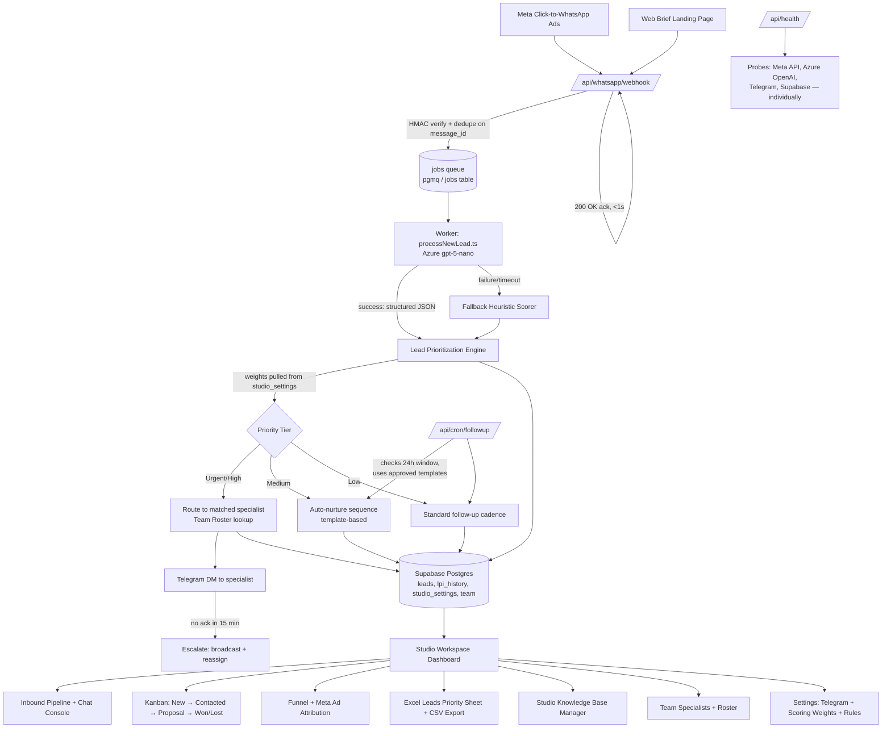

# WhatsApp Lead Pipeline — System Design v2

Revision of the original architecture: adds async processing, fallback
scoring, tiered routing with escalation, and security/data primitives
adapted from wacrm's CRM foundation.

## 1. Goals

- Never lose a lead, even if a downstream dependency (AI, Telegram, DB) fails.
- Route hot leads to the right specialist fast, with an SLA and escalation path.
- Keep every non-urgent lead moving through an active nurture path instead
  of going quiet until a cron job eventually finds it.
- Respect WhatsApp's 24-hour messaging window for all outbound automation.
- Multi-tenant safe: every table scoped by account/studio, secrets encrypted.

## 2. High-Level Flow

## 3. Components

### 3.1 Ingestion — `/api/whatsapp/webhook`
- Verifies Meta's HMAC signature before parsing payload.
- Dedupes on WhatsApp `message_id` (and secondarily on phone number, to
  catch re-sends that generate a new message_id but are the same contact).
- Does **not** call the LLM inline. Writes a job row and returns `200 OK`
  immediately — keeps Meta's retry logic from ever seeing a slow response.

### 3.2 Job Queue
- A `jobs` table (or `pgmq` if available on the Supabase project) holding
  `{lead_raw_payload, status, attempts, created_at}`.
- A worker (cron-triggered or a long-running process) claims jobs,
  processes them, and marks them `done` / `failed`.
- Failed jobs retry with backoff; after N attempts they still land in
  `leads` with the fallback score rather than disappearing.

### 3.3 `processNewLead.ts` (Worker)
- Calls Azure gpt-5-nano with a JSON-schema-constrained prompt (structured
  output, not free-text parsing).
- On success: extracted fields feed the Prioritization Engine.
- On failure/timeout/malformed output: falls through to a **fallback
  heuristic scorer** — simple rule-based scoring off whatever raw fields
  are available (e.g., message length, keyword match, UTM presence) —
  so every lead gets *some* score and enters the pipeline.
- Input is treated as untrusted text; basic injection-resistant prompt
  structure (system/user separation, no instruction-following from lead
  text).

### 3.4 Lead Prioritization Engine (LPI 0–100)
- Weights (Budget Depth 0–25, Scope Detail 0–15, Timeline Urgency 0–10,
  Qualification % 0–40, Returning VIP 0–10) are **read from
  `studio_settings` at runtime**, not hardcoded — each studio can tune
  its own weighting.
- Every score write appends to an `lpi_history` table (lead_id, score,
  inputs, scored_at) instead of overwriting — gives you an audit trail
  and lets you later validate weights against actual close rates.
- **Recompute trigger**: if a lead sends a follow-up message with new
  qualifying info (budget, timeline), the worker re-scores and appends
  a new history row rather than leaving the first score frozen.

### 3.5 Priority Tier Routing
- **Urgent/High** → looked up against `team` roster for the specialist
  matching the lead's scope/service type → Telegram DM to that person
  specifically (not a broadcast). If unacknowledged within 15 minutes,
  escalate: broadcast to the studio channel and flag for reassignment.
- **Medium** → enters an automated nurture sequence immediately (not
  just "wait for cron") — template-based WhatsApp messages spaced over
  a few days, using Meta-approved templates if outside the 24h window.
- **Low** → standard follow-up cadence, lower frequency, same template
  constraint.
- All three tiers write to `leads` with `tier`, `assigned_to`, and
  `status` so the dashboard's Kanban view has something to render.

### 3.6 Storage — Supabase Postgres
- `leads`, `lpi_history`, `studio_settings`, `team`, `jobs` — every table
  scoped by `account_id` with RLS enabled (matches wacrm's per-table RLS
  approach), so a multi-studio deployment can't leak across tenants.
- Secrets (Azure key, Telegram bot token, Meta tokens) encrypted at rest
  (AES-256-GCM), not stored plaintext in `studio_settings`.
- Contact dedup on phone number at write time, so repeat inbound messages
  update the existing lead instead of fragmenting into duplicates.

### 3.7 Studio Workspace Dashboard
Adds one tab versus the original design:
1. Inbound Pipeline + Chat Console
2. **Kanban board** (New → Contacted → Proposal → Won/Lost) — tracks a
   lead after the first triage, which the original "priority sheet"
   alone didn't cover
3. Funnel & Meta Ad Attribution
4. Excel Leads Priority Sheet + CSV Export
5. Studio Knowledge Base Manager
6. Team Specialists & Roster
7. Settings (Telegram config + **scoring weight editor**, since weights
   are now data-driven)

### 3.8 Telemetry & Cron
- `/api/health` probes Meta API, Azure OpenAI, Telegram, and Supabase
  **individually**, not just app uptime — so an outage surfaces which
  dependency is down.
- `/api/cron/followup` checks the 24-hour customer-service window per
  lead before sending; outside the window it only sends pre-approved
  Meta templates. Re-engagement has explicit stop conditions: opted
  out, already converted, or max attempts reached.
- `/dashboard/platform` should be wired to the real telemetry data —
  the original design left this as simulated/empty.

## 4. Security Checklist (adapted from wacrm's baseline)

- [ ] HMAC signature verification on the webhook
- [ ] RLS on every table, scoped by account_id
- [ ] Encrypted storage for Azure/Meta/Telegram secrets
- [ ] Rate limiting on public endpoints
- [ ] Scoped, revocable API keys if the scoring engine or lead data is
      ever exposed externally
- [ ] CI typecheck/build gate on every PR

## 5. What This Fixes vs. the Original Diagram

| Issue in original design | Fix in v2 |
|---|---|
| LLM call inline in webhook handler | Async job queue, webhook acks immediately |
| No fallback if AI scoring fails | Heuristic fallback scorer, lead never dropped |
| Medium/Low tiers have no active path | Immediate nurture sequences per tier |
| Telegram is a flat broadcast | Routed to matched specialist + SLA escalation |
| LPI score is write-once | Recompute on new info, full history logged |
| Scoring weights implied hardcoded | Pulled from studio_settings, editable in dashboard |
| No dedup mentioned | Dedup on message_id and phone number |
| Re-engagement window not addressed | Explicit 24h-window + template check |
| `/dashboard/platform` shows 0 simulated data | Wired to real health/telemetry probes |
| No tenant isolation shown | RLS + encrypted secrets on every table |

## 6. Open Questions to Resolve Before Build

- Single-studio or multi-tenant from day one? (Affects how hard to
  enforce RLS now vs. later.)
- Who owns "matched specialist" logic — keyword match on scope, or a
  manual routing rule set by the studio owner?
- What's the actual SLA threshold for escalation — 15 min was assumed
  above, confirm against how fast a studio can realistically respond.
- Embeddings/pgvector for the Knowledge Base Manager, or keep it to
  Postgres full-text for now?
